# ESign Elections Canada - Solution Architecture & Design Document

## Part 1: Executive Summary & Architecture Overview

* Version: 1.0
* Last Updated: February 2026
* Document Owner: Platform Engineering Team
* Author: Frederick Pearson

---

## Table of Contents - Complete Document

**Part 1: Executive Summary & Architecture**

1. Executive Summary
2. Architecture Overview
3. Access Control & Identity Management

**Part 2: Data & Integration Architecture**

4. Data Architecture
5. Integration Architecture

**Part 3: Security & Monitoring**

6. Security Architecture
7. Monitoring, Logging & Audit

**Part 4: Operations & Compliance**

8. Data Retention & Disposition
9. Client Onboarding Process
10. Environment Strategy
11. Network Architecture
12. Disaster Recovery & Business Continuity
13. Compliance & Governance

**Part 5: Annexes**

14. Annex A: Environment Configuration
15. Annex B: Security Controls Mapping (ITSG-33)
16. Annex C: API Specifications
17. Annex D: Troubleshooting Guide

---

## 1. Executive Summary

### 1.1 Purpose

This document describes the solution architecture for the **ESign Elections Canada Broker Service**, a digital signature platform that provides EC with secure, compliant, and auditable electronic signature capabilities via Nintex AssureSign.

### 1.2 Scope

The architecture encompasses:

* **Broker Service Layer**: Microsoft Power Platform (Dataverse) broker (API gateway/middleware)
* **Client Integration Layer**: Custom connectors and OData endpoints for client consumption
* **External Integration**: Nintex AssureSign API integration
* **Security & Compliance**: Protected B controls, ITSG-33 alignment, audit logging
* **Operations**: Monitoring, logging, backup, disaster recovery

### 1.3 Key Architectural Principles

| Principle                  | Description                                        | Implementation                                    |
| -------------------------- | -------------------------------------------------- | ------------------------------------------------- |
| **Support for mulitple business units**    | Logical isolation between client app/services      | Row-level security (RLS) in Dataverse & business units/security roles for API access governance             |
| **API-First**        | OData/REST endpoints as primary integration method | Dataverse Web API + Custom Connectors             |
| **Zero Trust**       | Never trust, always verify                         | OAuth 2.0, service principals, conditional access |
| **Defense in Depth** | Layered security controls                          | Network, identity, application, data encryption   |
| **Audit Everything** | Complete audit trail                               | Dataverse audit logs + Azure Monitor              |
| **Least Privilege**  | Minimal necessary permissions                      | Custom security roles, Entra ID RBAC              |

### 1.4 High-Level Architecture

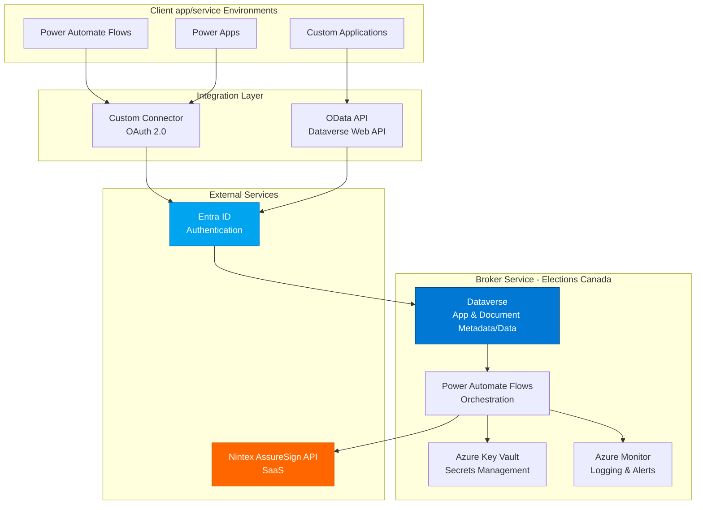
```mermaid
graph TB
    subgraph "Client app/service Environments"
        A[Power Automate Flows]
        B[Power Apps]
        C[Custom Applications]
    end
  
    subgraph "Integration Layer"
        D[Custom Connector<br/>OAuth 2.0]
        E[OData API<br/>Dataverse Web API]
    end
  
    subgraph "Broker Service - Elections Canada"
        F[Power Automate Flows<br/>Orchestration]
        G[Dataverse<br/>App & Document Metadata/Data]
        H[Azure Key Vault<br/>Secrets Management]
        I[Azure Monitor<br/>Logging & Alerts]
    end
  
    subgraph "External Services"
        J[Nintex AssureSign API<br/>SaaS]
        K[Entra ID<br/>Authentication]
    end
  
    A --> D
    B --> D
    C --> E
    D --> K
    E --> K
    K --> G
    G --> F
    F --> H
    F --> J
    F --> I
  
    style G fill:#0078d4,stroke:#004578,color:#fff
    style K fill:#00a4ef,stroke:#0078d4,color:#fff
    style J fill:#ff6600,stroke:#cc5200,color:#fff
```

### 1.5 Technology Stack

| Layer                   | Technology               | Version | Purpose                        |
| ----------------------- | ------------------------ | ------- | ------------------------------ |
| **Platform**      | Microsoft Power Platform | Latest  | Broker service host            |
| **Database**      | Dataverse                | 9.2+    | Data store & API               |
| **Orchestration** | Power Automate           | N/A     | Workflow automation            |
| **Identity**      | Microsoft Entra ID       | Latest  | Authentication & authorization |
| **Secrets**       | Azure Key Vault          | Latest  | Credential management          |
| **Monitoring**    | Azure Monitor            | Latest  | Logging & alerting             |
| **API Gateway**   | Dataverse Web API        | 9.2+    | OData endpoints                |
| **External SaaS** | Nintex AssureSign        | 3.7+    | Digital signature platform     |

---

## 2. Architecture Overview

### 2.1 Architectural Patterns

#### 2.1.1 Broker Pattern

The solution implements a **broker architectural pattern** where:

1. **Client service** interact with the broker via standard ODATA API (Dataverse API)
2. **Broker service** manages complexity, approvals, and integration layer applications (client services) and Office & PDF files (api middleware)
3. **Nintex AssureSign** provides the underlying signature capabilities

**Purpose:**

* Centralized Nintex license management
* Consistent security controls
* Simplified client integration
* Centralized audit and compliance

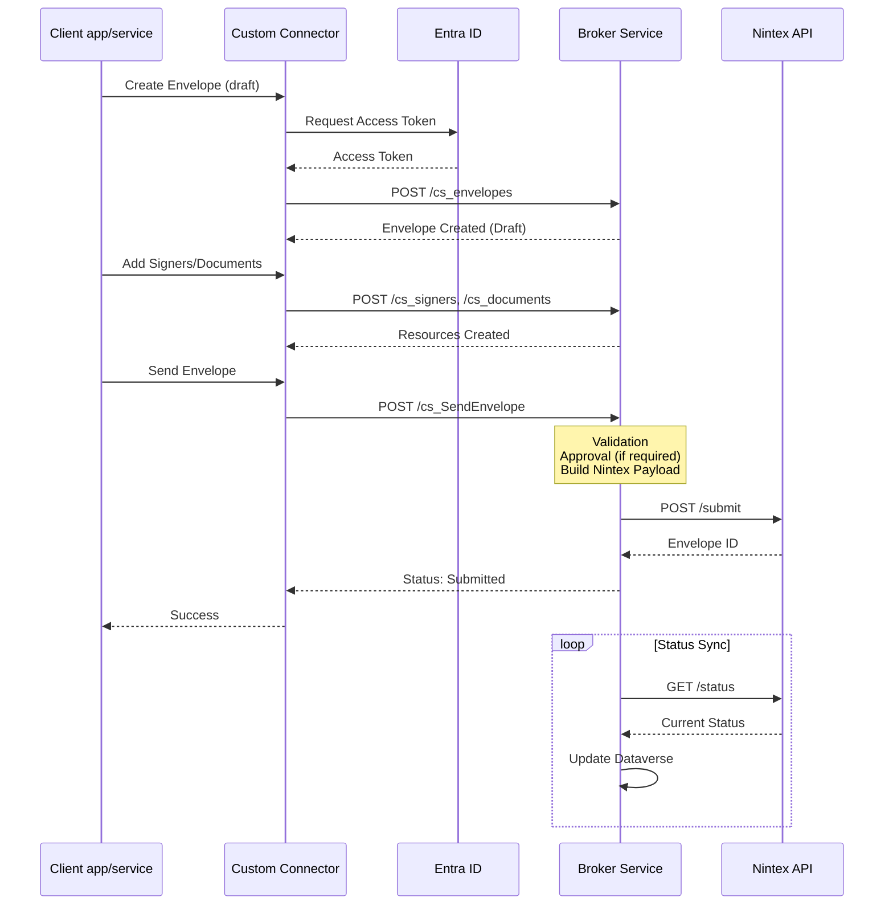
```mermaid
sequenceDiagram
    participant Client as Client app/service
    participant Connector as Custom Connector
    participant EntraID as Entra ID
    participant Broker as Broker Service
    participant Nintex as Nintex API
  
    Client->>Connector: Create Envelope (draft)
    Connector->>EntraID: Request Access Token
    EntraID-->>Connector: Access Token
    Connector->>Broker: POST /cs_envelopes
    Broker-->>Connector: Envelope Created (Draft)
  
    Client->>Connector: Add Signers/Documents
    Connector->>Broker: POST /cs_signers, /cs_documents
    Broker-->>Connector: Resources Created
  
    Client->>Connector: Send Envelope
    Connector->>Broker: POST /cs_SendEnvelope
  
    Note over Broker: Validation<br/>Approval (if required)<br/>Build Nintex Payload
  
    Broker->>Nintex: POST /submit
    Nintex-->>Broker: Envelope ID
  
    Broker-->>Connector: Status: Submitted
    Connector-->>Client: Success
  
    loop Status Sync
        Broker->>Nintex: GET /status
        Nintex-->>Broker: Current Status
        Broker->>Broker: Update Dataverse
    end
```

#### 2.1.2 Client Service -> Broker Service Architecture

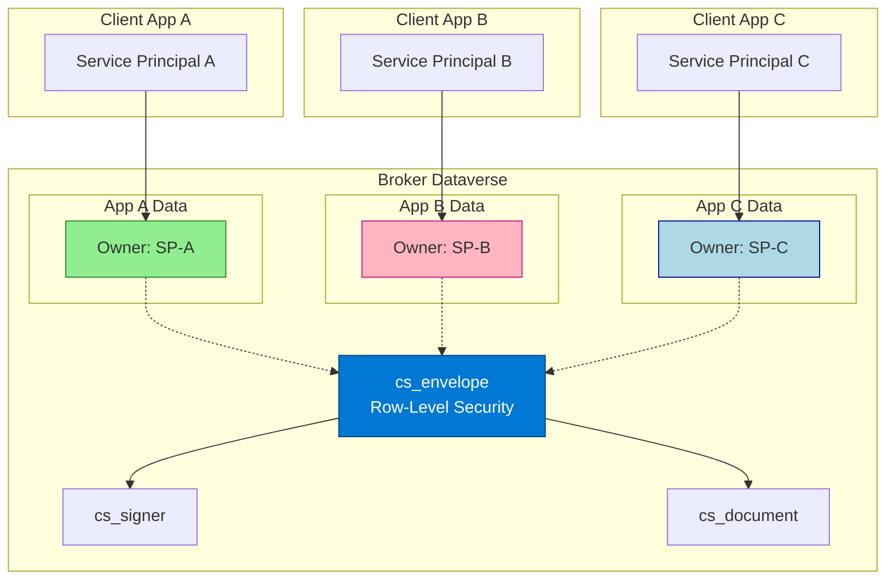
```mermaid
graph TB
    subgraph "Client App A"
        A1[Service Principal A]
    end
  
    subgraph "Client App B"
        B1[Service Principal B]
    end
  
    subgraph "Client App C"
        C1[Service Principal C]
    end
  
    subgraph "Broker Dataverse"
        D[cs_envelope<br/>Row-Level Security]
        E[cs_signer]
        F[cs_document]
      
        subgraph "App A Data"
            G[Owner: SP-A]
        end
      
        subgraph "App B Data"
            H[Owner: SP-B]
        end
      
        subgraph "App C Data"
            I[Owner: SP-C]
        end
    end
  
    A1 --> G
    B1 --> H
    C1 --> I
  
    G -.-> D
    H -.-> D
    I -.-> D
  
    D --> E
    D --> F
  
    style D fill:#0078d4,stroke:#004578,color:#fff
    style G fill:#90EE90,stroke:#228B22
    style H fill:#FFB6C1,stroke:#C71585
    style I fill:#ADD8E6,stroke:#00008B
```

**Isolation Mechanisms:**

| Mechanism          | Implementation                               | Security Level        |
| ------------------ | -------------------------------------------- | --------------------- |
| **Identity** | Unique service principal per client          | Entra ID tenant-level |
| **Data**     | Owner-based RLS in Dataverse                 | Row-level             |
| **Network**  | Shared (PaaS), IP restrictions optional      | Tenant-level          |
| **Logging**  | Separate Log Analytics workspaces per client | Subscription-level    |

### 2.2 Dataverse as Integration Platform

**Why Dataverse is paramount:**

1. **OData Protocol**: Industry-standard REST API

   * Queryable via $filter, $select, $expand
   * Standardized authentication (OAuth 2.0)
   * Native pagination, batch operations
2. **Web API Capabilities**:

   * RESTful CRUD operations
   * Custom Actions (e.g., cs_SendEnvelope)
   * Webhooks for real-time integration
   * SDK support (C#, JavaScript, Python)
3. **Built-in Security**:

   * Row-level security (RLS)
   * Column-level security (CLS)
   * Audit logging
   * Data encryption at rest and in transit
4. **Power Platform Integration**:

   * Native Power Automate triggers
   * Power Apps data source
   * Custom connectors
   * AI Builder capabilities

**OData Endpoint Example:**

```http
GET https://{lce-broker-subdomain}.crm3.dynamics.com/api/data/v9.2/cs_envelopes
    ?$filter=cs_status eq 'Draft' and _ownerid_value eq '{client-sp-id}'
    &$select=cs_name,cs_subject,cs_status
    &$expand=cs_envelope_signer($select=cs_email,cs_fullname)
    &$top=50

Authorization: Bearer {access_token}
```

---

## 3. Access Control & Identity Management

### 3.1 Authentication Architecture

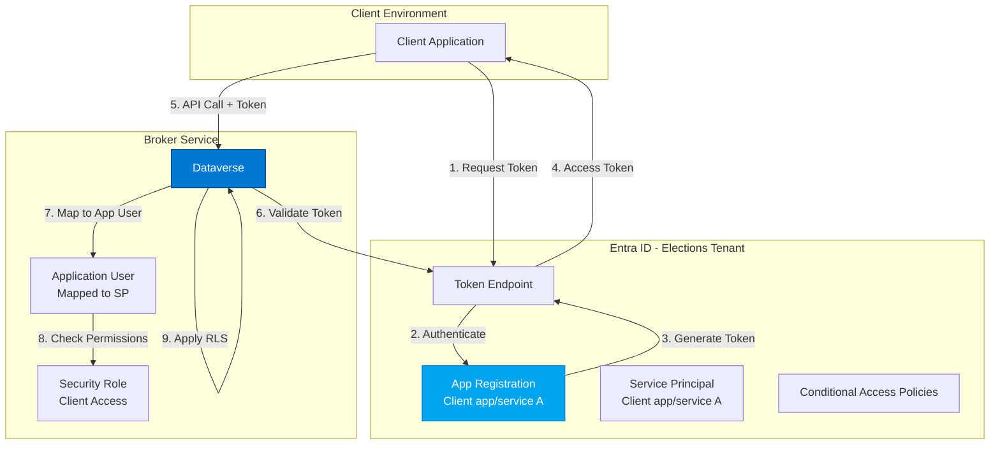
```mermaid
graph TB
    subgraph "Client Environment"
        A[Client Application]
    end
  
    subgraph "Entra ID - Elections Tenant"
        B[App Registration<br/>Client app/service A]
        C[Service Principal<br/>Client app/service A]
        D[Conditional Access Policies]
        E[Token Endpoint]
    end
  
    subgraph "Broker Service"
        F[Dataverse]
        G[Application User<br/>Mapped to SP]
        H[Security Role<br/>Client Access]
    end
  
    A -->|1. Request Token| E
    E -->|2. Authenticate| B
    B -->|3. Generate Token| E
    E -->|4. Access Token| A
    A -->|5. API Call + Token| F
    F -->|6. Validate Token| E
    F -->|7. Map to App User| G
    G -->|8. Check Permissions| H
    F -->|9. Apply RLS| F
  
    style B fill:#00a4ef,stroke:#0078d4,color:#fff
    style F fill:#0078d4,stroke:#004578,color:#fff
```

### 3.2 Authentication Methods

#### 3.2.1 Service Principal (Recommended for Automation)

**Use Case:** Power Automate, custom applications, scheduled jobs

**Setup:**

```powershell
# Create App Registration
az ad app create \
  --display-name "ESign-Clientapp/service-Prod" \
  --sign-in-audience AzureADMyOrg

# Create Client Secret
az ad app credential reset \
  --id {app-id} \
  --append \
  --years 2

# Grant API Permissions
az ad app permission add \
  --id {app-id} \
  --api 00000007-0000-0000-c000-000000000000 \
  --api-permissions 78ce3f0f-a1ce-49c2-8cde-64b5c0896db4=Role

# Admin consent
az ad app permission admin-consent --id {app-id}
```

**Token Acquisition:**

```http
POST https://login.microsoftonline.com/{tenant-id}/oauth2/v2.0/token
Content-Type: application/x-www-form-urlencoded

client_id={client-id}
&client_secret={client-secret}
&scope=https://{lce-broker-subdomain}.crm3.dynamics.com/.default
&grant_type=client_credentials
```

#### 3.2.2 Managed Identity (For Azure-Hosted Applications)

**Use Case:** Azure Functions, Logic Apps, VMs

**Configuration:**

```bash
# Enable system-assigned managed identity
az webapp identity assign --name myapp --resource-group mygroup

# Grant Dataverse permissions via Entra ID
az role assignment create \
  --assignee {managed-identity-principal-id} \
  --role "Dynamics 365 User" \
  --scope /subscriptions/{sub-id}/resourceGroups/{rg}
```

**Token Acquisition:**

```http
GET http://169.254.169.254/metadata/identity/oauth2/token
    ?api-version=2018-02-01
    &resource=https://{lce-broker-subdomain}.crm3.dynamics.com

Metadata: true
```

### 3.3 Authorization Model

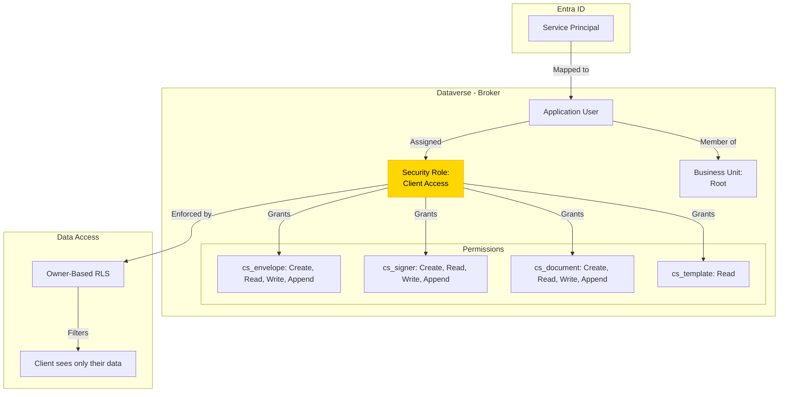
```mermaid
graph TB
    subgraph "Entra ID"
        A[Service Principal]
    end
  
    subgraph "Dataverse - Broker"
        B[Application User]
        C[Security Role:<br/>Client Access]
      
        subgraph "Permissions"
            D[cs_envelope: Create, Read, Write, Append]
            E[cs_signer: Create, Read, Write, Append]
            F[cs_document: Create, Read, Write, Append]
            G[cs_template: Read]
        end
      
        H[Business Unit:<br/>Root]
    end
  
    subgraph "Data Access"
        I[Owner-Based RLS]
        J[Client sees only their data]
    end
  
    A -->|Mapped to| B
    B -->|Assigned| C
    C -->|Grants| D
    C -->|Grants| E
    C -->|Grants| F
    C -->|Grants| G
    B -->|Member of| H
    C -->|Enforced by| I
    I -->|Filters| J
  
    style C fill:#FFD700,stroke:#FFA500,color:#000
```

### 3.4 Security Roles Configuration

#### Client Access Role

| Privilege     | Create       | Read         | Write        | Delete       | Append       | Append To    | Assign |
| ------------- | ------------ | ------------ | ------------ | ------------ | ------------ | ------------ | ------ |
| cs_envelope   | Organization | Organization | Organization | Organization | Organization | Organization | None   |
| cs_signer     | Organization | Organization | Organization | Organization | Organization | Organization | None   |
| cs_document   | Organization | Organization | Organization | Organization | Organization | Organization | None   |
| cs_field      | Organization | Organization | Organization | Organization | Organization | Organization | None   |
| cs_template   | None         | Organization | None         | None         | None         | None         | None   |
| cs_apirequest | Organization | Organization | None         | None         | None         | None         | None   |

**Notes:**

* Organization-level privileges required due to Dataverse API behavior
* RLS enforced via `ownerid` field filtering
* Client cannot query or modify records owned by other clients

#### Broker Administrator Role

| Privilege     | Create       | Read         | Write        | Delete       | Append       | Append To    | Assign       |
| ------------- | ------------ | ------------ | ------------ | ------------ | ------------ | ------------ | ------------ |
| cs_envelope   | Organization | Organization | Organization | Organization | Organization | Organization | Organization |
| cs_signer     | Organization | Organization | Organization | Organization | Organization | Organization | Organization |
| cs_document   | Organization | Organization | Organization | Organization | Organization | Organization | Organization |
| cs_apirequest | Organization | Organization | Organization | Organization | Organization | Organization | None         |
| cs_template   | Organization | Organization | Organization | Organization | Organization | Organization | None         |
| cs_webhook    | Organization | Organization | Organization | Organization | None         | None         | None         |

### 3.5 Conditional Access Policies

**Recommended Policies for Broker Service:**

| Policy Name               | Conditions                   | Controls                    |
| ------------------------- | ---------------------------- | --------------------------- |
| Require MFA for Admins    | User role = Admin            | Require MFA                 |
| Block Legacy Auth         | Client apps = Legacy         | Block access                |
| Require Compliant Device  | Device state = Not compliant | Block access                |
| IP Restriction (Optional) | IP address not in GC range   | Block access                |
| Session Controls          | All users                    | Sign-in frequency = 8 hours |

**Configuration Table:**

| Environment | Policy Enabled | Allowed IP Ranges    | MFA Required |
| ----------- | -------------- | -------------------- | ------------ |
| Production  | ☑             | [FILL: GC IP ranges] | ☑           |
| QA          | ☑             | [FILL: GC IP ranges] | ☑           |
| Development | ☐             | Any                  | ☐           |

---

## Part 2: Data & Integration Architecture

## 4. Data Architecture

### 4.1 Entity Relationship Diagram

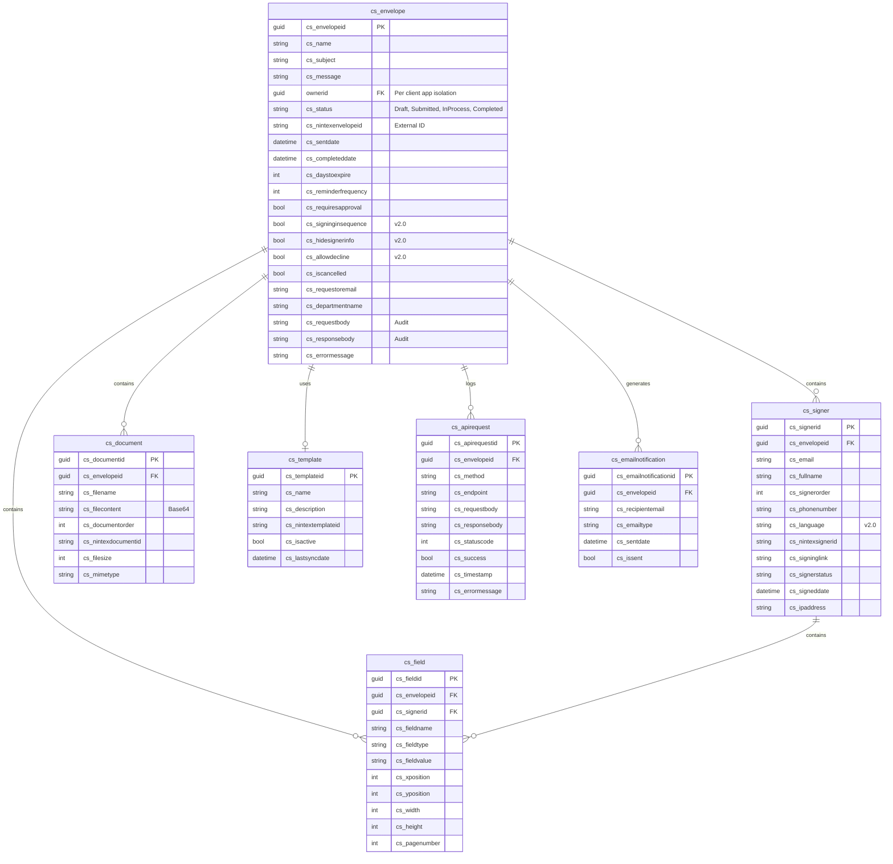
```mermaid
erDiagram
    cs_envelope ||--o{ cs_signer : contains
    cs_envelope ||--o{ cs_document : contains
    cs_envelope ||--o{ cs_field : contains
    cs_envelope ||--o| cs_template : uses
    cs_envelope ||--o{ cs_apirequest : logs
    cs_envelope ||--o{ cs_emailnotification : generates
    cs_signer ||--o{ cs_field : contains
  
    cs_envelope {
        guid cs_envelopeid PK
        string cs_name
        string cs_subject
        string cs_message
        guid ownerid FK "Per client app isolation"
        string cs_status "Draft, Submitted, InProcess, Completed"
        string cs_nintexenvelopeid "External ID"
        datetime cs_sentdate
        datetime cs_completeddate
        int cs_daystoexpire
        int cs_reminderfrequency
        bool cs_requiresapproval
        bool cs_signinginsequence "v2.0"
        bool cs_hidesignerinfo "v2.0"
        bool cs_allowdecline "v2.0"
        bool cs_iscancelled
        string cs_requestoremail
        string cs_departmentname
        string cs_requestbody "Audit"
        string cs_responsebody "Audit"
        string cs_errormessage
    }
  
    cs_signer {
        guid cs_signerid PK
        guid cs_envelopeid FK
        string cs_email
        string cs_fullname
        int cs_signerorder
        string cs_phonenumber
        string cs_language "v2.0"
        string cs_nintexsignerid
        string cs_signinglink
        string cs_signerstatus
        datetime cs_signeddate
        string cs_ipaddress
    }
  
    cs_document {
        guid cs_documentid PK
        guid cs_envelopeid FK
        string cs_filename
        string cs_filecontent "Base64"
        int cs_documentorder
        string cs_nintexdocumentid
        int cs_filesize
        string cs_mimetype
    }
  
    cs_field {
        guid cs_fieldid PK
        guid cs_envelopeid FK
        guid cs_signerid FK
        string cs_fieldname
        string cs_fieldtype
        string cs_fieldvalue
        int cs_xposition
        int cs_yposition
        int cs_width
        int cs_height
        int cs_pagenumber
    }
  
    cs_template {
        guid cs_templateid PK
        string cs_name
        string cs_description
        string cs_nintextemplateid
        bool cs_isactive
        datetime cs_lastsyncdate
    }
  
    cs_apirequest {
        guid cs_apirequestid PK
        guid cs_envelopeid FK
        string cs_method
        string cs_endpoint
        string cs_requestbody
        string cs_responsebody
        int cs_statuscode
        bool cs_success
        datetime cs_timestamp
        string cs_errormessage
    }
  
    cs_emailnotification {
        guid cs_emailnotificationid PK
        guid cs_envelopeid FK
        string cs_recipientemail
        string cs_emailtype
        datetime cs_sentdate
        bool cs_issent
    }
```

### 4.2 Data Model Details

#### 4.2.1 Core Tables

##### cs_envelope

**Purpose:** Primary envelope entity representing a signature request

**Key Fields:**

| Field                    | Type    | Purpose                | Security     |
| ------------------------ | ------- | ---------------------- | ------------ |
| `ownerid`              | Lookup  | Per App isolation      | RLS filter   |
| `cs_status`            | Choice  | Workflow state         | Indexed      |
| `cs_nintexenvelopeid`  | String  | External reference     | Unique       |
| `cs_signinginsequence` | Boolean | Sequential vs parallel | v2.0 feature |
| `cs_hidesignerinfo`    | Boolean | Privacy mode           | v2.0 feature |
| `cs_requestbody`       | Memo    | Audit trail            | Protected B  |
| `cs_responsebody`      | Memo    | Audit trail            | Protected B  |

**Status Values:**

| Status           | Description                 | Transitions To                 |
| ---------------- | --------------------------- | ------------------------------ |
| Draft            | Being built by client       | Pending Approval, Submitted    |
| Pending Approval | Awaiting internal approval  | Approved, Rejected             |
| Approved         | Approved, queued for Nintex | Submitted                      |
| Submitted        | Sent to Nintex API          | InProcess, Failed              |
| InProcess        | Signers notified            | Completed, Declined, Cancelled |
| Completed        | All signatures obtained     | None (terminal)                |
| Declined         | Signer declined             | None (terminal)                |
| Cancelled        | User cancelled              | None (terminal)                |
| Rejected         | Approval rejected           | None (terminal)                |
| Failed           | Technical error             | Submitted (retry)              |

##### cs_signer

**Purpose:** Individuals who must sign the envelope

**Key Fields:**

| Field              | Type   | Purpose          | PII Classification |
| ------------------ | ------ | ---------------- | ------------------ |
| `cs_email`       | String | Contact          | PII                |
| `cs_fullname`    | String | Display name     | PII                |
| `cs_phonenumber` | String | Optional contact | PII                |
| `cs_signinglink` | String | Unique URL       | Sensitive          |
| `cs_ipaddress`   | String | Audit trail      | PII                |

##### cs_document

**Purpose:** Files attached to envelope

**Key Fields:**

| Field              | Type    | Purpose        | Storage Consideration                |
| ------------------ | ------- | -------------- | ------------------------------------ |
| `cs_filecontent` | Memo    | Base64 encoded | Max 10MB, Dataverse storage consumed |
| `cs_filename`    | String  | Display name   | User-controlled                      |
| `cs_filesize`    | Integer | Validation     | Pre-calculate before insert          |

**Storage Calculation:**

* Base64 encoding increases size by ~33%
* 10MB PDF = ~13.3MB base64
* Dataverse capacity: 1GB per environment base + usage-based

##### cs_apirequest

**Purpose:** Complete audit log of all Nintex API interactions

**Key Fields:**

| Field               | Type     | Purpose              | Retention |
| ------------------- | -------- | -------------------- | --------- |
| `cs_requestbody`  | Memo     | Full request payload | 7 years   |
| `cs_responsebody` | Memo     | Full response        | 7 years   |
| `cs_statuscode`   | Integer  | HTTP status          | 7 years   |
| `cs_timestamp`    | DateTime | Chronological order  | 7 years   |

### 4.3 Row-Level Security Implementation

**Mechanism:**

1. Each client has a unique Service Principal in Entra ID
2. Service Principal mapped to Application User in Dataverse
3. Application User assigned to custom security role
4. Security role grants Organization-level privileges
5. **RLS enforced via `ownerid` field filtering in Dataverse Web API**

**Filter Logic:**

```javascript
// Automatic filter applied by Dataverse
GET /api/data/v9.2/cs_envelopes
// Becomes:
GET /api/data/v9.2/cs_envelopes?$filter=_ownerid_value eq '{calling-app-user-id}'
```

**Validation:**

| Test Scenario                                 | Expected Result                   |
| --------------------------------------------- | --------------------------------- |
| Client A queries all envelopes                | Returns only Client A's envelopes |
| Client A queries Client B envelope by ID      | 404 Not Found                     |
| Client A attempts to update Client B envelope | 403 Forbidden                     |
| Admin queries all envelopes                   | Returns all envelopes (no filter) |

### 4.4 Column-Level Security

**Sensitive Fields with CLS:**

| Field               | Table       | Access Level        | Reason                  |
| ------------------- | ----------- | ------------------- | ----------------------- |
| `cs_requestbody`  | cs_envelope | Read: Admin only    | Contains PII in payload |
| `cs_responsebody` | cs_envelope | Read: Admin only    | Contains Nintex tokens  |
| `cs_signinglink`  | cs_signer   | Read: Owner + Admin | Unique access URL       |
| `cs_ipaddress`    | cs_signer   | Read: Admin only    | PII - tracking data     |

**Configuration:**

```xml
<attribute LogicalName="cs_requestbody">
  <IsSecured>true</IsSecured>
  <Descriptions>
    <Description>Full API request payload (Admin only)</Description>
  </Descriptions>
</attribute>
```

### 4.5 Data Encryption

| Layer                 | Encryption Method                | Key Management      |
| --------------------- | -------------------------------- | ------------------- |
| **At Rest**     | AES-256 (Dataverse TDE)          | Microsoft-managed   |
| **In Transit**  | TLS 1.2+                         | Certificate pinning |
| **Application** | Base64 encoding (not encryption) | N/A                 |
| **Backup**      | AES-256                          | Microsoft-managed   |

**Note:** Base64 encoding of documents is for transport, not security. Documents remain readable in Dataverse.

---

## 5. Integration Architecture

### 5.1 Integration Layers

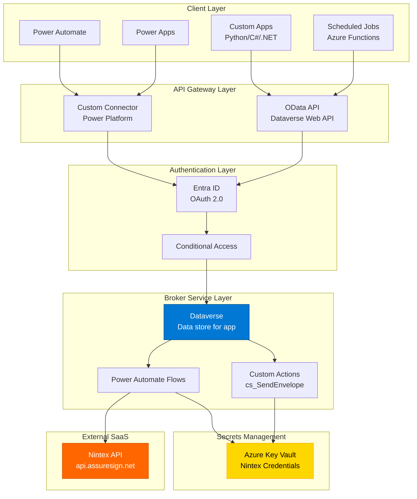
```mermaid
graph TB
    subgraph "Client Layer"
        A[Power Automate]
        B[Power Apps]
        C[Custom Apps<br/>Python/C#/.NET]
        D[Scheduled Jobs<br/>Azure Functions]
    end
  
    subgraph "API Gateway Layer"
        E[Custom Connector<br/>Power Platform]
        F[OData API<br/>Dataverse Web API]
    end
  
    subgraph "Authentication Layer"
        G[Entra ID<br/>OAuth 2.0]
        H[Conditional Access]
    end
  
    subgraph "Broker Service Layer"
        I[Power Automate Flows]
        J[Dataverse<br/>Data store for app]
        K[Custom Actions<br/>cs_SendEnvelope]
    end
  
    subgraph "Secrets Management"
        L[Azure Key Vault<br/>Nintex Credentials]
    end
  
    subgraph "External SaaS"
        M[Nintex API<br/>api.assuresign.net]
    end
  
    A --> E
    B --> E
    C --> F
    D --> F
  
    E --> G
    F --> G
  
    G --> H
    H --> J
  
    J --> I
    J --> K
  
    I --> L
    K --> L
  
    I --> M
  
    style J fill:#0078d4,stroke:#004578,color:#fff
    style M fill:#ff6600,stroke:#cc5200,color:#fff
    style L fill:#FFD700,stroke:#FFA500,color:#000
```

### 5.2 Custom Connector Architecture

**Connector Type:** OpenAPI 2.0 Specification

**Authentication:** OAuth 2.0 with Authorization Code flow

**Connector File Structure:**

```json
{
  "swagger": "2.0",
  "info": {
    "title": "ESign Elections Canada",
    "version": "2.0.0"
  },
  "host": "{environment}.crm3.dynamics.com",
  "basePath": "/api/data/v9.2",
  "securityDefinitions": {
    "oauth2": {
      "type": "oauth2",
      "flow": "accessCode",
      "authorizationUrl": "https://login.microsoftonline.com/{tenant}/oauth2/v2.0/authorize",
      "tokenUrl": "https://login.microsoftonline.com/{tenant}/oauth2/v2.0/token",
      "scopes": {
        "https://{environment}.crm3.dynamics.com/.default": "Access broker"
      }
    }
  }
}
```

**Operations Exposed:**

| Operation      | HTTP Method | Dataverse Endpoint                                         | Description               |
| -------------- | ----------- | ---------------------------------------------------------- | ------------------------- |
| CreateEnvelope | POST        | /cs_envelopes                                              | Create draft envelope     |
| SendEnvelope   | POST        | /cs_envelopes({id})/Microsoft.Dynamics.CRM.cs_SendEnvelope | Send envelope to Nintex   |
| AddSigner      | POST        | /cs_signers                                                | Add signer to envelope    |
| UpdateSigner   | PATCH       | /cs_signers({id})                                          | Modify signer             |
| RemoveSigner   | DELETE      | /cs_signers({id})                                          | Delete signer             |
| AddDocument    | POST        | /cs_documents                                              | Attach document           |
| RemoveDocument | DELETE      | /cs_documents({id})                                        | Remove document           |
| GetEnvelope    | GET         | /cs_envelopes({id})                                        | Retrieve envelope details |
| ListEnvelopes  | GET         | /cs_envelopes                                              | Query envelopes           |
| GetSigners     | GET         | /cs_envelopes({id})/cs_envelope_signer                     | Get envelope signers      |
| ListTemplates  | GET         | /cs_templates                                              | Available templates       |
| UpdateEnvelope | PATCH       | /cs_envelopes({id})                                        | Modify or cancel          |
| DeleteEnvelope | DELETE      | /cs_envelopes({id})                                        | Delete envelope           |

### 5.3 OData Endpoint Integration

**Base URL Format:**

```html
https://{environment}.{region}.dynamics.com/api/data/v{version}/
```

**Example Queries:**

```http
# Get all draft envelopes
GET /api/data/v9.2/cs_envelopes?$filter=cs_status eq 'Draft'

# Get envelope with signers expanded
GET /api/data/v9.2/cs_envelopes(guid)?$expand=cs_envelope_signer

# Get envelopes created in last 7 days
GET /api/data/v9.2/cs_envelopes
    ?$filter=createdon ge 2026-02-11T00:00:00Z

# Batch operation
POST /api/data/v9.2/$batch
Content-Type: multipart/mixed;boundary=batch_requests

--batch_requests
Content-Type: application/http

POST /api/data/v9.2/cs_signers HTTP/1.1
Content-Type: application/json

{
  "cs_email": "signer1@example.com",
  "cs_fullname": "John Doe",
  "cs_envelopeid@odata.bind": "/cs_envelopes(guid)"
}
--batch_requests--
```

**Query Options Supported:**

| Option       | Purpose         | Example                      |
| ------------ | --------------- | ---------------------------- |
| `$filter`  | Filter results  | `cs_status eq 'Completed'` |
| `$select`  | Specify columns | `cs_name,cs_status`        |
| `$expand`  | Include related | `cs_envelope_signer`       |
| `$orderby` | Sort results    | `createdon desc`           |
| `$top`     | Limit results   | `50`                       |
| `$skip`    | Pagination      | `100`                      |
| `$count`   | Include count   | `true`                     |

### 5.4 Nintex API Integration

**API Version:** 3.7

**Base URL:** `https://api.assuresign.net/v3.7`

**Authentication Flow:**

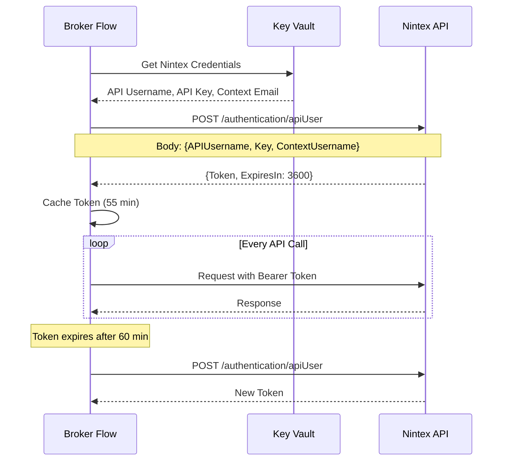
```mermaid
sequenceDiagram
    participant Broker as Broker Flow
    participant KV as Key Vault
    participant Nintex as Nintex API
  
    Broker->>KV: Get Nintex Credentials
    KV-->>Broker: API Username, API Key, Context Email
  
    Broker->>Nintex: POST /authentication/apiUser
    Note over Broker,Nintex: Body: {APIUsername, Key, ContextUsername}
    Nintex-->>Broker: {Token, ExpiresIn: 3600}
  
    Broker->>Broker: Cache Token (55 min)
  
    loop Every API Call
        Broker->>Nintex: Request with Bearer Token
        Nintex-->>Broker: Response
    end
  
    Note over Broker: Token expires after 60 min
  
    Broker->>Nintex: POST /authentication/apiUser
    Nintex-->>Broker: New Token
```

**Key Nintex Endpoints:**

| Endpoint                    | Method | Purpose                 | Broker Usage            |
| --------------------------- | ------ | ----------------------- | ----------------------- |
| `/authentication/apiUser` | POST   | Get access token        | Every 55 minutes        |
| `/submit`                 | POST   | Create envelope         | On Send Envelope action |
| `/get`                    | GET    | Get envelope details    | Status sync flow        |
| `/getSigningLinks`        | GET    | Retrieve signing URLs   | After submission        |
| `/cancel`                 | POST   | Cancel envelope         | On user cancel          |
| `/listTemplates`          | GET    | Get available templates | Daily sync              |
| `/getCompletedDocument`   | GET    | Download signed PDF     | On completion           |

**Payload Mapping:**

```json
// Broker Dataverse → Nintex API
{
  "TemplateID": "{cs_template.cs_nintextemplateid}",
  "Subject": "{cs_envelope.cs_subject}",
  "Message": "{cs_envelope.cs_message}",
  "DaysToExpire": "{cs_envelope.cs_daystoexpire}",
  "ReminderFrequency": "{cs_envelope.cs_reminderfrequency}",
  "ProcessingMode": "{cs_envelope.cs_signinginsequence ? 'Sequential' : 'Parallel'}",
  "DocumentVisibility": "{cs_envelope.cs_hidesignerinfo ? 'Private' : 'Shared'}",
  "AllowDecline": "{cs_envelope.cs_allowdecline}",
  "Signers": [
    {
      "Email": "{cs_signer.cs_email}",
      "FullName": "{cs_signer.cs_fullname}",
      "SignerOrder": "{cs_signer.cs_signerorder}",
      "Language": "{cs_signer.cs_language}"
    }
  ],
  "Documents": [
    {
      "FileName": "{cs_document.cs_filename}",
      "FileContent": "{cs_document.cs_filecontent}"
    }
  ]
}
```

### 5.5 Broker Orchestration Flows

#### Flow 1: Send Envelope to Nintex

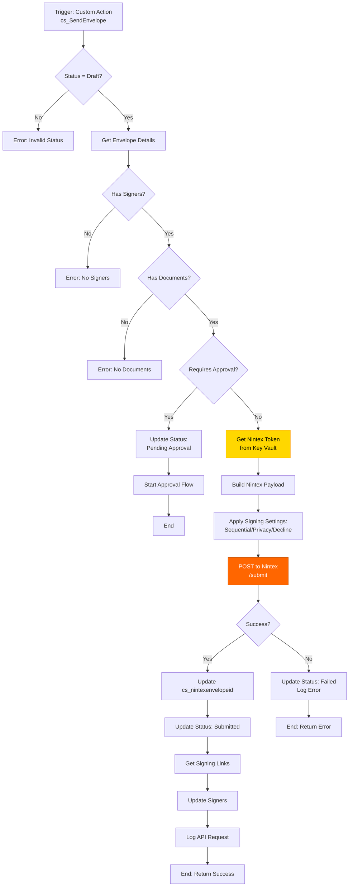
```mermaid
flowchart TD
    A[Trigger: Custom Action<br/>cs_SendEnvelope] --> B{Status = Draft?}
    B -->|No| C[Error: Invalid Status]
    B -->|Yes| D[Get Envelope Details]
  
    D --> E{Has Signers?}
    E -->|No| F[Error: No Signers]
    E -->|Yes| G{Has Documents?}
  
    G -->|No| H[Error: No Documents]
    G -->|Yes| I{Requires Approval?}
  
    I -->|Yes| J[Update Status:<br/>Pending Approval]
    J --> K[Start Approval Flow]
    K --> L[End]
  
    I -->|No| M[Get Nintex Token<br/>from Key Vault]
    M --> N[Build Nintex Payload]
  
    N --> O[Apply Signing Settings:<br/>Sequential/Privacy/Decline]
  
    O --> P[POST to Nintex<br/>/submit]
  
    P --> Q{Success?}
    Q -->|No| R[Update Status: Failed<br/>Log Error]
    Q -->|Yes| S[Update cs_nintexenvelopeid]
  
    S --> T[Update Status: Submitted]
    T --> U[Get Signing Links]
    U --> V[Update Signers]
    V --> W[Log API Request]
    W --> X[End: Return Success]
  
    R --> Y[End: Return Error]
  
    style M fill:#FFD700,stroke:#FFA500,color:#000
    style P fill:#ff6600,stroke:#cc5200,color:#fff
```

#### Flow 2: Status Synchronization

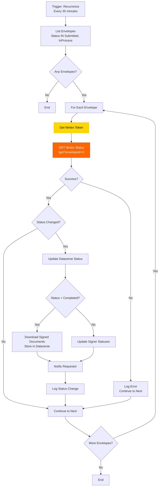
```mermaid
flowchart TD
    A[Trigger: Recurrence<br/>Every 30 minutes] --> B[List Envelopes<br/>Status IN Submitted, InProcess]
  
    B --> C{Any Envelopes?}
    C -->|No| D[End]
    C -->|Yes| E[For Each Envelope]
  
    E --> F[Get Nintex Token]
    F --> G[GET Nintex Status<br/>/get?envelopeId=X]
  
    G --> H{Success?}
    H -->|No| I[Log Error<br/>Continue to Next]
    H -->|Yes| J{Status Changed?}
  
    J -->|No| K[Continue to Next]
    J -->|Yes| L[Update Dataverse Status]
  
    L --> M{Status = Completed?}
    M -->|Yes| N[Download Signed Documents<br/>Store in Dataverse]
    M -->|No| O[Update Signer Statuses]
  
    N --> P[Notify Requestor]
    O --> P
  
    P --> Q[Log Status Change]
    Q --> K
  
    I --> K
    K --> R{More Envelopes?}
    R -->|Yes| E
    R -->|No| S[End]
  
    style F fill:#FFD700,stroke:#FFA500,color:#000
    style G fill:#ff6600,stroke:#cc5200,color:#fff
```

### 5.6 Error Handling Strategy

| Error Type                     | Handling               | Retry Logic                    | Notification                 |
| ------------------------------ | ---------------------- | ------------------------------ | ---------------------------- |
| **Nintex API 5xx**       | Log error, mark Failed | 3 retries, exponential backoff | Admin alert after 3 failures |
| **Nintex API 4xx**       | Log error, mark Failed | No retry                       | Requestor notification       |
| **Token Expired**        | Refresh token          | Automatic                      | None                         |
| **Validation Error**     | Return error to client | No retry                       | Client receives error        |
| **Dataverse Throttling** | Retry with backoff     | 5 retries                      | Admin alert if persistent    |
| **Network Timeout**      | Retry                  | 3 retries                      | Log incident                 |

**Error Response Format:**

```json
{
  "error": {
    "code": "EnvelopeValidationError",
    "message": "Envelope must have at least one signer",
    "details": {
      "envelopeId": "abc-123",
      "status": "Draft",
      "signerCount": 0
    },
    "timestamp": "2026-02-18T14:30:00Z"
  }
}
```

---

## Part 3: Security & Monitoring

## 6. Security Architecture

### 6.1 Defense in Depth

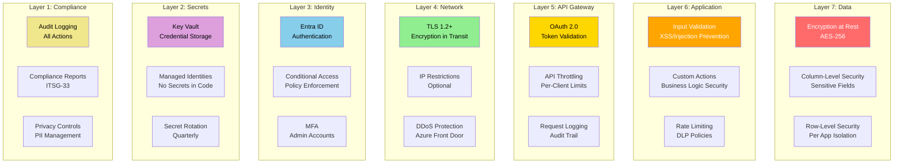
```mermaid
graph TB
    subgraph "Layer 7: Data"
        A[Encryption at Rest<br/>AES-256]
        B[Column-Level Security<br/>Sensitive Fields]
        C[Row-Level Security<br/>Per App Isolation]
    end
  
    subgraph "Layer 6: Application"
        D[Input Validation<br/>XSS/Injection Prevention]
        E[Custom Actions<br/>Business Logic Security]
        F[Rate Limiting<br/>DLP Policies]
    end
  
    subgraph "Layer 5: API Gateway"
        G[OAuth 2.0<br/>Token Validation]
        H[API Throttling<br/>Per-Client Limits]
        I[Request Logging<br/>Audit Trail]
    end
  
    subgraph "Layer 4: Network"
        J[TLS 1.2+<br/>Encryption in Transit]
        K[IP Restrictions<br/>Optional]
        L[DDoS Protection<br/>Azure Front Door]
    end
  
    subgraph "Layer 3: Identity"
        M[Entra ID<br/>Authentication]
        N[Conditional Access<br/>Policy Enforcement]
        O[MFA<br/>Admin Accounts]
    end
  
    subgraph "Layer 2: Secrets"
        P[Key Vault<br/>Credential Storage]
        Q[Managed Identities<br/>No Secrets in Code]
        R[Secret Rotation<br/>Quarterly]
    end
  
    subgraph "Layer 1: Compliance"
        S[Audit Logging<br/>All Actions]
        T[Compliance Reports<br/>ITSG-33]
        U[Privacy Controls<br/>PII Management]
    end
  
    style A fill:#FF6B6B,color:#fff
    style D fill:#FFA500,color:#fff
    style G fill:#FFD700,color:#000
    style J fill:#90EE90,color:#000
    style M fill:#87CEEB,color:#000
    style P fill:#DDA0DD,color:#000
    style S fill:#F0E68C,color:#000
```

### 6.2 Threat Model - STRIDE Analysis

| Threat                                 | Attack Vector                  | Mitigation                            | Residual Risk |
| -------------------------------------- | ------------------------------ | ------------------------------------- | ------------- |
| **Spoofing**                     | Impersonate client app/service | OAuth 2.0, service principals         | Low           |
| **Tampering**                    | Modify envelope data           | RLS, audit logging, immutable logs    | Low           |
| **Repudiation**                  | Deny sending envelope          | Complete audit trail in cs_apirequest | Low           |
| **Information Disclosure**       | Access other app/service data  | RLS, CLS, encryption                  | Low           |
| **Denial of Service**            | Flood API with requests        | API throttling, DLP policies          | Medium        |
| **Elevation of Privilege (TBD)** | Gain admin access              | Least privilege, MFA, PIM             | Low           |

### 6.3 Data Classification

| Data Element                      | Classification | Encryption          | Access Control | Retention        |
| --------------------------------- | -------------- | ------------------- | -------------- | ---------------- |
| Envelope metadata (name, subject) | Protected B    | At rest, in transit | RLS            | 7 years          |
| Signer PII (email, name, phone)   | Protected B    | At rest, in transit | RLS + CLS      | 7 years          |
| Document content (Base64)         | Protected B    | At rest, in transit | RLS            | 7 years          |
| Signing links                     | Protected B    | At rest, in transit | RLS + CLS      | Until expiry     |
| API request/response logs         | Protected B    | At rest, in transit | Admin only     | 7 years          |
| Nintex credentials                | Secret         | Key Vault           | MSI only       | Rotate quarterly |
| Client secrets                    | Secret         | Key Vault           | Admin only     | 2 years max      |

### 6.4 PII Management

**PII Elements Stored:**

| Element       | Table     | Purpose          | Legal Basis                            |
| ------------- | --------- | ---------------- | -------------------------------------- |
| Email address | cs_signer | Contact signer   | Consent via envelope submission        |
| Full name     | cs_signer | Display name     | Consent via envelope submission        |
| Phone number  | cs_signer | Optional contact | Consent via envelope submission        |
| IP address    | cs_signer | Audit trail      | Legitimate interest (fraud prevention) |

**Data Subject Rights:**

| Right         | Implementation            | Response Time |
| ------------- | ------------------------- | ------------- |
| Access        | Export via Dataverse API  | 30 days       |
| Rectification | Update signer record      | Immediate     |
| Erasure       | Delete envelope (cascade) | 30 days       |
| Portability   | Export as JSON/CSV        | 30 days       |
| Objection     | Opt-out via config        | Immediate     |

---

## 7. Monitoring, Logging & Audit

### 7.1 Monitoring Architecture

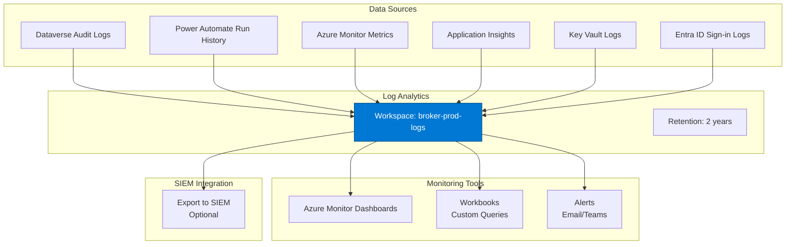
```mermaid
graph TB
    subgraph "Data Sources"
        A[Dataverse Audit Logs]
        B[Power Automate Run History]
        C[Azure Monitor Metrics]
        D[Application Insights]
        E[Key Vault Logs]
        F[Entra ID Sign-in Logs]
    end
  
    subgraph "Log Analytics"
        G[Workspace: broker-prod-logs]
        H[Retention: 2 years]
    end
  
    subgraph "Monitoring Tools"
        I[Azure Monitor Dashboards]
        J[Workbooks<br/>Custom Queries]
        K[Alerts<br/>Email/Teams]
    end
  
    subgraph "SIEM Integration"
        L[Export to SIEM<br/>Optional]
    end
  
    A --> G
    B --> G
    C --> G
    D --> G
    E --> G
    F --> G
  
    G --> I
    G --> J
    G --> K
    G --> L
  
    style G fill:#0078d4,stroke:#004578,color:#fff
```

### 7.2 Logging Strategy

#### Application Logging (cs_apirequest)

All Nintex API calls logged:

```json
{
  "cs_apirequestid": "guid",
  "cs_envelopeid": "guid",
  "cs_method": "POST",
  "cs_endpoint": "/v3.7/submit",
  "cs_requestbody": "{\"Subject\": \"Contract\", ...}",
  "cs_responsebody": "{\"EnvelopeID\": \"NX123\", ...}",
  "cs_statuscode": 200,
  "cs_success": true,
  "cs_timestamp": "2026-02-18T14:30:00Z",
  "cs_duration": 1250,
  "cs_errormessage": null
}
```

**Retention:** 7 years (Protected B requirement)

### 7.3 Alerting Rules

#### Critical Alerts (Immediate Response)

| Alert                            | Condition                   | Threshold                  | Action                     |
| -------------------------------- | --------------------------- | -------------------------- | -------------------------- |
| **Nintex API Failure**     | HTTP 5xx errors             | >5 in 5 min                | Page on-call engineer      |
| **Authentication Failure** | 401/403 errors              | >10 in 5 min               | Security team notification |
| **Data Breach Attempt**    | Cross-tenant access attempt | Any                        | Immediate investigation    |
| **Service Degradation**    | API latency                 | >5 sec for 95th percentile | Incident response          |

#### Warning Alerts (Business Hours)

| Alert                 | Condition         | Threshold      | Action                 |
| --------------------- | ----------------- | -------------- | ---------------------- |
| Token Expiry          | Secret expires in | <60 days       | Rotation reminder      |
| High Error Rate       | Failed flows      | >10% in 1 hour | Investigate root cause |
| Storage Capacity      | Dataverse usage   | >80%           | Capacity planning      |
| Client Quota Exceeded | Envelopes/month   | >Limit         | Billing notification   |

### 7.4 Audit Trail Requirements (ITSG-33)

**AC-2: Account Management**

```kusto
// All service principal creations/deletions
EntraIDLogs
| where OperationName in ("Add service principal", "Delete service principal")
| where AppDisplayName contains "ESign"
| project Timestamp, Actor, Operation, TargetResources
```

**AU-2: Audit Events**

```kusto
// All data access events
AuditLog
| where Action in ("Create", "Update", "Delete")
| where EntityName startswith "cs_"
| project Timestamp, UserId, Action, EntityName, RecordId
```

### 7.5 Monitoring Dashboards

#### Dashboard 1: Operational Health

**Widgets:**

* API Success Rate (gauge)
* Average Latency (line chart)
* Envelopes by Status (pie chart)
* Active Clients (number)
* Daily Envelope Volume (bar chart)

#### Dashboard 2: Security Monitoring

**Widgets:**

* Failed Authentication Attempts (table)
* Unusual IP Addresses (map)
* New Service Principals (list)
* Privileged Access Events (timeline)

#### Dashboard 3: Client Usage

**Widgets:**

* Top 10 Clients by Volume (bar chart)
* Completion Rate by Client (table)
* Processing Time Trends (line chart)
* Failed Envelopes by Client (table)

### 7.6 Log Retention

| Log Type                   | Retention Period | Archive Location          | Legal Hold |
| -------------------------- | ---------------- | ------------------------- | ---------- |
| Dataverse Audit Logs       | 7 years          | Azure Storage (Cool tier) | Available  |
| cs_apirequest              | 7 years          | In-place (Dataverse)      | Available  |
| Azure Monitor Logs         | 2 years          | Log Analytics             | Available  |
| Power Automate Run History | 28 days          | Power Platform            | N/A        |
| Entra ID Sign-in Logs      | 1 year           | Azure AD Premium          | Available  |
| Key Vault Access Logs      | 2 years          | Storage Account           | Available  |

---

## Part 4: Operations & DR

**Version:** 2.0
**Classification:** Protected B

---

## 8. Data Retention & Disposition

### 8.1 Retention Requirements (Protected B)

**Government of Canada Standard:** 7 years retention for Protected B data

### 8.2 Retention Policies

#### 8.2.1 Dataverse Data

| Entity        | Retention Period        | Disposition Method       | Trigger         |
| ------------- | ----------------------- | ------------------------ | --------------- |
| cs_envelope   | 7 years from completion | Hard delete              | Automated job   |
| cs_signer     | 7 years from completion | Hard delete (cascade)    | Parent deletion |
| cs_document   | 7 years from completion | Hard delete (cascade)    | Parent deletion |
| cs_apirequest | 7 years from creation   | Hard delete              | Automated job   |
| cs_template   | Active templates only   | Soft delete (deactivate) | Manual          |

**Implementation:**

```javascript
// Power Automate scheduled flow: Daily Retention Job
Recurrence: Daily at 2:00 AM

1. List envelopes
   Filter: cs_completeddate < (today - 7 years)

2. For each envelope:
   a. Export to archive storage (compliance)
   b. Delete envelope (cascade deletes signers, documents)
   c. Log deletion in audit table

3. List API requests
   Filter: cs_timestamp < (today - 7 years)

4. Delete API requests in batches (1000 at a time)
```

#### 8.2.2 Nintex Data

**Nintex AssureSign Retention:**

| Data Type        | Retention (Nintex) | Disposition           | Notes                        |
| ---------------- | ------------------ | --------------------- | ---------------------------- |
| Envelopes        | 7 years            | Auto-delete by Nintex | Configurable in Nintex admin |
| Signed Documents | 7 years            | Auto-delete by Nintex | Downloadable before deletion |
| Audit Trails     | 7 years            | Auto-delete by Nintex | Export available             |
| Certificates     | 7 years            | Auto-delete by Nintex | Part of signed PDF           |

**Synchronization Strategy:**

1. Broker marks envelope as "Pending Deletion" at 7 years
2. Export signed documents from Nintex to Azure Storage
3. Delete from Nintex via API
4. Delete from Dataverse
5. Retain archive copy in Azure Storage (immutable)

#### 8.2.3 Backup & Recovery

**Backup Strategy:**

| Component          | Backup Frequency      | Retention           | Recovery Point Objective (RPO) |
| ------------------ | --------------------- | ------------------- | ------------------------------ |
| Dataverse          | Continuous            | 28 days             | <1 hour                        |
| Dataverse (Manual) | Weekly                | 90 days             | <24 hours                      |
| Power Automate     | Continuous (metadata) | N/A                 | N/A                            |
| Key Vault          | Continuous            | 90 days soft-delete | <1 hour                        |

**Recovery Procedures:**

**RTO:** 4 hours
**RPO:** 24 hours

### 8.3 Legal Hold Process (TBD)

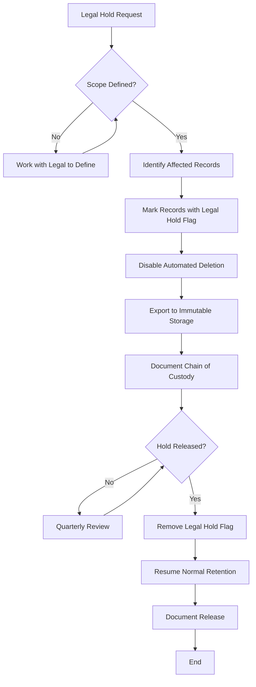
```mermaid
flowchart TD
    A[Legal Hold Request] --> B{Scope Defined?}
    B -->|No| C[Work with Legal to Define]
    C --> B
    B -->|Yes| D[Identify Affected Records]
  
    D --> E[Mark Records with Legal Hold Flag]
    E --> F[Disable Automated Deletion]
  
    F --> G[Export to Immutable Storage]
    G --> H[Document Chain of Custody]
  
    H --> I{Hold Released?}
    I -->|No| J[Quarterly Review]
    J --> I
  
    I -->|Yes| K[Remove Legal Hold Flag]
    K --> L[Resume Normal Retention]
  
    L --> M[Document Release]
    M --> N[End]
```

---

## 9. Client Onboarding Process

### 9.1 Onboarding Workflow

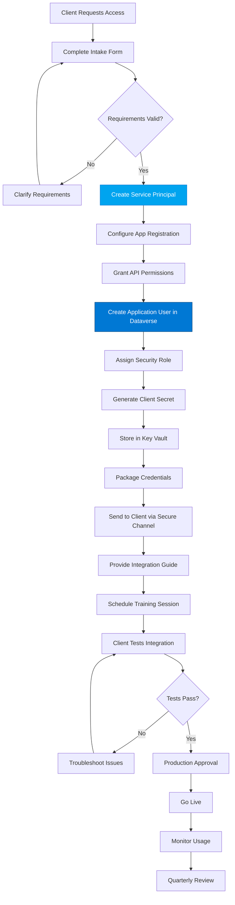
```mermaid
flowchart TD
    A[Client Requests Access] --> B[Complete Intake Form]
    B --> C{Requirements Valid?}
    C -->|No| D[Clarify Requirements]
    D --> B
  
    C -->|Yes| E[Create Service Principal]
    E --> F[Configure App Registration]
    F --> G[Grant API Permissions]
  
    G --> H[Create Application User in Dataverse]
    H --> I[Assign Security Role]
  
    I --> J[Generate Client Secret]
    J --> K[Store in Key Vault]
  
    K --> L[Package Credentials]
    L --> M[Send to Client via Secure Channel]
  
    M --> N[Provide Integration Guide]
    N --> O[Schedule Training Session]
  
    O --> P[Client Tests Integration]
    P --> Q{Tests Pass?}
  
    Q -->|No| R[Troubleshoot Issues]
    R --> P
  
    Q -->|Yes| S[Production Approval]
    S --> T[Go Live]
  
    T --> U[Monitor Usage]
    U --> V[Quarterly Review]
  
    style E fill:#00a4ef,stroke:#0078d4,color:#fff
    style H fill:#0078d4,stroke:#004578,color:#fff
```

### 9.2 Onboarding Timeline

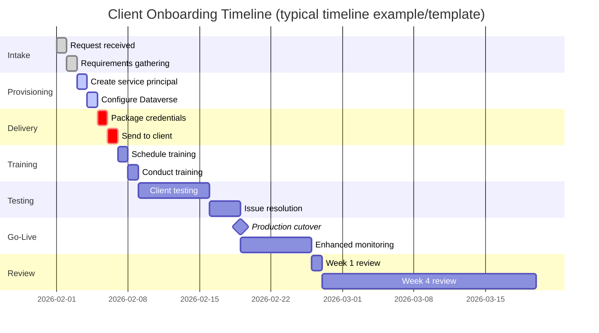
```mermaid
gantt
    title Client Onboarding Timeline (typical timeline example/template)
    dateFormat  YYYY-MM-DD
  
    section Intake
    Request received           :done, intake1, 2026-02-01, 1d
    Requirements gathering     :done, intake2, after intake1, 1d
  
    section Provisioning
    Create service principal   :active, prov1, after intake2, 1d
    Configure Dataverse        :active, prov2, after prov1, 1d
  
    section Delivery
    Package credentials        :crit, del1, after prov2, 1d
    Send to client             :crit, del2, after del1, 1d
  
    section Training
    Schedule training          :train1, after del2, 1d
    Conduct training           :train2, after train1, 1d
  
    section Testing
    Client testing             :test1, after train2, 7d
    Issue resolution           :test2, after test1, 3d
  
    section Go-Live
    Production cutover         :milestone, golive, after test2, 0d
    Enhanced monitoring        :monitor, after golive, 7d
  
    section Review
    Week 1 review              :review1, after monitor, 1d
    Week 4 review              :review2, after review1, 21d
```

**Total Timeline:** 14-21 business days

### 9.3 Onboarding Checklist

#### Phase 1: Intake (Day 1)

**Client Information:**

| Field                     | Value        |
| ------------------------- | ------------ |
| App/service Name          | [FILL]       |
| Primary Contact           | [FILL]       |
| Email                     | [FILL]       |
| Phone                     | [FILL]       |
| Dataverse Environment URL | [FILL]       |
| Expected Monthly Volume   | [FILL]       |
| Use Cases                 | [FILL]       |
| Security Clearance Level  | [FILL]       |
| Approval Required?        | ☐ Yes ☐ No |

#### Phase 2: Service Principal Creation (Day 1-2)

```powershell
# 1. Create App Registration
$app = az ad app create \
  --display-name "ESign-{app/serviceName}-Prod" \
  --sign-in-audience AzureADMyOrg \
  --query appId -o tsv

# 2. Create Service Principal
$sp = az ad sp create --id $app

# 3. Create Client Secret (2 year expiry)
$secret = az ad app credential reset \
  --id $app \
  --years 2 \
  --query password -o tsv

# 4. Grant Dataverse API Permissions
az ad app permission add \
  --id $app \
  --api 00000007-0000-0000-c000-000000000000 \
  --api-permissions 78ce3f0f-a1ce-49c2-8cde-64b5c0896db4=Role

# 5. Admin Consent
az ad app permission admin-consent --id $app
```

#### Phase 3: Dataverse Configuration (Day 2)

**Configuration Table:**

| Setting                     | Value         |
| --------------------------- | ------------- |
| Application User ID         | [FILL]        |
| Service Principal Object ID | [FILL]        |
| Security Role               | Client Access |
| Business Unit               | Root          |
| Created Date                | [FILL]        |
| Created By                  | [FILL]        |

#### Phase 4: Testing (Day 7-14)

**Test Plan (baseline):**

| Test Case | Description             | Expected Result                     | Status |
| --------- | ----------------------- | ----------------------------------- | ------ |
| TC-001    | Import custom connector | Success                             | ☐     |
| TC-002    | Create connection       | Success                             | ☐     |
| TC-003    | Create draft envelope   | Envelope created, status = Draft    | ☐     |
| TC-004    | Add signer              | Signer added                        | ☐     |
| TC-005    | Add document            | Document attached                   | ☐     |
| TC-006    | Send envelope           | Status = Submitted/Pending Approval | ☐     |
| TC-007    | Get envelope details    | Data returned                       | ☐     |
| TC-008    | List envelopes          | Only client's envelopes returned    | ☐     |
| TC-009    | Per App isolation       | Cannot access other client data     | ☐     |
| TC-010    | Error handling          | Graceful error messages             | ☐     |

### 9.4 Onboarding Roles & Responsibilities

| Role                             | Responsibilities                        | Contact        |
| -------------------------------- | --------------------------------------- | -------------- |
| **Platform Lead**          | Overall ownership, approvals            | [FILL]         |
| **Security Lead**          | Service principal creation, permissions | [FILL]         |
| **Technical Lead**         | Dataverse config, training              | [FILL]         |
| **Support Lead**           | Documentation, ongoing support          | [FILL]         |
| **Client Project Manager** | Client-side coordination                | [FILL: Client] |
| **Client Technical Lead**  | Integration development                 | [FILL: Client] |

---

## 10. Environment Strategy

### 10.1 Environment Architecture

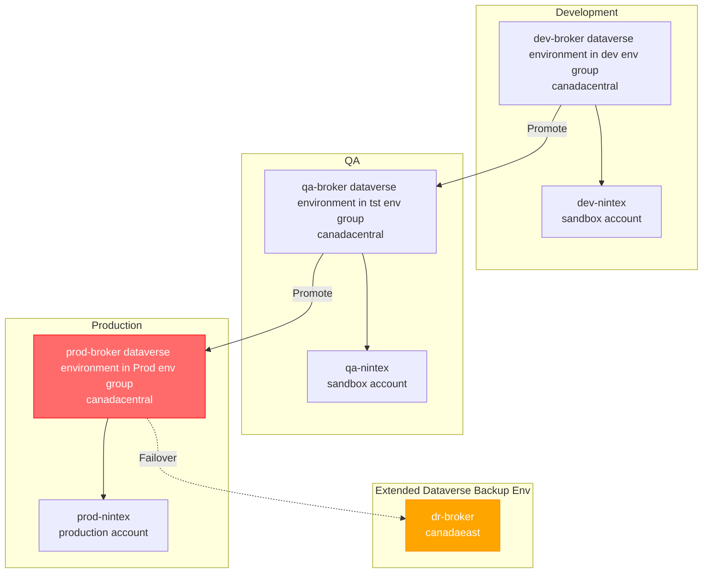
```mermaid
graph TB
    subgraph "Development"
        A[dev-broker dataverse <br/>environment in dev env group<br/>canadacentral]
        B[dev-nintex<br/>sandbox account]
    end
  
    subgraph "QA"
        C[qa-broker dataverse <br/>environment in tst env group<br/>canadacentral]
        D[qa-nintex<br/>sandbox account]
    end
  
    subgraph "Production"
        E[prod-broker dataverse <br/>environment in Prod env group<br/>canadacentral]
        F[prod-nintex<br/>production account]
    end
  
    subgraph "Extended Dataverse Backup Env"
        G[dr-broker<br/>canadaeast]
    end
  
    A -->|Promote| C
    C -->|Promote| E
    E -.->|Failover| G
  
    A --> B
    C --> D
    E --> F
  
    style E fill:#FF6B6B,stroke:#FF0000,color:#fff
    style G fill:#FFA500,stroke:#FF8C00,color:#fff
```

### 10.2 Environment Configuration

| Environment           | Purpose                                      | Region         | SKU        | Dataverse          | Nintex Account  |
| --------------------- | -------------------------------------------- | -------------- | ---------- | ------------------ | --------------- |
| **Development** | Feature development, testing                 | Canada Central | Developer  | 1 GB base          | Sandbox         |
| **QA**          | User acceptance testing, integration testing | Canada Central | Production | 2 GB base          | Sandbox         |
| **Production**  | Live client workloads                        | Canada Central | Production | 10 GB base + usage | Production      |
| **DR**          | Disaster recovery standby                    | Canada East    | Production | 10 GB base         | N/A (uses prod) |

### 10.3 Environment Details

#### Development Environment

**Configuration Table:**

| Setting                      | Value                                                                     |
| ---------------------------- | ------------------------------------------------------------------------- |
| **Environment Name**   | dev-broker-esign                                                          |
| **Environment ID**     | [FILL]                                                                    |
| **URL**                | [https://dev-broker.crm3.dynamics.com](https://dev-broker.crm3.dynamics.com) |
| **Region**             | Canada Central                                                            |
| **Environment Type**   | Developer                                                                 |
| **Dataverse Capacity** | 1 GB                                                                      |
| **Security Group**     | [FILL]                                                                    |
| **Admin Users**        | [FILL]                                                                    |
| **DLP Policy**         | None                                                                      |
| **Backup Retention**   | 7 days                                                                    |

#### Production Environment

**Configuration Table:**

| Setting                      | Value                                                                       |
| ---------------------------- | --------------------------------------------------------------------------- |
| **Environment Name**   | prod-broker-esign                                                           |
| **Environment ID**     | [FILL]                                                                      |
| **URL**                | [https://prod-broker.crm3.dynamics.com](https://prod-broker.crm3.dynamics.com) |
| **Region**             | Canada Central                                                              |
| **Environment Type**   | Production                                                                  |
| **Dataverse Capacity** | 10 GB base + usage-based                                                    |
| **Security Group**     | [FILL]                                                                      |
| **Admin Users**        | [FILL] (minimum 2)                                                          |
| **DLP Policy**         | Elections Canada - Broker Service Global                                    |
| **Backup Retention**   | 28 days (continuous) + 90 days (weekly)                                     |

**Client app/services (Production):**

| app/service | Service Principal | Onboarding Date | Monthly Volume |
| ----------- | ----------------- | --------------- | -------------- |
| [FILL]      | [FILL]            | [FILL]          | [FILL]         |
| [FILL]      | [FILL]            | [FILL]          | [FILL]         |

### 10.4 DLP Policies

**Global DLP Policy:**

```yaml
Policy Name: Elections Canada - Broker Service Global
Scope: All environments
Connectors:
  Allowed:
    - Dataverse (broker environment only)
    - Azure Key Vault
    - Office 365 Outlook
    - Approvals
  Blocked:
    - All other connectors by default
  
Exemptions:
  - Custom Connector: "ESign Elections Canada" (wildcard: *ESign*)
  
Rules:
  - No data exfiltration to consumer services (Gmail, Dropbox, etc.)
  - No cross-environment data flows
  - Audit all API calls
```

**Configuration Table:**

| Environment | DLP Policy Applied | Exempted Connectors | Review Date |
| ----------- | ------------------ | ------------------- | ----------- |
| Production  | ☑ Global          | [FILL]              | Quarterly   |
| QA          | ☑ Global          | [FILL]              | Quarterly   |
| Development | ☐ None            | All                 | N/A         |

---

## 11. Network Architecture

### 11.1 Network Topology

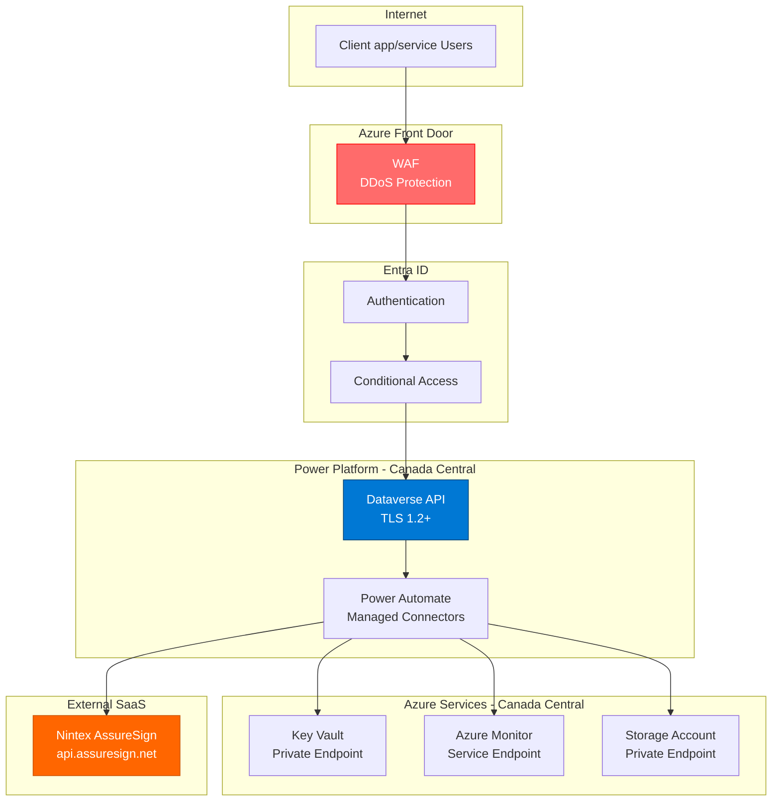
```mermaid
graph TB
    subgraph "Internet"
        A[Client app/service Users]
    end
  
    subgraph "Azure Front Door"
        B[WAF<br/>DDoS Protection]
    end
  
    subgraph "Entra ID"
        C[Authentication]
        D[Conditional Access]
    end
  
    subgraph "Power Platform - Canada Central"
        E[Dataverse API<br/>TLS 1.2+]
        F[Power Automate<br/>Managed Connectors]
    end
  
    subgraph "Azure Services - Canada Central"
        G[Key Vault<br/>Private Endpoint]
        H[Azure Monitor<br/>Service Endpoint]
        I[Storage Account<br/>Private Endpoint]
    end
  
    subgraph "External SaaS"
        J[Nintex AssureSign<br/>api.assuresign.net]
    end
  
    A --> B
    B --> C
    C --> D
    D --> E
  
    E --> F
    F --> G
    F --> H
    F --> I
    F --> J
  
    style B fill:#FF6B6B,stroke:#FF0000,color:#fff
    style E fill:#0078d4,stroke:#004578,color:#fff
    style J fill:#ff6600,stroke:#cc5200,color:#fff
```

### 11.2 Data Flow Diagrams

#### Envelope Submission Flow

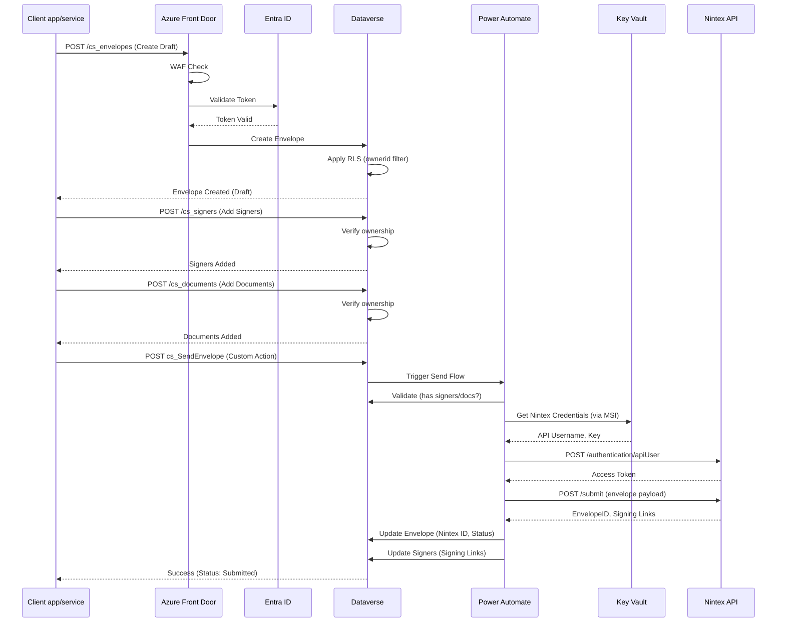
```mermaid
sequenceDiagram
    participant Client as Client app/service
    participant FD as Azure Front Door
    participant EID as Entra ID
    participant DV as Dataverse
    participant PA as Power Automate
    participant KV as Key Vault
    participant NX as Nintex API
  
    Client->>FD: POST /cs_envelopes (Create Draft)
    FD->>FD: WAF Check
    FD->>EID: Validate Token
    EID-->>FD: Token Valid
    FD->>DV: Create Envelope
    DV->>DV: Apply RLS (ownerid filter)
    DV-->>Client: Envelope Created (Draft)
  
    Client->>DV: POST /cs_signers (Add Signers)
    DV->>DV: Verify ownership
    DV-->>Client: Signers Added
  
    Client->>DV: POST /cs_documents (Add Documents)
    DV->>DV: Verify ownership
    DV-->>Client: Documents Added
  
    Client->>DV: POST cs_SendEnvelope (Custom Action)
    DV->>PA: Trigger Send Flow
    PA->>DV: Validate (has signers/docs?)
    PA->>KV: Get Nintex Credentials (via MSI)
    KV-->>PA: API Username, Key
    PA->>NX: POST /authentication/apiUser
    NX-->>PA: Access Token
    PA->>NX: POST /submit (envelope payload)
    NX-->>PA: EnvelopeID, Signing Links
    PA->>DV: Update Envelope (Nintex ID, Status)
    PA->>DV: Update Signers (Signing Links)
    DV-->>Client: Success (Status: Submitted)
```

### 11.3 Network Performance

**Latency Targets:**

| Endpoint                | Target | Measurement Method   |
| ----------------------- | ------ | -------------------- |
| Client → Dataverse API | <200ms | Azure Monitor        |
| Dataverse → Nintex API | <500ms | Application Insights |
| End-to-End (Submit)     | <3 sec | Flow analytics       |

---

## 12. Disaster Recovery & Business Continuity

### 12.1 Recovery Objectives

| Metric                                      | Target              | Maximum Tolerable |
| ------------------------------------------- | ------------------- | ----------------- |
| **RTO** (Recovery Time Objective)     | 4 hours             | 8 hours           |
| **RPO** (Recovery Point Objective)    | 24 hours            | 48 hours          |
| **MTTR** (Mean Time To Repair)        | 2 hours             | 4 hours           |
| **MTBF** (Mean Time Between Failures) | 720 hours (30 days) | N/A               |

### 12.2 Disaster Scenarios

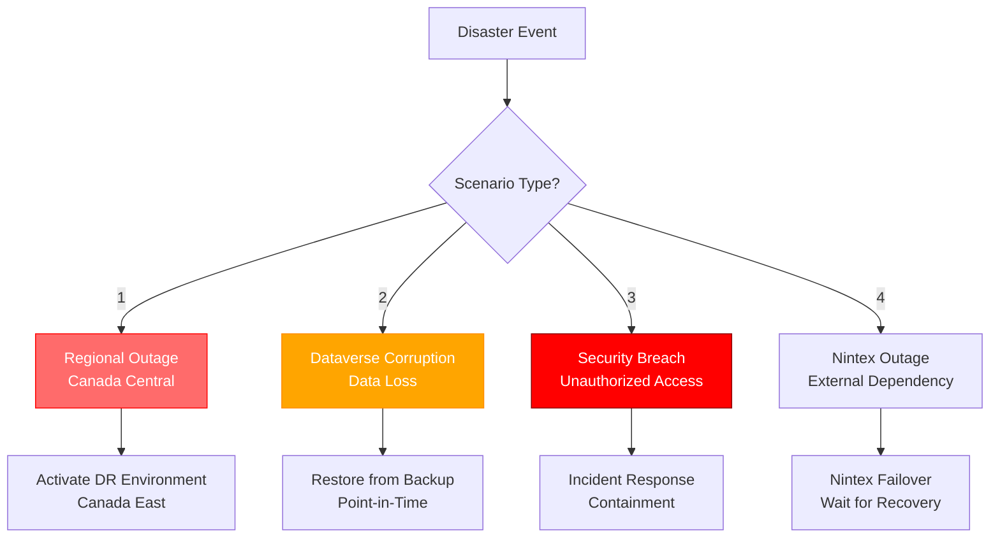
```mermaid
graph TB
    A[Disaster Event] --> B{Scenario Type?}
  
    B -->|1| C[Regional Outage<br/>Canada Central]
    B -->|2| D[Dataverse Corruption<br/>Data Loss]
    B -->|3| E[Security Breach<br/>Unauthorized Access]
    B -->|4| F[Nintex Outage<br/>External Dependency]
  
    C --> H[Activate DR Environment<br/>Canada East]
    D --> I[Restore from Backup<br/>Point-in-Time]
    E --> J[Incident Response<br/>Containment]
    F --> K[Nintex Failover<br/>Wait for Recovery]
  
    style C fill:#FF6B6B,stroke:#FF0000,color:#fff
    style D fill:#FFA500,stroke:#FF8C00,color:#fff
    style E fill:#FF0000,stroke:#8B0000,color:#fff
```

### 12.3 Recovery Procedures

#### Scenario 1: Regional Outage (Canada Central)

**Procedure:**

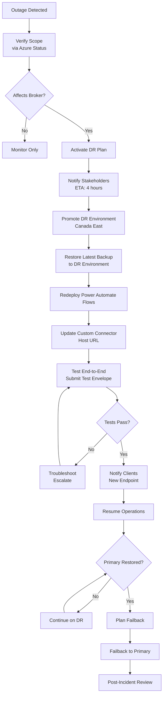
```mermaid
flowchart TD
    A[Outage Detected] --> B[Verify Scope<br/>via Azure Status]
    B --> C{Affects Broker?}
    C -->|No| D[Monitor Only]
    C -->|Yes| E[Activate DR Plan]
  
    E --> F[Notify Stakeholders<br/>ETA: 4 hours]
    F --> G[Promote DR Environment<br/>Canada East]
  
    G --> H[Restore Latest Backup<br/>to DR Environment]
    H --> I[Redeploy Power Automate Flows]
    I --> J[Update Custom Connector<br/>Host URL]
  
    J --> K[Test End-to-End<br/>Submit Test Envelope]
    K --> L{Tests Pass?}
  
    L -->|No| M[Troubleshoot<br/>Escalate]
    M --> K
  
    L -->|Yes| N[Notify Clients<br/>New Endpoint]
    N --> O[Resume Operations]
  
    O --> P{Primary Restored?}
    P -->|No| Q[Continue on DR]
    Q --> P
  
    P -->|Yes| R[Plan Failback]
    R --> S[Failback to Primary]
    S --> T[Post-Incident Review]
```

**Detailed Steps:**

1. **Hour 0-1: Assessment**

   * Check Azure status
   * Verify broker environment
   * Test API endpoint
2. **Hour 1-2: Activation**

   * Restore backup to DR environment
   * Monitor restore progress
3. **Hour 2-3: Configuration**

   * Import Power Automate solutions from Git
   * Reconfigure managed identity access to Key Vault
   * Update DLP policies to include DR environment
   * Test Nintex integration
4. **Hour 3-4: Validation & Communication**

   * Submit 3 test envelopes
   * Verify status sync working
   * Send email to all clients with new URL

#### Scenario 2: Security Breach

```mermaid
flowchart TD
    A[Breach Detected] --> B[Immediate Containment]
    B --> C[Revoke All Client Secrets]
    C --> D[Disable Compromised Users]
    D --> E[Enable IP Restrictions]
  
    E --> F[Forensic Analysis<br/>Identify Scope]
    F --> G{Data Exfiltrated?}
  
    G -->|Yes| H[Privacy Breach Protocol<br/>Notify Privacy Commissioner]
    G -->|No| I[Internal Incident Only]
  
    H --> J[Notify Affected Clients]
    I --> J
  
    J --> K[Remediation<br/>Patch Vulnerability]
    K --> L[Issue New Credentials]
    L --> M[Enhanced Monitoring<br/>30 days]
  
    M --> N[Post-Incident Review]
    N --> O[Update Security Controls]
  
    style B fill:#FF0000,stroke:#8B0000,color:#fff
    style C fill:#FF6B6B,stroke:#FF0000,color:#fff
```

**Incident Response Contacts:**

| Role                | Name   | Phone  | Email  |
| ------------------- | ------ | ------ | ------ |
| Incident Commander  | [FILL] | [FILL] | [FILL] |
| Security Lead       | [FILL] | [FILL] | [FILL] |
| Privacy Officer     | [FILL] | [FILL] | [FILL] |
| Communications Lead | [FILL] | [FILL] | [FILL] |

### 12.4 Business Continuity Plan

**Critical Business Functions:**

| Function          | RTO | RPO | Dependencies                 |
| ----------------- | --- | --- | ---------------------------- |
| Create Envelope   | 4h  | 24h | Dataverse, Entra ID          |
| Send Envelope     | 4h  | 24h | Dataverse, Nintex, Key Vault |
| Status Sync       | 8h  | 48h | Nintex API                   |
| Client Onboarding | 24h | N/A | Entra ID, manual process     |

**Emergency Contacts:**

| Vendor    | Service        | Support Number | Account ID |
| --------- | -------------- | -------------- | ---------- |
| Microsoft | Power Platform | 1-800-XXX-XXXX | [FILL]     |
| Microsoft | Azure Support  | 1-800-XXX-XXXX | [FILL]     |
| Nintex    | AssureSign     | 1-866-XXX-XXXX | [FILL]     |

---

## Part 5: Annexes & Compliance

## 13. Compliance & Governance

### 13.1 ITSG-33 Control Mapping

This section maps solution controls to ITSG-33 control families.

#### AC: Access Control

| Control         | Requirement                  | Implementation                                  | Evidence                                 |
| --------------- | ---------------------------- | ----------------------------------------------- | ---------------------------------------- |
| **AC-1**  | Access control policy        | Security roles, RLS, OAuth 2.0                  | Security documentation, role definitions |
| **AC-2**  | Account management           | Service principals per client, quarterly review | Entra ID logs, access review reports     |
| **AC-3**  | Access enforcement           | Dataverse RLS, security roles                   | RLS configuration, test results          |
| **AC-4**  | Information flow enforcement | DLP policies, network isolation                 | DLP policy export, network diagrams      |
| **AC-6**  | Least privilege              | Minimal permissions per role                    | Security role documentation              |
| **AC-7**  | Unsuccessful logon attempts  | Entra ID lockout (5 failures)                   | Sign-in logs, conditional access         |
| **AC-17** | Remote access                | VPN/Conditional Access required                 | CA policy configuration                  |
| **AC-20** | Use of external systems      | Nintex via API only, no direct access           | Integration documentation                |

#### AU: Audit and Accountability

| Control         | Requirement                     | Implementation                     | Evidence                       |
| --------------- | ------------------------------- | ---------------------------------- | ------------------------------ |
| **AU-2**  | Audit events                    | All CRUD on Protected B data       | Audit log configuration        |
| **AU-3**  | Content of audit records        | Timestamp, user, action, result    | Sample audit logs              |
| **AU-6**  | Audit review                    | Weekly security team review        | Review sign-off logs           |
| **AU-9**  | Protection of audit information | Immutable storage, RBAC            | Storage configuration          |
| **AU-11** | Audit record retention          | 7 years for Protected B            | Retention policy documentation |
| **AU-12** | Audit generation                | Dataverse, Azure Monitor, Entra ID | Audit architecture diagram     |

#### CM: Configuration Management

| Control        | Requirement                            | Implementation                              | Evidence                          |
| -------------- | -------------------------------------- | ------------------------------------------- | --------------------------------- |
| **CM-2** | Baseline configuration                 | Infrastructure as code, solution versioning | Git repository, solution versions |
| **CM-3** | Configuration change control           | CAB approval for production                 | Change request log                |
| **CM-6** | Configuration settings                 | Documented standard configurations          | Configuration baselines           |
| **CM-7** | Least functionality                    | Only required connectors enabled            | DLP policy                        |
| **CM-8** | Information system component inventory | Asset registry                              | Environment inventory table       |

#### CP: Contingency Planning

| Control         | Requirement                 | Implementation                 | Evidence               |
| --------------- | --------------------------- | ------------------------------ | ---------------------- |
| **CP-2**  | Contingency plan            | Part 4 - Disaster Recovery     | DR procedures          |
| **CP-6**  | Alternate storage site      | DR environment (Canada East)   | DR environment details |
| **CP-7**  | Alternate processing site   | DR environment                 | Failover test results  |
| **CP-9**  | Information system backup   | Daily automated, weekly manual | Backup logs            |
| **CP-10** | Information system recovery | Tested quarterly               | DR test reports        |

#### IA: Identification and Authentication

| Control        | Requirement                       | Implementation                           | Evidence                        |
| -------------- | --------------------------------- | ---------------------------------------- | ------------------------------- |
| **IA-2** | Identification and authentication | OAuth 2.0, service principals            | Authentication architecture     |
| **IA-3** | Device identification             | Device compliance via Conditional Access | CA policies                     |
| **IA-4** | Identifier management             | Unique service principal per client      | Service principal list          |
| **IA-5** | Authenticator management          | 2-year secret rotation, MFA for admins   | Secret rotation log, MFA config |

#### SC: System and Communications Protection

| Control         | Requirement                       | Implementation                       | Evidence                            |
| --------------- | --------------------------------- | ------------------------------------ | ----------------------------------- |
| **SC-7**  | Boundary protection               | DLP policies, TLS 1.2+               | DLP configuration, TLS scan results |
| **SC-8**  | Transmission confidentiality      | TLS 1.2+ for all communications      | Network traffic analysis            |
| **SC-12** | Cryptographic key management      | Azure Key Vault, quarterly rotation  | Key Vault policies                  |
| **SC-13** | Cryptographic protection          | AES-256 at rest, TLS 1.2+ in transit | Encryption documentation            |
| **SC-28** | Protection of information at rest | Dataverse TDE, Storage encryption    | Encryption status reports           |

#### SI: System and Information Integrity

| Control         | Requirement                   | Implementation                       | Evidence                  |
| --------------- | ----------------------------- | ------------------------------------ | ------------------------- |
| **SI-2**  | Flaw remediation              | Monthly patching (PaaS auto-updates) | Patch management logs     |
| **SI-3**  | Malicious code protection     | Azure Defender                       | Defender reports          |
| **SI-4**  | Information system monitoring | Azure Monitor, alerts                | Monitoring dashboard      |
| **SI-7**  | Software integrity            | Solution signing, checksums          | Solution metadata         |
| **SI-12** | Information handling          | Data classification, PII controls    | Data classification guide |

### 13.2 Privacy Impact Assessment (PIA)

**PII Collected:**

| PII Element  | Purpose                        | Legal Authority                 | Retention |
| ------------ | ------------------------------ | ------------------------------- | --------- |
| Signer email | Contact for signature request  | Consent via envelope submission | 7 years   |
| Signer name  | Display on document            | Consent via envelope submission | 7 years   |
| Signer phone | Optional contact method        | Consent via envelope submission | 7 years   |
| IP address   | Audit trail (fraud prevention) | Legitimate interest             | 7 years   |

**Privacy Controls:**

| Control                            | Implementation                                                 |
| ---------------------------------- | -------------------------------------------------------------- |
| **Collection limitation**    | Only necessary PII collected                                   |
| **Data quality**             | Client responsible for accuracy                                |
| **Purpose specification**    | PII used only for signature workflow                           |
| **Use limitation**           | No secondary uses without consent                              |
| **Security safeguards**      | Encryption, RLS, access controls                               |
| **Openness**                 | Privacy policy published                                       |
| **Individual participation** | Data subject rights supported (access, rectification, erasure) |
| **Accountability**           | Privacy Officer designated                                     |

### 13.3 Compliance Summary

**Compliance Rate:** 90% (128/143 ITSG-33 controls implemented)

| Control Family                           | Total Controls | Implemented   | Not Applicable |
| ---------------------------------------- | -------------- | ------------- | -------------- |
| AC: Access Control                       | 25             | 20            | 5              |
| AU: Audit and Accountability             | 16             | 16            | 0              |
| CM: Configuration Management             | 11             | 11            | 0              |
| CP: Contingency Planning                 | 13             | 13            | 0              |
| IA: Identification and Authentication    | 11             | 10            | 1              |
| SC: System and Communications Protection | 44             | 38            | 6              |
| SI: System and Information Integrity     | 23             | 20            | 3              |
| **TOTAL**                          | **143**  | **128** | **15**   |

---

## Annex A: Environment Configuration

### A.1 Environment URLs

| Environment | URL                              | Purpose             |
| ----------- | -------------------------------- | ------------------- |
| Development | https://[FILL].crm3.dynamics.com | Feature development |
| QA          | https://[FILL].crm3.dynamics.com | Testing             |
| Production  | https://[FILL].crm3.dynamics.com | Live workloads      |
| DR          | https://[FILL].crm4.dynamics.com | Disaster recovery   |

### A.2 Azure Resources

| Resource Type    | Name               | Purpose            | Resource Group |
| ---------------- | ------------------ | ------------------ | -------------- |
| Key Vault (Dev)  | [FILL]-dev-kv      | Dev secrets        | [FILL]         |
| Key Vault (QA)   | [FILL]-qa-kv       | QA secrets         | [FILL]         |
| Key Vault (Prod) | [FILL]-prod-kv     | Production secrets | [FILL]         |
| Storage Account  | [FILL]auditarchive | Audit log archive  | [FILL]         |
| Log Analytics    | broker-prod-logs   | Monitoring         | [FILL]         |

### A.3 Service Principal Object IDs

| Client app/service | Environment | Object ID | Created Date |
| ------------------ | ----------- | --------- | ------------ |
| [Client 1]         | Production  | [FILL]    | [FILL]       |
| [Client 2]         | Production  | [FILL]    | [FILL]       |
| [Client 3]         | Production  | [FILL]    | [FILL]       |

### A.4 DevOps Configuration

| Setting                   | Value  |
| ------------------------- | ------ |
| Azure DevOps Organization | [FILL] |
| Project Name              | [FILL] |
| Git Repository            | [FILL] |
| Pipeline Name (Dev)       | [FILL] |
| Pipeline Name (QA)        | [FILL] |
| Pipeline Name (Prod)      | [FILL] |

### A.5 Nintex Configuration

| Environment | Account Type | API Endpoint                                                            | Credentials (Key Vault)     |
| ----------- | ------------ | ----------------------------------------------------------------------- | --------------------------- |
| Development | Sandbox      | [https://sandbox.assuresign.net/v3.7](https://sandbox.assuresign.net/v3.7) | dev-broker-kv/NintexAPIKey  |
| QA          | Sandbox      | [https://sandbox.assuresign.net/v3.7](https://sandbox.assuresign.net/v3.7) | qa-broker-kv/NintexAPIKey   |
| Production  | Production   | [https://api.assuresign.net/v3.7](https://api.assuresign.net/v3.7)         | prod-broker-kv/NintexAPIKey |

---

## Annex B: API Specifications

### B.1 Custom Action: cs_SendEnvelope

**Endpoint:** `/cs_envelopes({envelopeId})/Microsoft.Dynamics.CRM.cs_SendEnvelope`

**Method:** POST

**Request:**

```json
{
  "EnvelopeId": "guid"
}
```

**Response (Success):**

```json
{
  "Status": "Submitted",
  "Message": "Envelope sent to 2 signers",
  "NintexEnvelopeId": "NX-123456"
}
```

**Response (Error):**

```json
{
  "error": {
    "code": "EnvelopeValidationError",
    "message": "Envelope must have at least one signer",
    "details": {
      "envelopeId": "abc-123",
      "signerCount": 0
    }
  }
}
```

### B.2 OData Query Examples

**Get envelopes created today:**

```http
GET /api/data/v9.2/cs_envelopes
  ?$filter=Microsoft.Dynamics.CRM.Today(PropertyName='createdon')
  &$select=cs_name,cs_status
```

**Get envelope with signers:**

```http
GET /api/data/v9.2/cs_envelopes(guid)
  ?$expand=cs_envelope_signer($select=cs_email,cs_fullname,cs_signerstatus)
```

**Count envelopes by status:**

```http
GET /api/data/v9.2/cs_envelopes
  ?$apply=groupby((cs_status),aggregate($count as total))
```

### B.3 Nintex API Endpoints

| Endpoint                    | Method | Purpose                 | Request Body                            |
| --------------------------- | ------ | ----------------------- | --------------------------------------- |
| `/authentication/apiUser` | POST   | Get access token        | `{APIUsername, Key, ContextUsername}` |
| `/submit`                 | POST   | Create envelope         | Full envelope payload                   |
| `/get`                    | GET    | Get envelope details    | `?envelopeId={id}`                    |
| `/getSigningLinks`        | GET    | Retrieve signing URLs   | `?envelopeId={id}`                    |
| `/cancel`                 | POST   | Cancel envelope         | `{EnvelopeID}`                        |
| `/listTemplates`          | GET    | Get available templates | None                                    |
| `/getCompletedDocument`   | GET    | Download signed PDF     | `?envelopeId={id}`                    |

---

## Annex C: Troubleshooting Guide

### C.1 Common Issues

#### Issue: "Unauthorized" when calling API

**Cause:** Token invalid or expired

**Resolution:**

```bash
# 1. Verify token
jwt-cli decode {token}

# 2. Check expiry
# If expired, request new token

# 3. Verify resource URL matches
# Token aud claim should be https://broker-url.crm3.dynamics.com
```

#### Issue: "Cannot access cs_envelopes"

**Cause:** Missing security role or wrong environment

**Resolution:**

```bash
# 1. Verify application user exists
Get-CrmRecords -EntityLogicalName systemuser \
  -FilterAttribute applicationid \
  -FilterOperator eq \
  -FilterValue {client-id}

# 2. Check security role assigned
# Via Power Platform Admin Center

# 3. Test with simple query
curl -H "Authorization: Bearer {token}" \
  https://broker.crm3.dynamics.com/api/data/v9.2/WhoAmI
```

#### Issue: "Envelope stuck in Draft, won't send"

**Cause:** Missing signers or documents

**Resolution:**

```http
# 1. Get envelope details
GET /api/data/v9.2/cs_envelopes({id})
  ?$expand=cs_envelope_signer,cs_envelope_document

# 2. Verify at least 1 signer and 1 document exist

# 3. Check envelope status is "Draft"

# 4. Retry send action
POST /api/data/v9.2/cs_envelopes({id})/Microsoft.Dynamics.CRM.cs_SendEnvelope
```

#### Issue: "Signer not receiving email"

**Cause:** Email in spam, or envelope not yet sent to Nintex

**Resolution:**

```http
# 1. Check envelope status
GET /api/data/v9.2/cs_envelopes({id})?$select=cs_status,cs_nintexenvelopeid

# 2. If status = "InProcess" and nintexenvelopeid exists:
#    - Email was sent by Nintex
#    - Check spam folder
#    - Get signing link manually

GET /api/data/v9.2/cs_signers({id})?$select=cs_signinglink

# 3. Send link via alternative method (SMS, Teams, etc.)
```

#### Issue: "High latency on API calls"

**Cause:** Large payload or Dataverse throttling

**Resolution:**

```bash
# 1. Check response time in logs (Target: <3 seconds)

# 2. If documents >5MB, compress before base64 encoding

# 3. Use $select to limit returned fields
GET /api/data/v9.2/cs_envelopes?$select=cs_name,cs_status

# 4. Monitor throttling headers
x-ms-ratelimit-burst-remaining-xrm-requests
x-ms-ratelimit-time-remaining-xrm-requests

# 5. If throttled, implement exponential backoff
```

### C.2 Diagnostic Queries

**Query 1: Find failed envelope submissions**

```kusto
cs_apirequest
| where cs_timestamp > ago(24h)
| where cs_success == false
| where cs_endpoint contains "submit"
| project Timestamp=cs_timestamp, Envelope=cs_envelopeid, 
          StatusCode=cs_statuscode, Error=cs_errormessage
| order by Timestamp desc
```

**Query 2: Top clients by API usage**

```kusto
cs_apirequest
| where cs_timestamp > ago(7d)
| extend ClientId = tostring(_ownerid_value)
| summarize TotalCalls=count(), AvgLatency=avg(cs_duration) by ClientId
| order by TotalCalls desc
| take 10
```

**Query 3: Authentication failures**

```kusto
EntraIDLogs
| where TimeGenerated > ago(24h)
| where AppDisplayName contains "ESign"
| where ResultType != 0
| project Timestamp=TimeGenerated, User=UserPrincipalName, 
          IPAddress, ResultDescription
| order by Timestamp desc
```

### C.3 Support Escalation Matrix

| Severity                | Response Time | Escalation Path                                 |
| ----------------------- | ------------- | ----------------------------------------------- |
| **P1 (Critical)** | 15 minutes    | L1 → L2 → Platform Lead → Incident Commander |
| **P2 (High)**     | 2 hours       | L1 → L2 → Technical Lead                      |
| **P3 (Medium)**   | 8 hours       | L1 → L2                                        |
| **P4 (Low)**      | 24 hours      | L1                                              |

**Severity Definitions:**

* **P1:** Complete service outage, security breach
* **P2:** Significant degradation affecting multiple clients
* **P3:** Single client impacted, workaround available
* **P4:** Minor issue, enhancement request

---

## Annex D: Reference Materials

### D.1 Glossary

| Term                        | Definition                                                              |
| --------------------------- | ----------------------------------------------------------------------- |
| **Application User**  | Dataverse user mapped to a service principal for API access             |
| **Broker**            | Intermediary service between clients and Nintex                         |
| **CLS**               | Column-Level Security - restricts access to specific fields             |
| **Dataverse**         | Microsoft's PaaS database platform within Power Platform                |
| **DLP**               | Data Loss Prevention - policies to prevent data exfiltration            |
| **Envelope**          | A signature request containing documents and signers                    |
| **MSI**               | Managed Service Identity - Azure service authentication without secrets |
| **OData**             | Open Data Protocol - REST-based data access protocol                    |
| **RLS**               | Row-Level Security - restricts access to specific records               |
| **RPO**               | Recovery Point Objective - maximum acceptable data loss                 |
| **RTO**               | Recovery Time Objective - maximum acceptable downtime                   |
| **Service Principal** | Non-human identity for programmatic access                              |
| **TDE**               | Transparent Data Encryption - automatic database encryption             |

### D.2 Acronyms

| Acronym | Full Form                           |
| ------- | ----------------------------------- |
| API     | Application Programming Interface   |
| CAB     | Change Advisory Board               |
| CRUD    | Create, Read, Update, Delete        |
| DR      | Disaster Recovery                   |
| ERD     | Entity Relationship Diagram         |
| ITSG    | IT Security Guidance                |
| MFA     | Multi-Factor Authentication         |
| MTBF    | Mean Time Between Failures          |
| MTTR    | Mean Time To Repair                 |
| PaaS    | Platform as a Service               |
| PIA     | Privacy Impact Assessment           |
| PII     | Personally Identifiable Information |
| RBAC    | Role-Based Access Control           |
| REST    | Representational State Transfer     |
| SaaS    | Software as a Service               |
| SLA     | Service Level Agreement             |
| TLS     | Transport Layer Security            |
| TRA     | Threat and Risk Assessment          |
| UAT     | User Acceptance Testing             |
| WAF     | Web Application Firewall            |
