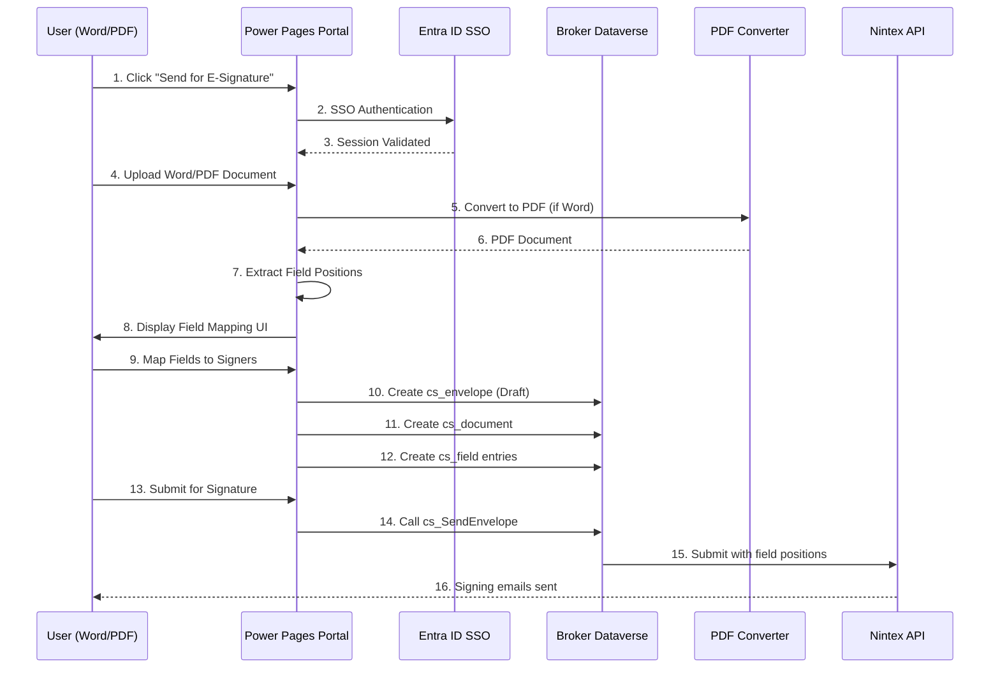
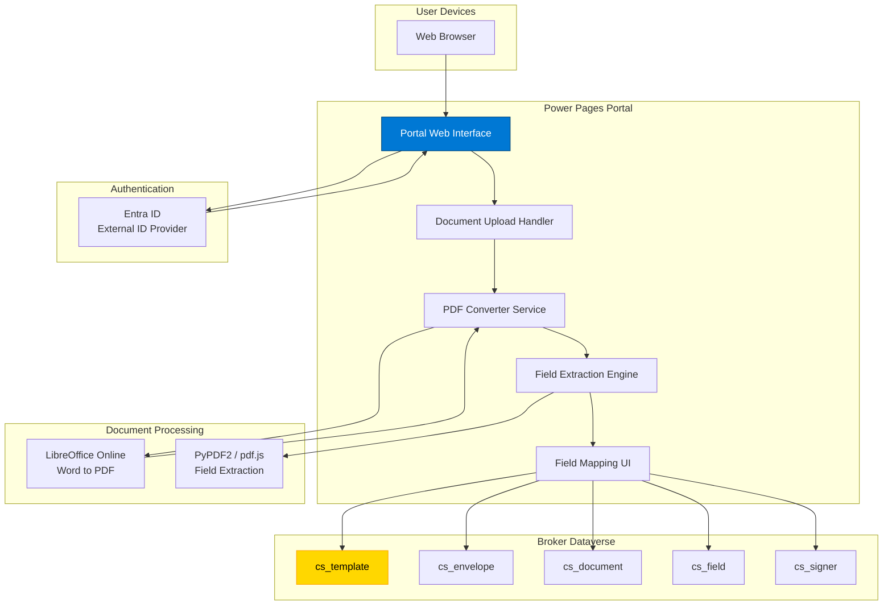
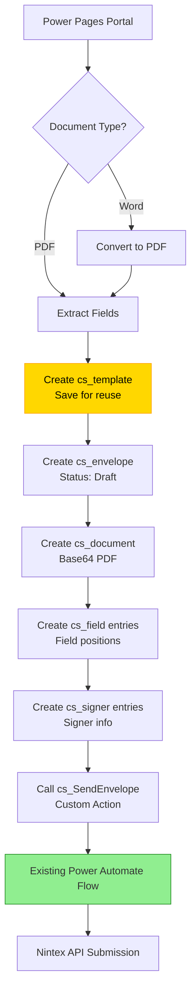
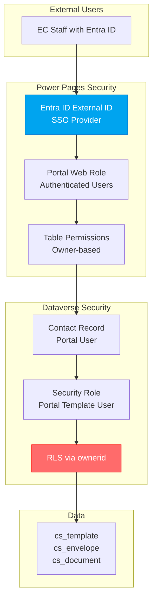
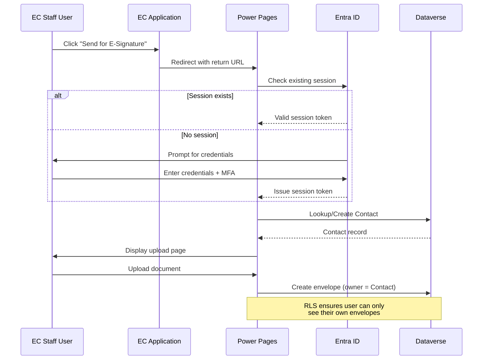
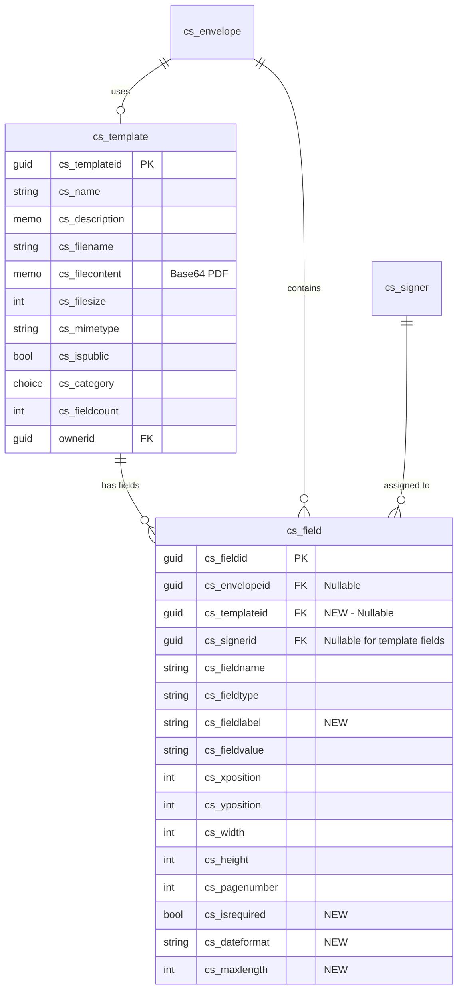

# ESign Elections Canada - Build Book
## Document Templating & Power Pages Portal Integration

**Version:** 1.0  
**Classification:** Protected B  
**Last Updated:** February 2026  
**Document Owner:** Platform Engineering Team  
**Author:** Frederick Pearson

---

## Document Control

| Version | Date | Author | Changes |
|---------|------|--------|---------|
| 1.0 | February 2026 | Frederick Pearson | Initial release - Templating feature |

### Approvals

| Role | Name | Signature | Date |
|------|------|-----------|------|
| Solution Architect | [NAME] | | |
| Security Lead | [NAME] | | |
| Platform Owner | [NAME] | | |

---

## Table of Contents

1. [Executive Summary](#1-executive-summary)
2. [Feature Overview](#2-feature-overview)
3. [Architecture & Design](#3-architecture--design)
4. [Power Pages Portal Design](#4-power-pages-portal-design)
5. [Document Processing Pipeline](#5-document-processing-pipeline)
6. [Integration with Broker Service](#6-integration-with-broker-service)
7. [Security & Access Control](#7-security--access-control)
8. [Data Model Extensions](#8-data-model-extensions)
9. [Implementation Guide](#9-implementation-guide)
10. [Testing & Validation](#10-testing--validation)
11. [Deployment Procedures](#11-deployment-procedures)
12. [Operations & Support](#12-operations--support)

**Annexes:**
- Annex A: Power Pages Configuration
- Annex B: Document Conversion Specifications
- Annex C: Field Mapping Schema
- Annex D: API Endpoints

---

## 1. Executive Summary

### 1.1 Purpose

This build book provides comprehensive technical guidance for implementing the **Document Templating Feature** for the ESign Elections Canada Broker Service. This feature enables users to:

1. Create Word/PDF templates with Nintex signature fields
2. Upload documents via a secure Power Pages portal
3. Automatically convert documents to PDF
4. Map template fields to Nintex signature positions
5. Send documents for e-signature via the existing broker

### 1.2 Scope

**In Scope:**
- Power Pages portal for document upload
- Entra ID SSO integration (session-based)
- Word-to-PDF conversion engine
- PDF field extraction and mapping
- Integration with existing cs_envelope workflow
- Template library management
- Field position mapping UI

**Out of Scope:**
- Direct Nintex template creation (use Nintex portal)
- Advanced PDF editing capabilities
- Batch document processing
- Mobile app development

### 1.3 Business Value

| Benefit | Description | Impact |
|---------|-------------|--------|
| **User Empowerment** | Users create their own templates | Reduced IT dependency |
| **Flexibility** | Support for Word and PDF templates | Broader use cases |
| **Speed** | No manual Nintex template creation | Faster time-to-signature |
| **Consistency** | Standardized field mapping | Fewer errors |
| **Self-Service** | Portal-based workflow | Lower support overhead |

### 1.4 High-Level Solution Flow



---

## 2. Feature Overview

### 2.1 User Journey

**Step 1: Template Creation (External)**
- User creates Word or PDF document
- Adds placeholder text for signature fields (e.g., "{{SIGNATURE}}", "{{DATE}}", "{{NAME}}")
- Saves template to local drive

**Step 2: Portal Access**
- User clicks "Send for E-Signature" button (embedded in app)
- Redirected to Power Pages portal
- Automatic SSO via Entra ID (uses existing session)
- Lands on document upload page

**Step 3: Document Upload**
- Drag-and-drop or browse to upload Word/PDF
- Portal validates file type and size (<10MB)
- If Word: Automatic conversion to PDF
- Document stored in Dataverse as base64

**Step 4: Field Mapping**
- Portal extracts text placeholders from PDF
- Displays PDF preview with detected fields highlighted
- User maps each field to:
  - Field type (Signature, Initial, Date, Text, Checkbox)
  - Signer (Signer 1, Signer 2, etc.)
  - Optional: Required/Optional flag

**Step 5: Envelope Configuration**
- User adds signer information (email, name)
- Sets envelope properties (subject, message, expiry)
- Previews final document with field mappings

**Step 6: Submission**
- User clicks "Send for E-Signature"
- Portal creates cs_envelope, cs_document, cs_field, cs_signer records
- Calls cs_SendEnvelope custom action
- Nintex sends signing invitations

### 2.2 Supported Document Types

| Format | Extension | Conversion Required | Max Size | Notes |
|--------|-----------|-------------------|----------|-------|
| PDF | .pdf | No | 10 MB | Native support |
| Word | .docx | Yes → PDF | 10 MB | Uses conversion service |
| Word Legacy | .doc | Yes → PDF | 10 MB | Conversion via LibreOffice |

### 2.3 Supported Field Types

| Field Type | Nintex Equivalent | Description | Validation |
|------------|------------------|-------------|------------|
| Signature | Signature | Full signature capture | Required position |
| Initial | Initial | Initials only | Required position |
| Date | Date Signed | Auto-populated date | Optional format |
| Text | Text Field | Free-form text entry | Max length |
| Checkbox | Checkbox | Boolean selection | None |
| Radio | Radio Button | Single selection | Group name required |

### 2.4 Field Placeholder Syntax

**In Word/PDF Templates:**

```
{{SIGNATURE:1}}     - Signature for Signer 1
{{INITIAL:2}}       - Initials for Signer 2
{{DATE:1}}          - Date for Signer 1
{{TEXT:Name:1}}     - Text field "Name" for Signer 1
{{CHECK:Agree:1}}   - Checkbox "Agree" for Signer 1
```

**Parsing Rules:**
- Format: `{{TYPE:Label:SignerIndex}}`
- Case-insensitive
- Whitespace trimmed
- Label optional for SIGNATURE, INITIAL, DATE
- SignerIndex defaults to 1 if omitted

---

## 3. Architecture & Design

### 3.1 Component Architecture



### 3.2 Integration with Existing Broker

**Existing Broker Flow (from SADD):**
```
Client App → Custom Connector → Entra ID → Dataverse → Power Automate → Nintex
```

**New Templating Flow:**
```
Power Pages Portal → Entra ID → Dataverse → (same Power Automate flows) → Nintex
```

**Key Integration Points:**

1. **Dataverse Tables**: Uses existing cs_envelope, cs_document, cs_field, cs_signer
2. **Custom Action**: Calls existing cs_SendEnvelope action
3. **Authentication**: Shares Entra ID tenant
4. **Security**: Uses same RLS model (portal user = owner)

### 3.3 Technology Stack

| Layer | Technology | Purpose |
|-------|-----------|---------|
| **Portal** | Power Pages | Web interface |
| **Authentication** | Entra ID External ID | SSO integration |
| **Backend** | Dataverse | Data storage |
| **Conversion** | LibreOffice Online API | Word → PDF |
| **PDF Processing** | PDF.js + Custom Parser | Field extraction |
| **File Storage** | Dataverse Attachments | Document storage |
| **Orchestration** | Power Automate (existing) | Nintex submission |

---

## 4. Power Pages Portal Design

### 4.1 Portal Architecture

**Portal Structure:**

```
/templates/
├── /upload              - Document upload page
├── /field-mapping       - Field mapping interface
├── /envelope-config     - Envelope configuration
├── /preview             - Final preview
├── /my-templates        - Template library (saved templates)
└── /help                - User guide
```

### 4.2 Authentication Configuration

**Entra ID External Identity Provider Setup:**

```yaml
Provider Type: OpenID Connect
Authority: https://login.microsoftonline.com/{tenant-id}/v2.0
Client ID: [FILL - Power Pages App Registration]
Client Secret: [FILL - Stored in Key Vault]
Redirect URI: https://{portal-subdomain}.powerappsportals.com/signin-oidc
Scopes: openid, profile, email
Claims Mapping:
  - email → emailaddress1
  - name → fullname
  - oid → externalidentityid
```

**Session Management:**

```javascript
// Leverage existing browser session
// No re-authentication if user already signed into Entra ID
Session Timeout: 8 hours (matches Conditional Access policy)
Idle Timeout: 2 hours
Session Storage: Encrypted cookie
```

### 4.3 Portal Pages Design

#### Page 1: Document Upload (`/upload`)

**Layout:**

```html
<div class="upload-container">
  <h1>Send Document for E-Signature</h1>
  
  <!-- Drag-and-drop zone -->
  <div class="dropzone" id="documentDropzone">
    <i class="icon-upload"></i>
    <p>Drag and drop your Word or PDF document</p>
    <p class="subtitle">or click to browse</p>
    <input type="file" accept=".pdf,.docx,.doc" hidden />
  </div>
  
  <!-- File info display -->
  <div class="file-info" style="display:none">
    <span class="filename"></span>
    <span class="filesize"></span>
    <button class="btn-remove">Remove</button>
  </div>
  
  <!-- Validation messages -->
  <div class="validation-message"></div>
  
  <!-- Actions -->
  <button class="btn-primary" id="btnNext" disabled>
    Next: Map Fields
  </button>
</div>
```

**Client-Side Validation:**

```javascript
// File validation
const MAX_FILE_SIZE = 10 * 1024 * 1024; // 10MB
const ALLOWED_TYPES = ['.pdf', '.docx', '.doc'];

function validateFile(file) {
  if (file.size > MAX_FILE_SIZE) {
    showError('File exceeds 10MB limit');
    return false;
  }
  
  const ext = file.name.substring(file.name.lastIndexOf('.')).toLowerCase();
  if (!ALLOWED_TYPES.includes(ext)) {
    showError('Only PDF and Word documents allowed');
    return false;
  }
  
  return true;
}

// Convert to base64
function convertToBase64(file) {
  return new Promise((resolve, reject) => {
    const reader = new FileReader();
    reader.onload = () => resolve(reader.result.split(',')[1]);
    reader.onerror = reject;
    reader.readAsDataURL(file);
  });
}
```

#### Page 2: Field Mapping (`/field-mapping`)

**Layout:**

```html
<div class="field-mapping-container">
  <h1>Map Signature Fields</h1>
  
  <div class="split-view">
    <!-- Left: PDF Preview -->
    <div class="pdf-preview">
      <canvas id="pdfCanvas"></canvas>
      <!-- Highlighted field overlays -->
      <div class="field-overlays"></div>
    </div>
    
    <!-- Right: Field Configuration -->
    <div class="field-config">
      <h3>Detected Fields (<span id="fieldCount">0</span>)</h3>
      
      <div class="field-list" id="fieldList">
        <!-- Dynamically generated -->
        <div class="field-item" data-field-id="1">
          <div class="field-preview">
            <span class="field-text">{{SIGNATURE:1}}</span>
            <span class="field-page">Page 1</span>
          </div>
          
          <div class="field-mapping">
            <label>Field Type</label>
            <select class="field-type">
              <option value="Signature">Signature</option>
              <option value="Initial">Initial</option>
              <option value="Date">Date</option>
              <option value="Text">Text</option>
              <option value="Checkbox">Checkbox</option>
            </select>
            
            <label>Assign to Signer</label>
            <select class="field-signer">
              <option value="1">Signer 1</option>
              <option value="2">Signer 2</option>
              <!-- Dynamic based on signer count -->
            </select>
            
            <label>
              <input type="checkbox" class="field-required" checked />
              Required field
            </label>
          </div>
        </div>
      </div>
      
      <button class="btn-add-field">+ Add Custom Field</button>
    </div>
  </div>
  
  <div class="actions">
    <button class="btn-secondary" id="btnBack">Back</button>
    <button class="btn-primary" id="btnNext">Next: Configure Envelope</button>
  </div>
</div>
```

**Field Extraction Logic:**

```javascript
// Extract placeholder text from PDF
async function extractFields(pdfDocument) {
  const fields = [];
  const numPages = pdfDocument.numPages;
  
  for (let i = 1; i <= numPages; i++) {
    const page = await pdfDocument.getPage(i);
    const textContent = await page.getTextContent();
    
    // Regex to match {{TYPE:Label:Signer}}
    const fieldRegex = /\{\{([A-Z]+):?([^:}]*):?(\d*)\}\}/gi;
    
    textContent.items.forEach((item, index) => {
      const matches = [...item.str.matchAll(fieldRegex)];
      
      matches.forEach(match => {
        fields.push({
          id: `field_${i}_${index}`,
          type: match[1],  // SIGNATURE, INITIAL, etc.
          label: match[2] || match[1],
          signerIndex: parseInt(match[3]) || 1,
          page: i,
          x: item.transform[4],
          y: item.transform[5],
          width: item.width,
          height: item.height,
          text: match[0]  // Original placeholder
        });
      });
    });
  }
  
  return fields;
}
```

#### Page 3: Envelope Configuration (`/envelope-config`)

**Layout:**

```html
<div class="envelope-config-container">
  <h1>Configure Envelope</h1>
  
  <!-- Signers Section -->
  <div class="signers-section">
    <h3>Signers</h3>
    <div id="signersList">
      <!-- Dynamic signer entries -->
      <div class="signer-entry" data-signer-index="1">
        <h4>Signer 1</h4>
        <input type="email" placeholder="Email" required />
        <input type="text" placeholder="Full Name" required />
        <input type="tel" placeholder="Phone (optional)" />
        <select class="signer-language">
          <option value="en">English</option>
          <option value="fr">Français</option>
        </select>
      </div>
    </div>
    <button class="btn-add-signer">+ Add Another Signer</button>
  </div>
  
  <!-- Envelope Properties -->
  <div class="envelope-props">
    <h3>Envelope Properties</h3>
    
    <label>Subject</label>
    <input type="text" id="envelopeSubject" required 
           placeholder="e.g., Contract for Review" />
    
    <label>Message</label>
    <textarea id="envelopeMessage" rows="4"
              placeholder="Message to signers..."></textarea>
    
    <label>Expiry (Days)</label>
    <input type="number" id="expiryDays" value="30" min="1" max="365" />
    
    <label>Reminder Frequency (Days)</label>
    <input type="number" id="reminderFreq" value="3" min="1" max="30" />
    
    <label>
      <input type="checkbox" id="sequentialSigning" />
      Sequential signing (signers must sign in order)
    </label>
    
    <label>
      <input type="checkbox" id="hideSignerInfo" />
      Hide other signers' information
    </label>
    
    <label>
      <input type="checkbox" id="allowDecline" />
      Allow signers to decline
    </label>
  </div>
  
  <div class="actions">
    <button class="btn-secondary" id="btnBack">Back</button>
    <button class="btn-primary" id="btnPreview">Preview & Send</button>
  </div>
</div>
```

#### Page 4: Preview & Submit (`/preview`)

**Layout:**

```html
<div class="preview-container">
  <h1>Preview & Send</h1>
  
  <div class="preview-summary">
    <div class="document-preview">
      <h3>Document</h3>
      <div class="doc-thumbnail">
        <canvas id="previewCanvas"></canvas>
      </div>
      <p class="doc-name" id="documentName"></p>
      <p class="field-count"><span id="totalFields">0</span> fields mapped</p>
    </div>
    
    <div class="signers-preview">
      <h3>Signers (<span id="signerCount">0</span>)</h3>
      <ul id="signerPreviewList">
        <!-- Dynamic -->
        <li>
          <strong>Signer 1:</strong> John Doe (john.doe@example.com)
          <br/>
          <span class="signer-fields">3 fields assigned</span>
        </li>
      </ul>
    </div>
    
    <div class="envelope-preview">
      <h3>Envelope Details</h3>
      <dl>
        <dt>Subject:</dt>
        <dd id="previewSubject"></dd>
        
        <dt>Expires in:</dt>
        <dd id="previewExpiry"></dd>
        
        <dt>Signing Mode:</dt>
        <dd id="previewMode"></dd>
      </dl>
    </div>
  </div>
  
  <div class="confirmation">
    <label>
      <input type="checkbox" id="confirmAccurate" required />
      I confirm that all information is accurate and the document is ready to send
    </label>
  </div>
  
  <div class="actions">
    <button class="btn-secondary" id="btnBack">Back</button>
    <button class="btn-primary btn-send" id="btnSend" disabled>
      <i class="icon-send"></i> Send for E-Signature
    </button>
  </div>
  
  <!-- Progress Modal -->
  <div class="modal" id="sendingModal" style="display:none">
    <div class="modal-content">
      <h3>Sending Document...</h3>
      <div class="progress-steps">
        <div class="step active">Creating envelope...</div>
        <div class="step">Uploading document...</div>
        <div class="step">Mapping fields...</div>
        <div class="step">Sending to Nintex...</div>
      </div>
      <div class="spinner"></div>
    </div>
  </div>
</div>
```

### 4.4 Portal Web API Integration

**Create Envelope via Portal Web API:**

```javascript
// JavaScript in Power Pages
async function submitEnvelope(envelopeData) {
  try {
    // Step 1: Create envelope (draft)
    const envelopeResponse = await webapi.safeAjax({
      type: "POST",
      url: "/_api/cs_envelopes",
      contentType: "application/json",
      data: JSON.stringify({
        "cs_name": envelopeData.subject,
        "cs_subject": envelopeData.subject,
        "cs_message": envelopeData.message,
        "cs_status": "Draft",
        "cs_daystoexpire": envelopeData.expiryDays,
        "cs_reminderfrequency": envelopeData.reminderFreq,
        "cs_signinginsequence": envelopeData.sequential,
        "cs_hidesignerinfo": envelopeData.hideSignerInfo,
        "cs_allowdecline": envelopeData.allowDecline,
        "cs_requestoremail": currentUser.email,
        "cs_departmentname": currentUser.department
      })
    });
    
    const envelopeId = envelopeResponse.cs_envelopeid;
    
    // Step 2: Upload document
    await webapi.safeAjax({
      type: "POST",
      url: "/_api/cs_documents",
      contentType: "application/json",
      data: JSON.stringify({
        "cs_filename": envelopeData.filename,
        "cs_filecontent": envelopeData.base64Content,
        "cs_filesize": envelopeData.filesize,
        "cs_mimetype": "application/pdf",
        "cs_documentorder": 1,
        "cs_envelopeid@odata.bind": `/cs_envelopes(${envelopeId})`
      })
    });
    
    // Step 3: Add signers
    for (let i = 0; i < envelopeData.signers.length; i++) {
      const signer = envelopeData.signers[i];
      await webapi.safeAjax({
        type: "POST",
        url: "/_api/cs_signers",
        contentType: "application/json",
        data: JSON.stringify({
          "cs_email": signer.email,
          "cs_fullname": signer.name,
          "cs_phonenumber": signer.phone,
          "cs_signerorder": i + 1,
          "cs_language": signer.language,
          "cs_envelopeid@odata.bind": `/cs_envelopes(${envelopeId})`
        })
      });
    }
    
    // Step 4: Add field mappings
    for (const field of envelopeData.fields) {
      await webapi.safeAjax({
        type: "POST",
        url: "/_api/cs_fields",
        contentType: "application/json",
        data: JSON.stringify({
          "cs_fieldname": field.label,
          "cs_fieldtype": field.type,
          "cs_xposition": field.x,
          "cs_yposition": field.y,
          "cs_width": field.width,
          "cs_height": field.height,
          "cs_pagenumber": field.page,
          "cs_envelopeid@odata.bind": `/cs_envelopes(${envelopeId})`,
          "cs_signerid@odata.bind": `/cs_signers(${field.signerId})`
        })
      });
    }
    
    // Step 5: Send envelope
    await webapi.safeAjax({
      type: "POST",
      url: `/_api/cs_envelopes(${envelopeId})/Microsoft.Dynamics.CRM.cs_SendEnvelope`,
      contentType: "application/json",
      data: JSON.stringify({
        "EnvelopeId": envelopeId
      })
    });
    
    return { success: true, envelopeId };
    
  } catch (error) {
    console.error('Envelope submission failed:', error);
    return { success: false, error };
  }
}
```

---

## 5. Document Processing Pipeline

### 5.1 Word to PDF Conversion

**Option 1: LibreOffice Online API (Recommended)**

```yaml
Service: LibreOffice Online (Collabora)
Deployment: Azure Container Instance
API Endpoint: https://libreoffice-api.{subdomain}.azurecontainer.io
Authentication: API Key (stored in Key Vault)
```

**Conversion Request:**

```javascript
async function convertWordToPdf(base64WordDoc) {
  const response = await fetch('https://libreoffice-api.example.com/convert', {
    method: 'POST',
    headers: {
      'Content-Type': 'application/json',
      'X-API-Key': await getKeyVaultSecret('LibreOfficeAPIKey')
    },
    body: JSON.stringify({
      document: base64WordDoc,
      from: 'docx',
      to: 'pdf',
      options: {
        preserveFormatting: true,
        embedFonts: true
      }
    })
  });
  
  const result = await response.json();
  return result.pdf; // Base64 PDF
}
```

**Option 2: Azure Functions with Aspose.Words**

```csharp
// Azure Function C#
[FunctionName("ConvertWordToPdf")]
public static async Task<IActionResult> Run(
    [HttpTrigger(AuthorizationLevel.Function, "post")] HttpRequest req,
    ILogger log)
{
    string requestBody = await new StreamReader(req.Body).ReadToEndAsync();
    dynamic data = JsonConvert.DeserializeObject(requestBody);
    
    string base64Word = data?.document;
    byte[] wordBytes = Convert.FromBase64String(base64Word);
    
    // Convert using Aspose.Words
    using (MemoryStream wordStream = new MemoryStream(wordBytes))
    using (MemoryStream pdfStream = new MemoryStream())
    {
        Document doc = new Document(wordStream);
        doc.Save(pdfStream, SaveFormat.Pdf);
        
        string base64Pdf = Convert.ToBase64String(pdfStream.ToArray());
        
        return new OkObjectResult(new { pdf = base64Pdf });
    }
}
```

### 5.2 PDF Field Extraction

**Using PDF.js + Custom Parser:**

```javascript
// Load PDF document
async function processPdf(base64Pdf) {
  const pdfData = atob(base64Pdf);
  const loadingTask = pdfjsLib.getDocument({ data: pdfData });
  const pdf = await loadingTask.promise;
  
  const fields = [];
  
  // Extract text from each page
  for (let pageNum = 1; pageNum <= pdf.numPages; pageNum++) {
    const page = await pdf.getPage(pageNum);
    const textContent = await page.getTextContent();
    const viewport = page.getViewport({ scale: 1.0 });
    
    // Parse text items for placeholders
    textContent.items.forEach((item, index) => {
      const text = item.str;
      
      // Regex: {{TYPE:Label:Signer}}
      const fieldPattern = /\{\{([A-Z]+):?([^:}]*):?(\d*)\}\}/gi;
      let match;
      
      while ((match = fieldPattern.exec(text)) !== null) {
        const fieldType = match[1].toUpperCase();
        const fieldLabel = match[2] || fieldType;
        const signerIndex = parseInt(match[3]) || 1;
        
        // Calculate position in PDF coordinates
        const transform = item.transform;
        const x = transform[4];
        const y = viewport.height - transform[5]; // Flip Y-axis
        
        fields.push({
          id: `field_${pageNum}_${index}`,
          type: mapFieldType(fieldType),
          label: fieldLabel,
          signerIndex: signerIndex,
          page: pageNum,
          x: x,
          y: y,
          width: item.width || 150,
          height: item.height || 30,
          placeholder: match[0]
        });
      }
    });
  }
  
  return fields;
}

function mapFieldType(placeholderType) {
  const mapping = {
    'SIGNATURE': 'Signature',
    'INITIAL': 'Initial',
    'DATE': 'Date',
    'TEXT': 'Text',
    'CHECK': 'Checkbox',
    'CHECKBOX': 'Checkbox',
    'RADIO': 'Radio'
  };
  return mapping[placeholderType] || 'Text';
}
```

### 5.3 Field Position Normalization

**PDF Coordinate System:**
- Origin: Bottom-left corner
- X-axis: Left to right
- Y-axis: Bottom to top

**Nintex Coordinate System:**
- Origin: Top-left corner
- X-axis: Left to right
- Y-axis: Top to bottom

**Conversion:**

```javascript
function convertToNintexCoordinates(pdfField, pageHeight) {
  return {
    x: pdfField.x,
    y: pageHeight - pdfField.y - pdfField.height,
    width: pdfField.width,
    height: pdfField.height,
    page: pdfField.page
  };
}
```

---

## 6. Integration with Broker Service

### 6.1 Dataverse Integration Points

**Tables Used:**

1. **cs_template** (NEW - see Section 8)
2. **cs_envelope** (Existing)
3. **cs_document** (Existing)
4. **cs_field** (Existing)
5. **cs_signer** (Existing)

**Integration Flow:**



### 6.2 Power Automate Flow Modification

**Existing Flow:** `Send Envelope to Nintex` (from SADD)

**Modification Required:**

```yaml
Flow Name: Send Envelope to Nintex (Enhanced)
Trigger: When cs_SendEnvelope action is called

Steps:
  1. Get Envelope Details (EXISTING)
  2. Validate Signers/Documents (EXISTING)
  3. Get Nintex Token from Key Vault (EXISTING)
  
  4. NEW: Check if envelope has cs_field entries
     Condition: cs_envelope_field count > 0
     
  5a. If YES (Template-based):
     - Get all cs_field records for envelope
     - Build Nintex payload with field positions:
       {
         "Fields": [
           {
             "Type": "Signature",
             "SignerIndex": 1,
             "PageNumber": 1,
             "X": 100,
             "Y": 200,
             "Width": 150,
             "Height": 30
           }
         ]
       }
  
  5b. If NO (Standard):
     - Use existing Nintex template ID
     - No field positions needed
  
  6. POST to Nintex /submit (EXISTING - with enhanced payload)
  7. Update envelope with Nintex ID (EXISTING)
  8. Get signing links (EXISTING)
  9. Update signers (EXISTING)
```

**Enhanced Nintex Payload:**

```json
{
  "Subject": "Contract for Review",
  "Message": "Please sign this document",
  "DaysToExpire": 30,
  "ReminderFrequency": 3,
  "ProcessingMode": "Sequential",
  "DocumentVisibility": "Private",
  "AllowDecline": true,
  "Signers": [
    {
      "Email": "john.doe@example.com",
      "FullName": "John Doe",
      "SignerOrder": 1,
      "Language": "en"
    }
  ],
  "Documents": [
    {
      "FileName": "contract.pdf",
      "FileContent": "base64-encoded-pdf-data"
    }
  ],
  "Fields": [
    {
      "Type": "Signature",
      "SignerIndex": 1,
      "PageNumber": 1,
      "FieldName": "Signature1",
      "XPosition": 100,
      "YPosition": 500,
      "Width": 200,
      "Height": 50,
      "Required": true
    },
    {
      "Type": "Date",
      "SignerIndex": 1,
      "PageNumber": 1,
      "FieldName": "DateSigned",
      "XPosition": 350,
      "YPosition": 500,
      "Width": 150,
      "Height": 30,
      "Required": true,
      "DateFormat": "MM/dd/yyyy"
    }
  ]
}
```

### 6.3 Security & Permissions

**Portal User Access:**

```
Portal Contact (Authenticated User)
  ↓
Mapped to Dataverse Contact
  ↓
Owner of cs_envelope record
  ↓
RLS enforced (can only see own envelopes)
```

**Web Role Configuration:**

```yaml
Web Role: Authenticated Users - Template Portal
Permissions:
  cs_template:
    - Read: Organization (all templates)
    - Create: User (own templates)
    - Write: User (own templates)
  
  cs_envelope:
    - Create: User
    - Read: User (own envelopes)
    - Write: User (own envelopes)
  
  cs_document:
    - Create: User
    - Read: User (via parent envelope)
  
  cs_field:
    - Create: User
    - Read: User (via parent envelope)
  
  cs_signer:
    - Create: User
    - Read: User (via parent envelope)

Table Permissions:
  - Global Read: cs_template (all users can see public templates)
  - Create/Write: Owner-based (RLS via ownerid)
```

---

## 7. Security & Access Control

### 7.1 Portal Security Architecture



### 7.2 Authentication Flow



### 7.3 Data Security Controls

| Control | Implementation | Purpose |
|---------|----------------|---------|
| **Authentication** | Entra ID SSO (OIDC) | Identity verification |
| **Authorization** | Table Permissions (owner-based) | Access control |
| **Row-Level Security** | ownerid field filtering | Multi-user isolation |
| **Column-Level Security** | Not required (all fields visible to owner) | N/A |
| **Encryption at Rest** | Dataverse TDE (AES-256) | Data protection |
| **Encryption in Transit** | TLS 1.2+ (HTTPS) | Network security |
| **Input Validation** | Client + server-side | Prevent injection |
| **File Type Validation** | Whitelist (.pdf, .docx, .doc) | Malware prevention |
| **File Size Limit** | 10MB max | DoS prevention |
| **Rate Limiting** | Portal throttling | Abuse prevention |
| **Audit Logging** | Portal logs + Dataverse audit | Compliance |

### 7.4 Threat Mitigation

| Threat | Mitigation | Residual Risk |
|--------|-----------|---------------|
| **Unauthorized Access** | Entra ID MFA, Conditional Access | Low |
| **File Upload Malware** | File type validation, size limits, antivirus scan (future) | Medium |
| **XSS Injection** | Input sanitization, CSP headers | Low |
| **CSRF** | Anti-forgery tokens (built-in) | Low |
| **SQL Injection** | Dataverse Web API (parameterized queries) | Low |
| **Session Hijacking** | Secure cookies, HTTPS only, session timeout | Low |
| **Data Exfiltration** | RLS, table permissions, audit logging | Low |
| **DoS via Large Files** | 10MB file size limit, rate limiting | Low |

---

## 8. Data Model Extensions

### 8.1 New Table: cs_template

**Purpose:** Store reusable document templates with field mappings

**Schema:**

| Field Name | Type | Description | Required |
|------------|------|-------------|----------|
| cs_templateid | Guid | Primary key | Yes |
| cs_name | String (100) | Template display name | Yes |
| cs_description | Memo | Template description | No |
| cs_filename | String (255) | Original filename | Yes |
| cs_filecontent | Memo | Base64 PDF content | Yes |
| cs_filesize | Integer | File size in bytes | Yes |
| cs_mimetype | String (50) | Always "application/pdf" | Yes |
| cs_ispublic | Boolean | Available to all users | Yes |
| cs_category | Choice | Template category | No |
| cs_fieldcount | Integer | Number of mapped fields | Yes |
| ownerid | Lookup | Template creator | Yes |
| createdon | DateTime | Creation timestamp | Auto |
| modifiedon | DateTime | Last modified | Auto |

**Choice Field: cs_category**

| Value | Label |
|-------|-------|
| 1 | Contracts |
| 2 | HR Documents |
| 3 | Financial Forms |
| 4 | Legal Documents |
| 5 | Approvals |
| 6 | Other |

**Relationships:**

```
cs_template (1) -----> (N) cs_field
  └─ Relationship: cs_template_field
  └─ Referential Behavior: Cascade delete
```

### 8.2 Modified Table: cs_field

**New Fields:**

| Field Name | Type | Description | Required |
|------------|------|-------------|----------|
| cs_templateid | Lookup | Link to template (optional) | No |
| cs_fieldlabel | String (100) | Display label for field | No |
| cs_isrequired | Boolean | Must be filled by signer | Yes (default: true) |
| cs_dateformat | String (20) | For date fields (e.g., "MM/dd/yyyy") | No |
| cs_maxlength | Integer | For text fields | No |

**Updated Relationships:**

```
cs_envelope (1) -----> (N) cs_field [EXISTING]
cs_template (1) -----> (N) cs_field [NEW]
cs_signer (1) -----> (N) cs_field [EXISTING]
```

### 8.3 ERD - Templating Feature



### 8.4 Sample Data

**cs_template Record:**

```json
{
  "cs_templateid": "a1b2c3d4-e5f6-7890-abcd-ef1234567890",
  "cs_name": "Standard Employment Contract",
  "cs_description": "Template for new employee contracts",
  "cs_filename": "employment-contract-template.pdf",
  "cs_filecontent": "JVBERi0xLjQKJeLjz9MKMy...", 
  "cs_filesize": 245678,
  "cs_mimetype": "application/pdf",
  "cs_ispublic": true,
  "cs_category": 2,
  "cs_fieldcount": 5,
  "ownerid": "user-guid"
}
```

**Associated cs_field Records:**

```json
[
  {
    "cs_fieldid": "field-guid-1",
    "cs_templateid": "a1b2c3d4-e5f6-7890-abcd-ef1234567890",
    "cs_fieldname": "EmployeeSignature",
    "cs_fieldtype": "Signature",
    "cs_fieldlabel": "Employee Signature",
    "cs_xposition": 100,
    "cs_yposition": 650,
    "cs_width": 200,
    "cs_height": 50,
    "cs_pagenumber": 3,
    "cs_isrequired": true
  },
  {
    "cs_fieldid": "field-guid-2",
    "cs_templateid": "a1b2c3d4-e5f6-7890-abcd-ef1234567890",
    "cs_fieldname": "EmployeeDate",
    "cs_fieldtype": "Date",
    "cs_fieldlabel": "Date Signed",
    "cs_xposition": 350,
    "cs_yposition": 650,
    "cs_width": 150,
    "cs_height": 30,
    "cs_pagenumber": 3,
    "cs_isrequired": true,
    "cs_dateformat": "MM/dd/yyyy"
  }
]
```

---

## 9. Implementation Guide

### 9.1 Prerequisites

**Azure Resources:**

| Resource | Purpose | Configuration |
|----------|---------|---------------|
| Power Pages Portal | Web interface | Entra ID authentication enabled |
| Dataverse Environment | Backend database | Same as broker environment |
| Azure Container Instance | LibreOffice converter | Linux, 2 CPU, 4GB RAM |
| Azure Key Vault | Store secrets | API keys, connection strings |
| Application Insights | Monitoring | Log Analytics workspace |

**Licenses Required:**

| License | Quantity | Purpose |
|---------|----------|---------|
| Power Pages (Authenticated) | Per user | Portal access |
| Dataverse Storage | 10GB+ | Document storage |
| Azure Container Instance | 1 instance | PDF conversion |

### 9.2 Implementation Phases

**Phase 1: Infrastructure Setup (Week 1)**

1. Create Power Pages Portal
2. Configure Entra ID External Identity Provider
3. Deploy LibreOffice Container Instance
4. Set up Application Insights

**Phase 2: Dataverse Extensions (Week 1)**

1. Create cs_template table
2. Modify cs_field table (add new columns)
3. Configure security roles
4. Create table permissions for portal

**Phase 3: Portal Development (Weeks 2-3)**

1. Build upload page
2. Implement PDF.js field extraction
3. Create field mapping UI
4. Build envelope configuration page
5. Implement preview page

**Phase 4: Integration (Week 4)**

1. Integrate with conversion service
2. Connect to Dataverse via Web API
3. Modify Power Automate flow
4. Test end-to-end workflow

**Phase 5: Testing (Week 5)**

1. Unit testing (individual components)
2. Integration testing (full workflow)
3. User acceptance testing
4. Performance testing

**Phase 6: Deployment (Week 6)**

1. Deploy to production
2. User training
3. Documentation
4. Go-live support

### 9.3 Deployment Checklist

**Pre-Deployment:**

- [ ] Backup existing Dataverse environment
- [ ] Test rollback procedure
- [ ] Verify all prerequisites met
- [ ] Obtain deployment approvals

**Deployment Steps:**

```bash
# 1. Deploy Dataverse changes
# Import solution containing cs_template table and cs_field modifications

# 2. Configure Power Pages
# - Enable Entra ID provider
# - Set up web roles and permissions
# - Configure CSP headers

# 3. Deploy portal web files
# Upload HTML, CSS, JavaScript files

# 4. Deploy conversion service
az container create \
  --resource-group rg-broker-prod \
  --name libreoffice-converter \
  --image collabora/code:latest \
  --cpu 2 \
  --memory 4 \
  --ports 9980 \
  --environment-variables \
    DONT_GEN_SSL_CERT=true

# 5. Update Power Automate flow
# Import modified flow solution

# 6. Configure monitoring
# Set up Application Insights alerts
```

**Post-Deployment:**

- [ ] Smoke test all portal pages
- [ ] Test document upload and conversion
- [ ] Verify Nintex integration
- [ ] Monitor for errors (first 24 hours)
- [ ] Collect user feedback

### 9.4 Configuration Tables

**Power Pages Portal:**

| Setting | Value |
|---------|-------|
| Portal Name | [FILL] |
| Portal URL | https://[FILL].powerappsportals.com |
| Dataverse Environment | [FILL] |
| Entra ID Tenant | [FILL] |
| Application ID | [FILL] |
| Redirect URI | https://[FILL].powerappsportals.com/signin-oidc |

**LibreOffice Converter:**

| Setting | Value |
|---------|-------|
| Container Name | [FILL] |
| Resource Group | [FILL] |
| Public IP | [FILL] |
| API Endpoint | https://[FILL].azurecontainer.io |
| API Key | [FILL - from Key Vault] |

**Application Insights:**

| Setting | Value |
|---------|-------|
| Instrumentation Key | [FILL] |
| Connection String | [FILL] |
| Log Retention | 90 days |

---

## 10. Testing & Validation

### 10.1 Test Scenarios

#### Scenario 1: Upload Word Document

**Steps:**
1. Navigate to portal upload page
2. Upload a .docx file with field placeholders
3. Verify conversion to PDF
4. Verify fields extracted correctly

**Expected Result:**
- Conversion completes in <10 seconds
- All placeholders detected
- Field positions accurate (±5px)

**Test Data:**
- employment-contract.docx (500KB, 3 pages, 5 fields)

#### Scenario 2: Map Fields to Signers

**Steps:**
1. After upload, view field mapping page
2. Verify all detected fields listed
3. Assign each field to a signer
4. Change field type for one field

**Expected Result:**
- All fields visible in list
- PDF preview shows highlighted fields
- Field assignments saved correctly

#### Scenario 3: Create Envelope and Send

**Steps:**
1. Configure envelope properties
2. Add 2 signers
3. Preview envelope
4. Submit for signature

**Expected Result:**
- Envelope created in Dataverse (Status: Draft)
- Document uploaded (Base64)
- Fields mapped (cs_field records created)
- Envelope sent to Nintex (Status: Submitted)
- Signers receive email within 5 minutes

#### Scenario 4: Reuse Template

**Steps:**
1. After successful send, save as template
2. Navigate to "My Templates"
3. Select saved template
4. Create new envelope from template

**Expected Result:**
- Template saved with field mappings
- New envelope created with same field positions
- Only signer details need to be entered

### 10.2 Performance Benchmarks

| Operation | Target | Acceptable | Unacceptable |
|-----------|--------|------------|--------------|
| Page Load (Portal) | <2 sec | <5 sec | >5 sec |
| Word to PDF Conversion | <10 sec | <20 sec | >20 sec |
| Field Extraction | <5 sec | <10 sec | >10 sec |
| Envelope Creation | <3 sec | <10 sec | >10 sec |
| End-to-End (Upload to Send) | <30 sec | <60 sec | >60 sec |

### 10.3 Security Testing

**Penetration Testing Checklist:**

- [ ] Test authentication bypass attempts
- [ ] Attempt to upload malicious files (.exe, .bat, .ps1)
- [ ] Test XSS in document filename
- [ ] Attempt SQL injection in form fields
- [ ] Test CSRF token validation
- [ ] Verify RLS (cannot access other users' envelopes)
- [ ] Test session timeout enforcement
- [ ] Attempt file size limit bypass (>10MB)

### 10.4 User Acceptance Testing

**UAT Participants:**
- 5 EC staff from different departments
- 1 IT administrator
- 1 security reviewer

**UAT Test Cases:**
1. Upload and send employment contract
2. Upload and send vendor agreement
3. Save frequently used document as template
4. Create envelope from saved template
5. Handle errors (invalid file, missing fields)

**Success Criteria:**
- 90%+ task completion rate
- Average user satisfaction score >4/5
- <5 support tickets in first week
- No critical bugs

---

## 11. Deployment Procedures

### 11.1 Solution Components

**Dataverse Solution:**

```xml
<Solution>
  <Name>ESignTemplatingFeature</Name>
  <Version>1.0.0.0</Version>
  <Components>
    <Entity>cs_template</Entity>
    <Entity>cs_field (modifications)</Entity>
    <SecurityRole>Portal Template User</SecurityRole>
    <WebResource>template-portal-css</WebResource>
    <WebResource>template-portal-js</WebResource>
    <WebResource>pdfjs-library</WebResource>
  </Components>
</Solution>
```

**Power Pages Portal Components:**

```
/portal-files/
├── /web-pages/
│   ├── upload.html
│   ├── field-mapping.html
│   ├── envelope-config.html
│   └── preview.html
├── /web-templates/
│   ├── master-template.html
│   ├── header.html
│   └── footer.html
├── /web-files/
│   ├── css/template-portal.css
│   ├── js/document-upload.js
│   ├── js/field-extraction.js
│   ├── js/field-mapping.js
│   ├── js/envelope-submit.js
│   └── lib/pdf.js
└── /content-snippets/
    ├── upload-instructions.html
    └── help-text.html
```

### 11.2 Deployment Script

```powershell
# ESign Templating Feature Deployment Script
# Run this script in Power Platform CLI

param(
    [Parameter(Mandatory=$true)]
    [string]$EnvironmentUrl,
    
    [Parameter(Mandatory=$true)]
    [string]$SolutionFile
)

Write-Host "Deploying ESign Templating Feature..." -ForegroundColor Cyan

# 1. Import Dataverse solution
Write-Host "Importing Dataverse solution..." -ForegroundColor Yellow
pac solution import `
  --environment-url $EnvironmentUrl `
  --path $SolutionFile `
  --force-overwrite

# 2. Configure portal authentication
Write-Host "Configuring portal authentication..." -ForegroundColor Yellow
pac paportal update `
  --environment-url $EnvironmentUrl `
  --auth-provider EntraID `
  --client-id $env:PORTAL_CLIENT_ID `
  --redirect-uri "https://portal.example.com/signin-oidc"

# 3. Upload portal web files
Write-Host "Uploading portal web files..." -ForegroundColor Yellow
pac paportal upload `
  --environment-url $EnvironmentUrl `
  --path "./portal-files"

# 4. Deploy conversion service
Write-Host "Deploying LibreOffice converter..." -ForegroundColor Yellow
az container create `
  --resource-group rg-broker-prod `
  --name libreoffice-converter `
  --image collabora/code:latest `
  --cpu 2 `
  --memory 4 `
  --ports 9980 `
  --dns-name-label libreoffice-api

Write-Host "Deployment complete!" -ForegroundColor Green
Write-Host "Next steps:" -ForegroundColor Cyan
Write-Host "1. Configure portal permissions" -ForegroundColor White
Write-Host "2. Test upload workflow" -ForegroundColor White
Write-Host "3. Train users" -ForegroundColor White
```

### 11.3 Rollback Procedure

**If deployment fails:**

```powershell
# 1. Delete new solution
pac solution delete `
  --environment-url $EnvironmentUrl `
  --solution-name ESignTemplatingFeature

# 2. Restore backup
pac solution import `
  --environment-url $EnvironmentUrl `
  --path "./backup/pre-deployment-backup.zip"

# 3. Delete container instance
az container delete `
  --resource-group rg-broker-prod `
  --name libreoffice-converter `
  --yes

# 4. Restore portal files
pac paportal download `
  --environment-url $EnvironmentUrl `
  --path "./backup/portal-files" `
  --overwrite
```

---

## 12. Operations & Support

### 12.1 Monitoring

**Application Insights Queries:**

```kusto
// Document upload failures
customEvents
| where name == "DocumentUploadFailed"
| project timestamp, userId, filename, errorMessage
| order by timestamp desc

// Conversion performance
customMetrics
| where name == "ConversionDuration"
| summarize avg(value), percentile(value, 95) by bin(timestamp, 1h)

// Field extraction accuracy
customMetrics
| where name == "FieldsDetected"
| summarize count() by value
```

**Alert Rules:**

| Alert | Condition | Action |
|-------|-----------|--------|
| High Conversion Failures | >10 failures in 1 hour | Email IT team |
| Slow Conversion | P95 > 30 seconds | Email platform team |
| Container Down | Converter unavailable | Page on-call |
| Storage Capacity | Dataverse >80% full | Email admin |

### 12.2 Common Issues

#### Issue: Conversion Fails

**Symptom:** "Document conversion failed" error

**Cause:** LibreOffice container crashed or network timeout

**Resolution:**
```bash
# Restart container
az container restart \
  --resource-group rg-broker-prod \
  --name libreoffice-converter

# Check logs
az container logs \
  --resource-group rg-broker-prod \
  --name libreoffice-converter
```

#### Issue: Fields Not Detected

**Symptom:** Placeholder text visible but no fields detected

**Cause:** Incorrect placeholder syntax or encoding issue

**Resolution:**
1. Verify placeholder format: `{{TYPE:Label:Signer}}`
2. Ensure document uses UTF-8 encoding
3. Check for hidden characters in placeholders
4. Re-save Word document and retry

#### Issue: Incorrect Field Positions

**Symptom:** Fields appear in wrong location on PDF

**Cause:** Coordinate system conversion error or font size differences

**Resolution:**
1. Use standard fonts (Arial, Times New Roman)
2. Avoid complex layouts
3. Manually adjust field positions in mapping UI
4. Test with different PDF viewers

### 12.3 User Training

**Training Materials:**

1. **Quick Start Guide** (1 page)
   - How to create a template
   - Upload process
   - Field mapping basics

2. **Video Tutorial** (5 minutes)
   - Screen recording of complete workflow
   - Voice-over explanation

3. **FAQ Document**
   - 10 most common questions
   - Troubleshooting tips

4. **Live Training Session** (30 minutes)
   - Walk through example
   - Q&A
   - Hands-on practice

**Training Schedule:**

| Audience | Format | Duration | Date |
|----------|--------|----------|------|
| Power Users (5) | Live session | 30 min | Week 1 |
| All Staff | Video + Guide | Self-paced | Week 2 |
| IT Support | Technical deep-dive | 1 hour | Week 1 |

### 12.4 Support Contact

| Issue Type | Contact | Response Time |
|-----------|---------|---------------|
| Portal Login | IT Helpdesk | 1 hour |
| Upload Error | Platform Team | 4 hours |
| Field Mapping | Platform Team | 4 hours |
| Template Questions | User Guide + FAQ | Self-service |
| Critical Bug | On-call Engineer | 15 minutes |

**Support Email:** esign-templates@elections.ca  
**Support Portal:** [FILL - SharePoint/Teams link]  
**Hours:** Monday-Friday, 8 AM - 6 PM ET

---

## Annex A: Power Pages Configuration

### A.1 Portal Settings

```yaml
Portal Name: ESign Template Portal
URL: https://esign-templates.powerappsportals.com
Dataverse Environment: prod-broker-esign
Primary Language: English
Secondary Language: Français

Authentication:
  Provider: Entra ID (External)
  Auto-Registration: Enabled
  Contact Mapping:
    - emailaddress1: email claim
    - fullname: name claim
    - externalidentityid: oid claim

Security:
  HTTPS Only: true
  Secure Cookies: true
  CSP Header: "default-src 'self'; script-src 'self' 'unsafe-inline' cdnjs.cloudflare.com"
  
Limits:
  Max Upload Size: 10 MB
  Session Timeout: 8 hours
  Idle Timeout: 2 hours
```

### A.2 Web Role Configuration

```yaml
Web Role: Authenticated Users - Template
Description: All authenticated EC staff
Parent Web Role: None

Website Access Permissions:
  - Manage Content: No
  - Manage Site Markers: No
  - Preview Unpublished Entities: No

Associated Contacts: All (via automatic assignment on login)
```

### A.3 Table Permissions

**cs_template:**

```yaml
Table Permission: Read All Templates
Web Role: Authenticated Users - Template
Access Type: Global (All records)
Privileges: Read

Table Permission: Manage My Templates
Web Role: Authenticated Users - Template
Access Type: Contact (ownerid = current contact)
Privileges: Create, Read, Write, Delete
```

**cs_envelope:**

```yaml
Table Permission: Manage My Envelopes
Web Role: Authenticated Users - Template
Access Type: Contact (ownerid = current contact)
Privileges: Create, Read, Write
```

**cs_document, cs_field, cs_signer:**

```yaml
Table Permission: Manage Envelope Children
Web Role: Authenticated Users - Template
Access Type: Parental (via cs_envelope)
Privileges: Create, Read, Append To
```

---

## Annex B: Document Conversion Specifications

### B.1 LibreOffice API Specification

**Endpoint:** `POST /convert`

**Request:**
```json
{
  "document": "base64-encoded-word-document",
  "from": "docx",
  "to": "pdf",
  "options": {
    "preserveFormatting": true,
    "embedFonts": true,
    "pdfVersion": "1.7",
    "compression": "medium"
  }
}
```

**Response:**
```json
{
  "success": true,
  "pdf": "base64-encoded-pdf-document",
  "pageCount": 3,
  "fileSize": 245678,
  "conversionTime": 8.3
}
```

**Error Response:**
```json
{
  "success": false,
  "error": "Conversion failed: Unsupported document format",
  "code": "INVALID_FORMAT"
}
```

### B.2 Supported Formats

| Input Format | Extension | Output | Notes |
|--------------|-----------|--------|-------|
| Word 2007+ | .docx | PDF | Full support |
| Word 97-2003 | .doc | PDF | Legacy support |
| OpenDocument | .odt | PDF | Full support |
| Rich Text | .rtf | PDF | Limited formatting |
| Plain Text | .txt | PDF | Basic conversion |

### B.3 Conversion Quality Settings

| Setting | Value | Impact |
|---------|-------|--------|
| DPI | 150 | Good quality, reasonable file size |
| Image Compression | Medium | Balanced quality/size |
| Font Embedding | All fonts | Ensures consistent rendering |
| PDF Version | 1.7 | Compatible with Nintex |

---

## Annex C: Field Mapping Schema

### C.1 Field Type Definitions

```json
{
  "fieldTypes": [
    {
      "type": "Signature",
      "nintexType": "Signature",
      "defaultWidth": 200,
      "defaultHeight": 50,
      "supportsValidation": true,
      "requiredProperties": ["signerIndex", "pageNumber", "x", "y"]
    },
    {
      "type": "Initial",
      "nintexType": "Initial",
      "defaultWidth": 100,
      "defaultHeight": 40,
      "supportsValidation": true,
      "requiredProperties": ["signerIndex", "pageNumber", "x", "y"]
    },
    {
      "type": "Date",
      "nintexType": "DateSigned",
      "defaultWidth": 150,
      "defaultHeight": 30,
      "supportsValidation": false,
      "requiredProperties": ["signerIndex", "pageNumber", "x", "y"],
      "optionalProperties": ["dateFormat"]
    },
    {
      "type": "Text",
      "nintexType": "TextField",
      "defaultWidth": 200,
      "defaultHeight": 30,
      "supportsValidation": true,
      "requiredProperties": ["signerIndex", "pageNumber", "x", "y"],
      "optionalProperties": ["maxLength", "validationRegex"]
    },
    {
      "type": "Checkbox",
      "nintexType": "Checkbox",
      "defaultWidth": 20,
      "defaultHeight": 20,
      "supportsValidation": false,
      "requiredProperties": ["signerIndex", "pageNumber", "x", "y"]
    }
  ]
}
```

### C.2 Coordinate System

```
PDF Coordinates (Origin: Bottom-Left):
┌─────────────────────────────┐
│                             │ Height
│         (x, y)              │
│                             │
│                             │
└─────────────────────────────┘
          Width

Nintex Coordinates (Origin: Top-Left):
┌─────────────────────────────┐
│         (x, y)              │
│                             │ Height
│                             │
│                             │
└─────────────────────────────┘
          Width

Conversion Formula:
nintexY = pageHeight - pdfY - fieldHeight
```

---

## Annex D: API Endpoints

### D.1 Portal Web API Endpoints

**Base URL:** `https://esign-templates.powerappsportals.com/_api`

| Endpoint | Method | Description |
|----------|--------|-------------|
| `/cs_templates` | GET | List all public templates |
| `/cs_templates` | POST | Create new template |
| `/cs_templates({id})` | GET | Get template details |
| `/cs_templates({id})` | PATCH | Update template |
| `/cs_templates({id})` | DELETE | Delete template |
| `/cs_envelopes` | POST | Create envelope |
| `/cs_documents` | POST | Upload document |
| `/cs_fields` | POST | Add field mapping |
| `/cs_signers` | POST | Add signer |
| `/cs_envelopes({id})/Microsoft.Dynamics.CRM.cs_SendEnvelope` | POST | Send envelope |

### D.2 Conversion Service API

**Base URL:** `https://libreoffice-api.azurecontainer.io`

| Endpoint | Method | Description |
|----------|--------|-------------|
| `/convert` | POST | Convert document to PDF |
| `/health` | GET | Service health check |
| `/formats` | GET | Supported formats list |

---

**END OF BUILD BOOK**
