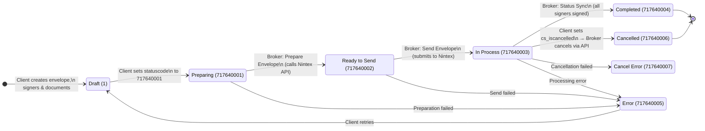
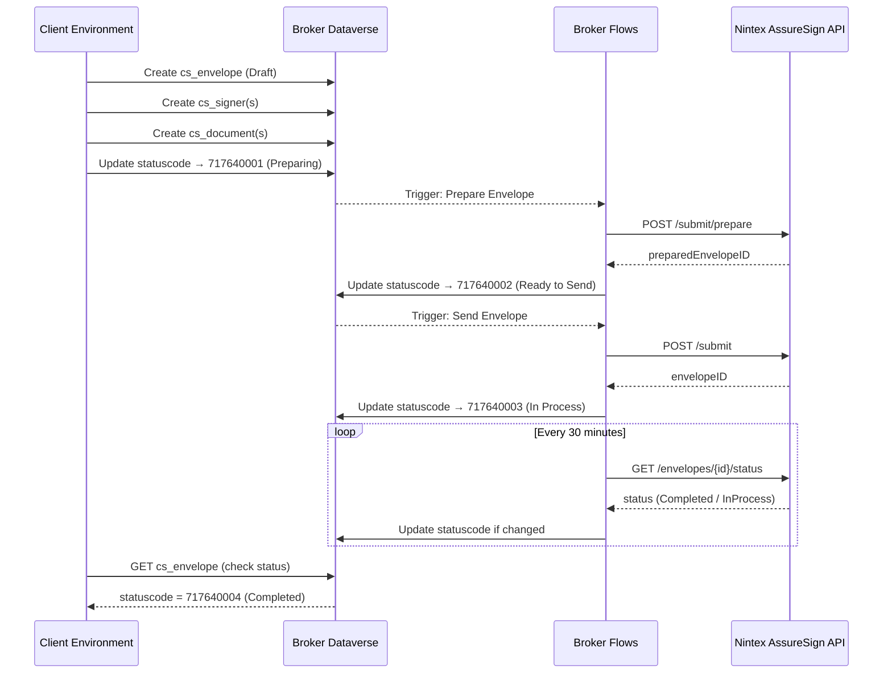

# E-Signature Client Solution

Sample Power Automate flows for integrating with the E-Signature Broker Service. This solution connects to the broker's Dataverse environment to create, send, and manage e-signature envelopes via Nintex AssureSign.

## Prerequisites

Before installing this solution, you need:

1. **Broker environment URL** — provided by your broker administrator (e.g., `https://your-broker.crm3.dynamics.com`)
2. **Application user credentials** — an Entra ID app registration (Client ID + Client Secret) with access to the broker environment, OR a regular Entra user account with the **E-Signature Broker User** security role assigned in the broker environment
3. **Power Automate license** — in your own environment where you'll import this solution

## Installation

### Step 1: Import the Solution

1. Go to **make.powerapps.com** > select your environment
2. Navigate to **Solutions** > **Import solution**
3. Upload either:
   - `ESignatureClient_1_0_0_0_unmanaged.zip` — if you want to modify the sample flows
   - `ESignatureClient_1_0_0_0_managed.zip` — for production use (locked, cannot be modified)
4. Click **Next**

### Step 2: Configure the Connection Reference

During import, you'll be prompted to configure the **E-Sign Broker (Dataverse)** connection reference:

1. Click **New connection** next to "E-Sign Broker (Dataverse)"
2. Select **Connect with Service Principal (App User)**
3. Enter the credentials provided by your broker administrator:
   - **Client ID** — the Application (client) ID of the Entra app registration
   - **Client Secret** — the client secret value
   - **Tenant ID** — your Entra tenant ID
4. For the **Environment URL**, enter the broker environment URL (e.g., `https://your-broker.crm3.dynamics.com`)
5. Click **Create**, then **Import**

> **Important:** The connection must point to the **broker environment**, not your local environment. This is what allows the flows to read/write envelope data in the broker's Dataverse tables.

### Step 3: Turn On the Flows

After import, go to **Solutions** > **E-Signature Client** > **Cloud flows** and turn on the flows you want to use.

## Included Sample Flows

| Flow | Description | Inputs |
|---|---|---|
| **Sample - Create and Send Envelope** | Creates an envelope with one signer, then triggers the prepare/send lifecycle | Subject, Signer Name, Signer Email, Template ID, Message |
| **Sample - Create Draft Envelope** | Creates an envelope in Draft status without sending | Subject, Template ID, Message, Days to Expire |
| **Sample - Add Signer to Envelope** | Adds a signer to an existing draft envelope | Envelope ID, Signer Name, Signer Email, Signer Order |
| **Sample - Check Envelope Status** | Retrieves envelope details, signers, and documents | Envelope ID |
| **Sample - Cancel Envelope** | Cancels an in-process envelope | Envelope ID |

## How It Works

### Envelope Lifecycle





### Statuscode Reference

| Value | Status | Description |
|---|---|---|
| 1 | Draft | Envelope created, not yet submitted |
| 717640001 | Preparing | Broker is preparing the envelope with Nintex |
| 717640002 | Ready to Send | Prepared, broker will auto-send |
| 717640003 | In Process | Sent to signers, awaiting signatures |
| 717640004 | Completed | All signers have signed |
| 717640005 | Error | An error occurred during processing |
| 717640006 | Cancelled | Envelope was cancelled |
| 717640007 | Cancel Error | Cancellation failed |

### Key Tables (in the Broker Environment)

| Table | Logical Name | Purpose |
|---|---|---|
| Envelope | cs_envelopes | Main envelope record |
| Signer | cs_signers | Signers attached to an envelope |
| Document | cs_documents | Documents attached to an envelope |
| Template | cs_templates | Available signing templates |
| Access Link | cs_accesslinks | Signing/viewing URLs |
| Envelope History | cs_envelopehistories | Audit trail of envelope events |

### Linking Signers/Documents to Envelopes

When creating a signer or document, link it to the envelope using the OData bind syntax:

```
cs_envelopelookup@odata.bind: /cs_envelopes(<envelope-id>)
```

## Building Your Own Flows

These sample flows are starting points. To build your own integration:

1. **Use the connection reference** — all your flows should use the "E-Sign Broker (Dataverse)" connection reference included in this solution
2. **Create envelopes in Draft first** — set `statuscode = 1`, add all signers and documents, then set `statuscode = 717640001` to trigger preparation
3. **Poll for completion** — use a scheduled flow or the Check Status pattern to monitor envelope progress
4. **Handle errors** — check for `statuscode = 717640005` (Error) and implement retry logic as needed

### Common Patterns

**Send envelope with multiple signers:**
1. Create envelope (Draft)
2. Create signer 1 (order=1)
3. Create signer 2 (order=2)
4. Update envelope statuscode to 717640001 (Preparing)

**Wait for completion:**
1. Create a scheduled flow (e.g., every hour)
2. List envelopes where `statuscode eq 717640003` (In Process)
3. For each, check if status has changed to Completed/Error

**Get signed documents:**
1. Find documents for a completed envelope
2. Set `cs_requestsignedcopy = true` on each document
3. The broker will populate `cs_signedcontent` with the signed PDF (base64)

## Troubleshooting

### "Could not find table" error
The connection is pointing to the wrong environment. Ensure the Dataverse connection targets the **broker environment URL**, not your local environment.

### "Insufficient privileges" error
Your app user or Entra user doesn't have the **E-Signature Broker User** security role assigned in the broker environment. Contact your broker administrator.

### Envelope stuck in "Preparing" status
The broker's Prepare Envelope flow may have failed. Contact your broker administrator to check the flow run history.

### Cannot turn on flows
Ensure the connection reference is properly configured. Go to **Solutions** > **E-Signature Client** > **Connection References** > verify the connection is active.

## Support

Contact your broker administrator for:
- App user credentials
- Security role assignment
- Troubleshooting broker-side issues
- Template IDs and configuration

## Version History

| Version | Date | Changes |
|---|---|---|
| 1.0.0.0 | 2026-03-17 | Initial release with 5 sample flows |
