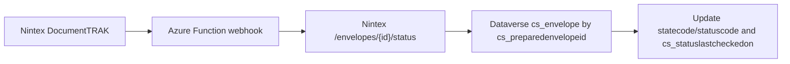

# Nintex DocumentTRAK Webhook Receiver

This project includes an optional Azure Function webhook receiver at:

```text
webhooks/nintex-status-webhook
```

Use it when you want Nintex eSign to push envelope lifecycle changes into the broker environment without waiting for the recurring status sync flow or requiring a client environment to request a status check.

## Recommended Flow



The webhook receiver does not trust the incoming status by itself. It uses the incoming envelope ID to query Nintex for the canonical status, then updates Dataverse.

## Deploy

From the function directory:

```bash
npm install
npm test
func azure functionapp publish <function-app-name>
```

Configure the app settings listed in [the function README](../webhooks/nintex-status-webhook/README.md). The Dataverse app user must be able to read and update `cs_envelope`.

## Configure Nintex

In Nintex eSign:

1. Open **Administration > DocumentTRAK > Notification Administration**.
2. Add a **Custom Webhook**.
3. Use the Function URL:
   ```text
   https://<function-app>.azurewebsites.net/api/nintex/status-webhook?code=<function-key>
   ```
4. Add the header:
   ```text
   x-cs-webhook-secret: <NINTEX_WEBHOOK_SECRET>
   ```
5. Use a JSON body like:
   ```json
   {
     "event": "Envelope Completed",
     "envelopeId": "[Envelope ID]",
     "envelopeName": "[Envelope Name]",
     "envelopeStatus": "[Envelope Status]",
     "envelopeCompletionDate": "[Envelope Completion Date]",
     "envelopeCancelledDate": "[Envelope Cancelled Date]",
     "envelopeDeclinedDate": "[Envelope Declined Date]"
   }
   ```
6. Assign the webhook to the relevant Simple Setup template stages.

Keep `ESign - Check Envelope Status` and `ESign - Status Sync` active as fallback paths.
