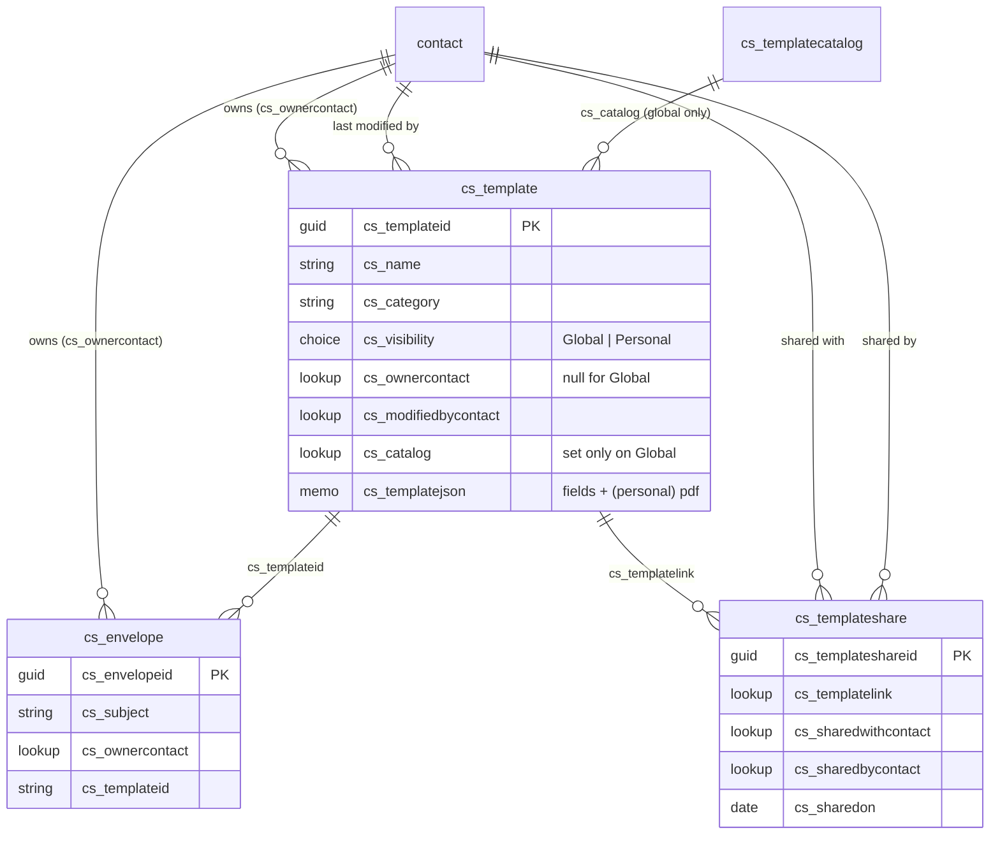
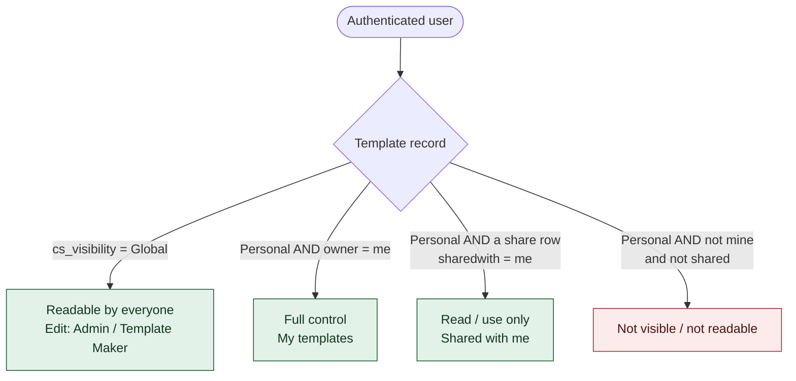
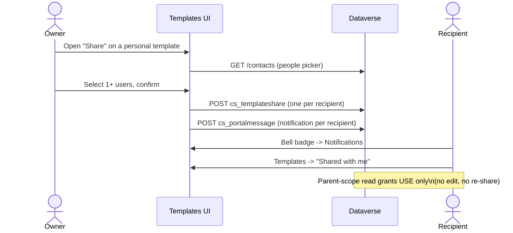
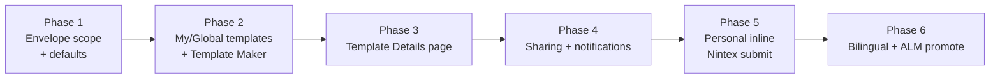

# Templates RBAC, My/Global/Shared templates & sharing

Feature design + implementation plan for the ec‑esign portal.
**Scope: dev only** until promoted via solution ALM. Publisher prefix `cs` (71764); schema lives in the **`ESignatureBroker`** unmanaged solution.

---

## 1. What this feature delivers

1. **Envelopes are scoped to the signed‑in user** — you only see envelopes you created (admins still see all).
2. **Global vs Personal templates**
   - **Global** — created by an **Administrator** or the new **Template Maker** role. Everyone can *use* them (read‑only); only admins/template‑makers can edit.
   - **Personal ("My templates")** — any authenticated user can upload + configure their own template. **Fully private** to its owner.
3. **Sharing** — an owner can share a personal template with one or more registered users (use‑only; no edit, no re‑share). Recipients get a notification and a **"Shared with me"** list.
4. **Template Details page** — audit (created/modified by + on), activity timeline, and a paginated list of associated envelopes with "Create envelope from this template".
5. **Graceful empty states** + **display‑only defaults** (empty subject → `template · id · sent date`; empty category → `Uncategorized`).

> Personal templates are **never saved in Nintex** — the PDF + field config live in Dataverse, and the send flow submits the document inline (base64) to AssureSign DocumentNOW, so Nintex isn't polluted with per‑user templates.

---

## 2. Status — implemented vs remaining

### ✅ Implemented so far (dev)
| Area | Item |
|---|---|
| Schema | `cs_envelope.cs_ownercontact`; `cs_template.cs_ownercontact / cs_modifiedbycontact / cs_visibility`; **`cs_templateshare`** table (`cs_templatelink`, `cs_sharedwithcontact`, `cs_sharedbycontact`, `cs_sharedon`, **`cs_sharedname`, `cs_sharedcategory`**); **`cs_templatecatalog`** (1 row) + `cs_template.cs_catalog` lookup — all added to `ESignatureBroker` |
| Roles | **Template Maker** web role created |
| **Enforcement** | **All 8 table permissions written in the correct enhanced‑model format** (see §5/§6): envelopes + My templates = **Contact scope**; Global templates = **Parent scope** via catalog + **Global manage** for Maker/Admin; shares = **Contact scope** (recipient read + owner manage). **Staged — activates on the one restart.** |
| Web API | Field lists extended for `cs_template` / `cs_envelope` / `cs_templateshare` / `cs_templatecatalog` with all new columns; all four enabled |
| Tagging | 41 legacy templates set to **Global** + pointed at the catalog record (personal templates untouched) |
| Tooling | **Idempotent provisioner** `power-pages/scripts/rbac/provision-rbac.mjs <dev|test>` reproduces the whole enforcement layer; writes `*.before.json` backups |
| UI | **Display defaults**: category → "Uncategorized" (verified live); envelope subject fallback (built) |
| Cleanup | Account‑scope approach removed (`cs_globalaccount` deleted) per decision |

### ✅ Verified working end‑to‑end (dev, after 3 restarts)
| Area | Item |
|---|---|
| Enforcement | Envelope Contact‑scope (API returns only the owner's envelopes); Global templates via catalog Parent‑scope; My/Shared via Contact‑scope. 494 legacy envelopes backfilled to the dev user. |
| Editors | Template create stamps `cs_OwnerContact` + `cs_visibility` (regular → Personal/owned, Maker/Admin → Global/catalog) + `cs_ModifiedByContact`; envelope create stamps `cs_OwnerContact`. |
| UI | Templates **sections** (Global 41 / My / Shared) with per‑tab KPI tiles, row menus, empty states; **Share dialog** with people‑picker + use‑only note, writing `cs_templateshare` (denormalised name/category) + a `cs_portalmessage` notification. Confirmed: create → My templates (not Global); share → Shared‑out count + picker populated. |

### 🚧 Remaining to implement
| Area | Item |
|---|---|
| UI | **Template Details** page (`/templates/details/` — the row menu "View details" links here; page not built yet). |
| Flow | Personal‑template **inline base64 submit** to AssureSign (no Nintex template) — verify DocumentNOW inline payload. |
| i18n | Bilingual (FR) snippets for all new UI strings. |

> **Lookup‑write gotchas (resolved, cost 2 extra restarts):** writing a lookup via the portal Web API needs the **PascalCase nav property** (`cs_OwnerContact`, …) in `Webapi/<t>/fields` *and* **AppendTo** on the target table permission — both activate only on a restart. Also: the live `/templates/` web template is **"Templates"** (`3ecb30b4`), not the decoy "CS Templates"; flush a web‑template change by marking **its own** `*.webtemplate.source.html`.

> **"Shared with me" — resolved natively.** Power Pages Parent scope only cascades parent→child (the permission sits on the "many" side), and `cs_template(1)→cs_templateshare(N)` makes the template the parent, so templates **cannot** be granted to recipients via Parent scope. Because the envelope **send runs server‑side in the broker flow** (full privilege), recipients never need portal read on `cs_template`: the share row carries the denormalised `cs_sharedname`/`cs_sharedcategory` + the template id, so "Shared with me" reads only `cs_templateshare` (recipient Contact scope) and "Use" creates an envelope the flow fulfils. Personal templates stay **fully private** (no `cs_template` read for non‑owners).

---

## 3. Data model

---

## 4. Visibility model (who sees what)

### Role → capability

| Role | Use global | Edit global | Create personal | Share own | See others' personal |
|---|:--:|:--:|:--:|:--:|:--:|
| Authenticated User | ✅ | ❌ | ✅ | ✅ | ❌ (only if shared) |
| Template Maker | ✅ | ✅ | ✅ | ✅ | ❌ |
| Administrator | ✅ | ✅ | ✅ | ✅ | ✅ (admin override) |

---

## 5. Table permissions (target design)

All enforcement is via Power Pages **table permissions** on `powerpagecomponent` (this site is enhanced‑model only — no `adx_`/`mspp_` backing tables).

| Permission | Table | Web role | Scope | Rights |
|---|---|---|---|---|
| Envelopes (own) | `cs_envelope` | Authenticated Users | **Contact** via `cs_ownercontact` | R/W/C/D |
| Envelopes (all) | `cs_envelope` | Administrators | Global | R/W/C/D |
| My templates | `cs_template` | Authenticated Users | **Contact** via `cs_ownercontact` | R/W/C/D |
| Global templates (read) | `cs_template` | Authenticated Users | **Parent** via `cs_catalog` → catalog record | R |
| Global templates (manage) | `cs_template` | Template Maker + Admin | Global | R/W/C/D |
| Catalog record | `cs_templatecatalog` | Authenticated Users | Global (1 harmless row) | R |
| My shares | `cs_templateshare` | Authenticated Users | **Contact** via `cs_sharedwithcontact` | R |
| Shared template (read) | `cs_template` | Authenticated Users | **Parent** via the share relationship | R |
| Contact picker | `contact` | Authenticated Users | Global | R |

> **Why a "catalog" record?** Power Pages permission scopes filter by *relationship*, not by a column value. A plain Global read on `cs_template` would expose personal templates too. Pointing every Global template at one shared **catalog** record and granting a **Parent‑scope** read gives "global‑to‑all" while personal templates (no catalog link) stay private — and it uses **no accounts**.

---

## 6. ⚠️ What I need from you — just one thing

**One site restart.** Table‑permission + Web‑API‑field changes in this enhanced site are **not** picked up by the programmatic cache flush — they need an admin **Restart** (admin center → your site → **Site Actions → Restart**). Everything is already written and batched, so **a single restart** activates the whole enforcement layer.

*(Resolved without you: the exact enhanced‑model permission format — I reverse‑engineered it from the COE reference portal's own Contact/Parent‑scope permissions. Scope `756150001`=Contact uses `contactrelationship` = the N:1 relationship **schema name**; `756150003`=Parent uses `parentrelationship` + `parententitypermission`. The global‑visibility catalog + Parent‑scope design is in place.)*

After the restart I verify enforcement end‑to‑end, then build the editor stamping, the Templates sections, the Details page, and the share dialog against the live config.

---

## 7. Sharing flow

---

## 8. Phased delivery

Each phase = a self‑contained deploy + (where permissions change) **one restart** + verification before the next.
