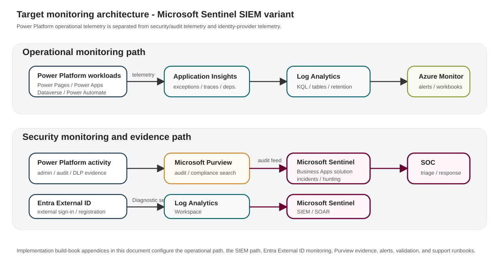

<a id="elections-canada-power-platform-monitoring-architecture-and-implementation-build-book-microsoft-sentinel-variant"></a>
# Elections Canada Power Platform Monitoring Architecture and Implementation Build Book - Microsoft Sentinel Variant

**Organization:** Elections Canada  
**Document owner:** Frederick Pearson, Platform Engineering  
**Document type:** Technical architecture and implementation build book  
**Revision:** 4.0  
**Date:** 2026-05-20  
**Status:** Draft for IM/IT RFC package

<a id="table-of-contents"></a>
## Table of contents

- [Elections Canada Power Platform Monitoring Architecture and Implementation Build Book - Microsoft Sentinel Variant](#elections-canada-power-platform-monitoring-architecture-and-implementation-build-book-microsoft-sentinel-variant)
  - [1. Document control](#1-document-control)
  - [2. Implementation summary](#2-implementation-summary)
  - [3. Target monitoring architecture](#3-target-monitoring-architecture)
    - [3.1 Architecture flow](#3-1-architecture-flow)
    - [3.2 Architecture implementation assertions](#3-2-architecture-implementation-assertions)
  - [4. Monitoring and security requirements](#4-monitoring-and-security-requirements)
    - [4.1 Azure Monitor requirements](#4-1-azure-monitor-requirements)
    - [4.2 SIEM requirements](#4-2-siem-requirements)
    - [4.3 Microsoft Purview requirements](#4-3-microsoft-purview-requirements)
    - [4.4 Entra External ID requirements](#4-4-entra-external-id-requirements)
  - [5. Team responsibilities](#5-team-responsibilities)
  - [6. Implementation artifacts and naming standard](#6-implementation-artifacts-and-naming-standard)
  - [7. Detailed monitoring design](#7-detailed-monitoring-design)
    - [7.1 Azure Monitor operational design](#7-1-azure-monitor-operational-design)
    - [7.2 SIEM security design](#7-2-siem-security-design)
    - [7.3 Purview evidence design](#7-3-purview-evidence-design)
    - [7.4 Entra External ID design for Power Pages](#7-4-entra-external-id-design-for-power-pages)
    - [7.5 Sentinel-specific SIEM routing requirement](#7-5-sentinel-specific-siem-routing-requirement)
  - [8. Alert catalogue and support runbooks](#8-alert-catalogue-and-support-runbooks)
    - [Operational alerts implemented in Azure Monitor](#operational-alerts-implemented-in-azure-monitor)
    - [Security alerts implemented in the SIEM](#security-alerts-implemented-in-the-siem)
  - [Appendix A - Azure Monitor Operational Monitoring Build Book](#appendix-a-azure-monitor-operational-monitoring-build-book)
    - [A.1 Purpose](#a-1-purpose)
    - [A.2 Prerequisites](#a-2-prerequisites)
    - [A.3 Artifact names](#a-3-artifact-names)
    - [A.4 Step-by-step configuration](#a-4-step-by-step-configuration)
  - [Appendix B - Microsoft Sentinel Security Monitoring Build Book](#appendix-b-microsoft-sentinel-security-monitoring-build-book)
    - [B.1 Purpose](#b-1-purpose)
    - [B.2 Prerequisites](#b-2-prerequisites)
    - [B.3 Step-by-step configuration](#b-3-step-by-step-configuration)
  - [Appendix C - Entra External ID Monitoring Build Book](#appendix-c-entra-external-id-monitoring-build-book)
    - [C.1 Purpose](#c-1-purpose)
    - [C.2 Required log categories](#c-2-required-log-categories)
    - [C.3 Step-by-step configuration for Entra diagnostic settings](#c-3-step-by-step-configuration-for-entra-diagnostic-settings)
    - [C.4 Step-by-step configuration for Sentinel ingestion](#c-4-step-by-step-configuration-for-sentinel-ingestion)
    - [C.5 Validation queries](#c-5-validation-queries)
    - [C.6 Required External ID security alerts](#c-6-required-external-id-security-alerts)
  - [Appendix D - Microsoft Purview Audit and Compliance Evidence Build Book](#appendix-d-microsoft-purview-audit-and-compliance-evidence-build-book)
    - [D.1 Purpose](#d-1-purpose)
    - [D.2 Configuration requirements](#d-2-configuration-requirements)
    - [D.3 Step-by-step configuration](#d-3-step-by-step-configuration)
  - [Appendix E - End-to-End Validation and Handoff](#appendix-e-end-to-end-validation-and-handoff)
    - [E.1 Implementation validation checklist](#e-1-implementation-validation-checklist)
    - [E.2 Handoff package contents](#e-2-handoff-package-contents)
  - [Appendix F - Official references](#appendix-f-official-references)

<a id="document-control"></a>
<a id="1-document-control"></a>
## 1. Document control

| Field | Value |
|---|---|
| Organization | Elections Canada |
| Author | Frederick Pearson, Platform Engineering |
| Audience | Global Administrators, Power Platform Administrators, IT Security/SOC, IT Operations, Compliance/Purview administrators |
| Primary implementation teams | IT Operations for Azure Monitor; IT Security/SOC for Microsoft Sentinel; Identity team for Entra External ID; Compliance team for Microsoft Purview |
| Environments in scope | Production Power Platform environments, production Dataverse environments, external-facing Power Pages sites, and Entra External ID tenants/applications used for external registration and sign-in |
| Out of scope | End-user training, maker governance process design, non-production proof-of-concept monitoring unless added by RFC, and general product comparison material |

<a id="executive-summary"></a>
<a id="2-implementation-summary"></a>
## 2. Implementation summary

Elections Canada will implement the following monitoring design for Power Platform and external-facing Power Pages services:

- Elections Canada will use **Azure Monitor** to collect and alert on operational telemetry for Power Platform workloads. This includes Power Pages availability, page response time, Power Automate run failures, Dataverse exceptions, connector dependency failures, canvas app client-side errors, and monitoring-pipeline health.
- Elections Canada will use **Microsoft Sentinel** as the SIEM for Power Platform security monitoring. This includes Power Platform administrative activity, DLP policy changes, custom connector changes, destructive environment actions, Dataverse/audit investigation signals, Entra External ID sign-in risk, external registration failure spikes, and application credential or consent changes.
- Elections Canada will use **Microsoft Purview** as the audit, compliance, DLP evidence, retention, and eDiscovery support layer. Purview will not replace Azure Monitor or Microsoft Sentinel; it will provide authoritative audit evidence and compliance investigation records.
- Elections Canada will monitor **Entra External ID** because Power Pages relies on Entra External ID for external user registration and sign-in. External identity monitoring is part of both the operational monitoring design and SIEM detection design.
- Elections Canada will implement explicit alert runbooks for each operational and security alert. Each alert will have a name, severity, affected workload, query/search expression, first response, triage steps, escalation owner, closure criteria, and tuning notes.

<a id="architecture"></a>
<a id="3-target-monitoring-architecture"></a>
## 3. Target monitoring architecture

<div class="diagram" role="img" aria-label="Architecture diagram for Power Platform monitoring with Azure Monitor, Purview and Microsoft Sentinel">
<svg viewBox="0 0 1080 500" xmlns="http://www.w3.org/2000/svg">
  <defs>
    <marker id="arrow" markerWidth="10" markerHeight="8" refX="9" refY="4" orient="auto"><path d="M0,0 L10,4 L0,8 z" fill="#1e384b"/></marker>
    <filter id="shadow" x="-10%" y="-10%" width="120%" height="120%"><feDropShadow dx="0" dy="2" stdDeviation="3" flood-opacity="0.15"/></filter>
  </defs>
  <rect width="1080" height="500" fill="#fff"/>
  <rect x="20" y="28" width="240" height="120" rx="12" fill="#f4f4f4" stroke="#d8d8d8" filter="url(#shadow)"/>
  <text x="40" y="60" font-size="18" font-weight="700" fill="#1e384b">Power Platform</text>
  <text x="40" y="88" font-size="14" fill="#333">Power Pages</text><text x="40" y="110" font-size="14" fill="#333">Power Apps / Dataverse</text><text x="40" y="132" font-size="14" fill="#333">Power Automate</text>
  <rect x="20" y="190" width="240" height="115" rx="12" fill="#f4f4f4" stroke="#d8d8d8" filter="url(#shadow)"/>
  <text x="40" y="224" font-size="18" font-weight="700" fill="#1e384b">Entra External ID</text>
  <text x="40" y="252" font-size="14" fill="#333">External registration</text><text x="40" y="274" font-size="14" fill="#333">External sign-in</text>
  <rect x="320" y="28" width="245" height="120" rx="12" fill="#eef6f6" stroke="#036064" filter="url(#shadow)"/>
  <text x="340" y="60" font-size="18" font-weight="700" fill="#036064">Azure Monitor</text>
  <text x="340" y="88" font-size="14" fill="#333">Application Insights</text><text x="340" y="110" font-size="14" fill="#333">Log Analytics</text><text x="340" y="132" font-size="14" fill="#333">Operational alerts</text>
  <rect x="320" y="190" width="245" height="115" rx="12" fill="#f8f5f7" stroke="#6a0032" filter="url(#shadow)"/>
  <text x="340" y="224" font-size="18" font-weight="700" fill="#6a0032">Microsoft Purview</text>
  <text x="340" y="252" font-size="14" fill="#333">Unified audit evidence</text><text x="340" y="274" font-size="14" fill="#333">DLP / compliance records</text>
  <rect x="645" y="82" width="260" height="160" rx="12" fill="#f8f5f7" stroke="#6a0032" filter="url(#shadow)"/>
  <text x="665" y="118" font-size="18" font-weight="700" fill="#6a0032">Microsoft Sentinel</text>
  <text x="665" y="148" font-size="14" fill="#333">Analytics rules</text><text x="665" y="170" font-size="14" fill="#333">Incidents</text><text x="665" y="192" font-size="14" fill="#333">Hunting queries</text><text x="665" y="214" font-size="14" fill="#333">Playbooks</text>
  <rect x="645" y="305" width="260" height="105" rx="12" fill="#f4f4f4" stroke="#8b9538" filter="url(#shadow)"/>
  <text x="665" y="340" font-size="18" font-weight="700" fill="#1e384b">Support outputs</text>
  <text x="665" y="368" font-size="14" fill="#333">IT Ops tickets</text><text x="665" y="390" font-size="14" fill="#333">SOC incidents / RFC evidence</text>
  <line x1="260" y1="88" x2="320" y2="88" stroke="#1e384b" stroke-width="2" marker-end="url(#arrow)"/>
  <line x1="260" y1="248" x2="320" y2="248" stroke="#1e384b" stroke-width="2" marker-end="url(#arrow)"/>
  <line x1="565" y1="88" x2="645" y2="138" stroke="#1e384b" stroke-width="2" marker-end="url(#arrow)"/>
  <line x1="565" y1="248" x2="645" y2="178" stroke="#1e384b" stroke-width="2" marker-end="url(#arrow)"/>
  <line x1="775" y1="242" x2="775" y2="305" stroke="#1e384b" stroke-width="2" marker-end="url(#arrow)"/>
  <line x1="442" y1="148" x2="710" y2="305" stroke="#036064" stroke-width="2" stroke-dasharray="6 4" marker-end="url(#arrow)"/>
</svg>
</div>

<a id="3-1-architecture-flow"></a>
### 3.1 Architecture flow



<a id="3-2-architecture-implementation-assertions"></a>
### 3.2 Architecture implementation assertions

- Power Platform telemetry will flow into Application Insights and Log Analytics for operational analysis.
- Azure Monitor alert rules will notify IT Operations when workloads are broken, slow, unavailable, unhealthy, or failing.
- Microsoft Purview audit will remain enabled and available for compliance search, audit export, DLP evidence, and SIEM ingestion patterns.
- Microsoft Sentinel will generate security detections and SOC-owned incidents/offenses when activity is unauthorized, suspicious, risky, malicious, or policy-relevant.
- Entra External ID logs will be collected for external sign-in, registration, and application/service-principal changes connected to Power Pages.
- The build steps for this architecture are implemented in **Appendix A**, **Appendix B - Microsoft Sentinel Security Monitoring Build Book**, **Appendix C**, and **Appendix D**.

<a id="requirements"></a>
<a id="4-monitoring-and-security-requirements"></a>
## 4. Monitoring and security requirements

<a id="4-1-azure-monitor-requirements"></a>
### 4.1 Azure Monitor requirements

Elections Canada will implement Azure Monitor to provide the operational monitoring layer for Power Platform. Azure Monitor will:

- Collect Power Platform telemetry in Application Insights.
- Store operational records in Log Analytics.
- Alert IT Operations when Power Pages becomes unavailable or degraded.
- Alert IT Operations when Power Automate cloud-flow failures exceed the approved threshold.
- Alert IT Operations when Dataverse exceptions, plug-in failures, or custom API failures exceed the approved threshold.
- Alert IT Operations when custom connectors, dependencies, or downstream APIs fail repeatedly or become slow.
- Alert IT Operations when monitoring telemetry stops arriving.
- Provide workbooks for support teams to triage incidents without requiring access to the SIEM.

<a id="4-2-siem-requirements"></a>
### 4.2 SIEM requirements

Elections Canada will implement Microsoft Sentinel to provide the security monitoring and incident response layer for Power Platform and Entra External ID. Microsoft Sentinel will:

- Receive or query Power Platform administrative and audit activity.
- Detect destructive or unusual administrative actions in production environments.
- Detect Power Platform DLP policy changes.
- Detect custom connector creation or modification.
- Detect audit-logging disablement or reduction.
- Detect External ID risky sign-ins associated with Power Pages.
- Detect External ID registration failure spikes.
- Detect app registration, service principal credential, redirect URI, and consent changes for identity components that support Power Pages.
- Generate SOC-owned incidents/offenses with severity, owner, response procedure, and closure criteria.

<a id="4-3-microsoft-purview-requirements"></a>
### 4.3 Microsoft Purview requirements

Elections Canada will implement Microsoft Purview as the audit and compliance evidence layer. Purview will:

- Provide searchable Power Platform activity and administrative audit evidence.
- Provide evidence for DLP investigations and compliance investigations.
- Support audit export for RFC evidence, incident response, and eDiscovery.
- Feed SIEM integration patterns where audit records are required for SOC correlation.
- Retain audit and compliance records according to approved Elections Canada retention requirements.

<a id="4-4-entra-external-id-requirements"></a>
### 4.4 Entra External ID requirements

Elections Canada will monitor Entra External ID because external-facing Power Pages sites use it for external registration and sign-in. The implementation will:

- Collect sign-in logs for external users.
- Collect audit logs for user flow, application, service principal, credential, and consent changes.
- Correlate External ID sign-in failures with Power Pages availability and authentication issues.
- Generate security detections for risky sign-ins and suspicious registration patterns.
- Generate operational evidence when authentication failures affect external users.

<a id="team-responsibilities"></a>
<a id="5-team-responsibilities"></a>
## 5. Team responsibilities

| Team | Implementation responsibility | Ongoing responsibility |
|---|---|---|
| Global Administrator / Privileged Identity team | Grant tenant consent, configure Entra diagnostic settings, authorize app registrations, validate External ID log routing. | Maintain privileged access, review app credential changes, support identity incident response. |
| IT Operations | Implement Azure Monitor, Application Insights, Log Analytics operational alerts, workbooks, and action groups. | Triage operational alerts, maintain runbooks, tune thresholds through change control. |
| IT Security / SOC | Implement Microsoft Sentinel rules, incidents/offenses, hunting searches, and security notification workflows. | Investigate security alerts, maintain SIEM detection content, tune false positives through change control. |
| Power Platform Administrators | Configure Power Platform export, audit settings, environment inventory, and production scope. | Support triage, validate environment changes, maintain production environment inventory. |
| Microsoft Purview / Compliance administrators | Configure audit access, validate audit search, define evidence export process. | Support compliance investigations, eDiscovery, DLP evidence, and audit evidence requests. |

<a id="implementation-artifacts"></a>
<a id="6-implementation-artifacts-and-naming-standard"></a>
## 6. Implementation artifacts and naming standard

| Artifact type | Recommended name | Notes |
|---|---|---|
| Azure subscription | `SUB-EC-PLATFORM-PROD` | Production subscription used for Power Platform monitoring resources. |
| Resource group | `RG-EC-PP-MON-PROD-CAC` | Canada Central resource group for monitoring resources. |
| Log Analytics workspace | `LAW-EC-PP-MON-PROD-CAC` | Shared workspace for Azure Monitor logs and SIEM feed integration. |
| Application Insights | `APPINS-EC-PP-PROD-CAC` | Workspace-based Application Insights resource for Power Platform telemetry. |
| Operational action group | `AG-EC-PP-OPS-P1` | Notifies IT Operations for priority operational alerts. |
| Security action group | `AG-EC-PP-SEC-P1` | Notifies SOC / IT Security for priority security alerts. |
| Event Hubs namespace | `EHNS-EC-SIEM-PROD-CAC` | Used when logs are streamed to a third-party SIEM such as QRadar. |
| Event Hub - Entra sign-ins | `EH-EC-ENTRA-SIGNIN-PROD` | Dedicated stream for external-user sign-in events. |
| Event Hub - Entra audit | `EH-EC-ENTRA-AUDIT-PROD` | Dedicated stream for audit and directory change events. |
| Event Hub - Power Platform audit | `EH-EC-M365-AUDIT-PROD` | Used only if the target SIEM integration pattern requires Event Hubs. |
| Storage account for QRadar checkpointing | `stecsiemcheckpointprod` | Required by IBM QRadar Event Hubs protocol for checkpoint state. |
| Key Vault | `KV-EC-PP-MON-PROD-CAC` | Stores client secrets/certificates for integrations where a certificate is not directly uploaded into the target platform. |

<a id="monitoring-design"></a>
<a id="7-detailed-monitoring-design"></a>
## 7. Detailed monitoring design

<a id="7-1-azure-monitor-operational-design"></a>
### 7.1 Azure Monitor operational design

Elections Canada will use Azure Monitor for production operational monitoring of Power Platform. The operational monitoring boundary includes Power Pages availability, Power Pages responsiveness, Power Automate failures, Dataverse exceptions, connector dependency failures, canvas app client-side errors, and telemetry-pipeline health. Azure Monitor alert rules will be owned by IT Operations and will generate operational tickets or notifications.

<a id="7-2-siem-security-design"></a>
### 7.2 SIEM security design

Elections Canada will use Microsoft Sentinel for security monitoring. The SIEM boundary includes administrative changes, audit policy changes, DLP policy changes, custom connector changes, production environment deletion/reset, suspicious External ID sign-in, External ID registration abuse, and app credential or consent changes. SIEM incidents/offenses will be owned by IT Security/SOC.

<a id="7-3-purview-evidence-design"></a>
### 7.3 Purview evidence design

Elections Canada will use Microsoft Purview as the audit evidence source for user, maker, admin, DLP, and compliance investigation activities where Microsoft 365/Purview audit captures the event. Purview will provide the evidence trail for audit queries, exports, and incident support. Purview alerting will not replace the Azure Monitor or SIEM alerting design because Purview is not the operational telemetry platform and is not the SOC correlation engine in this architecture.

<a id="7-4-entra-external-id-design-for-power-pages"></a>
### 7.4 Entra External ID design for Power Pages

Elections Canada will monitor Entra External ID because external-facing Power Pages sites use it for sign-in and registration. External ID logs will be used in two ways: IT Operations will use the logs to confirm whether registration or sign-in failures are service-impacting, and IT Security will use the logs to detect risky external access, registration abuse, and app/service-principal changes.

<a id="7-5-sentinel-specific-siem-routing-requirement"></a>
### 7.5 Sentinel-specific SIEM routing requirement

Elections Canada will deploy the Microsoft Sentinel solution for Microsoft Business Apps and the Microsoft Entra ID data connector in the Sentinel workspace. This approach provides the SOC with Power Platform security activity, Entra External ID sign-in/audit events, analytics rules, incidents, hunting queries, and response automation from the same Log Analytics-backed SIEM workspace.

<a id="alerts-runbooks"></a>
<a id="8-alert-catalogue-and-support-runbooks"></a>
## 8. Alert catalogue and support runbooks

<a id="operational-alerts-implemented-in-azure-monitor"></a>
### Operational alerts implemented in Azure Monitor

The following operational alerts are implemented in Azure Monitor against the Application Insights / Log Analytics telemetry for Power Platform workloads. Each alert is assigned a clear response owner and closure criterion before go-live.

#### EC-PP-OPS-P1-PowerPages-Unavailable

| Field | Required configuration |
|---|---|
| Severity | Sev1 / P1 |
| Environment and workload affected | External-facing Power Pages site |
| Alert purpose | Elections Canada will alert IT Operations when the Power Pages endpoint fails availability tests from two or more test locations within a 5-minute evaluation period. |
| Expected first response | Confirm whether the public URL is unavailable, identify whether the issue is DNS, TLS, identity, application, or platform, and open a priority incident if external users are impacted. |
| Escalation owner | IT Operations - Web/Application Support |
| Closure criteria | Availability tests pass from all configured locations for two consecutive evaluation windows and the incident record includes root cause and user-impact statement. |
| Known false positives and tuning notes | Maintenance windows and planned DNS/TLS changes must be suppressed through an alert processing rule or RFC-linked maintenance note. |

**KQL query**

```kusto
AppAvailabilityResults
| where TimeGenerated > ago(10m)
| where Name contains 'PowerPages'
| summarize FailedLocations=dcount(Location), Total=count(), Failed=countif(Success == false) by Name
| where FailedLocations >= 2
```

**Initial triage steps**

- Open the Application Insights availability result details.
- Validate DNS resolution and TLS certificate validity.
- Open Power Platform admin center and verify environment health.
- Validate Entra External ID sign-in flow if authentication pages are reachable but sign-in fails.
- Escalate to Power Platform support owner and Microsoft support if the platform is degraded.

#### EC-PP-OPS-P2-PowerPages-Latency-Degraded

| Field | Required configuration |
|---|---|
| Severity | Sev2 / P2 |
| Environment and workload affected | External-facing Power Pages site |
| Alert purpose | Elections Canada will alert IT Operations when Power Pages response time exceeds the operational threshold for external users. |
| Expected first response | Validate whether external users are experiencing slow registration, sign-in, or page rendering. |
| Escalation owner | IT Operations - Power Platform Operations |
| Closure criteria | P95 availability response time returns below 5 seconds for two consecutive evaluation windows or the threshold is formally tuned with approval. |
| Known false positives and tuning notes | Tune threshold per site. Critical public registration pages should use stricter thresholds than internal admin pages. |

**KQL query**

```kusto
AppAvailabilityResults
| where TimeGenerated > ago(15m)
| where Name contains 'PowerPages'
| summarize P95DurationMs=percentile(DurationMs,95) by Name
| where P95DurationMs > 5000
```

**Initial triage steps**

- Review availability test samples.
- Review dependencies for Dataverse/API latency.
- Check recent Power Pages deployments or configuration changes.
- Check Entra External ID sign-in latency if pages are gated behind authentication.

#### EC-PP-OPS-P2-CloudFlow-Failure-Spike

| Field | Required configuration |
|---|---|
| Severity | Sev2 / P2 |
| Environment and workload affected | Power Automate cloud flows |
| Alert purpose | Elections Canada will alert IT Operations when cloud flow runs fail above the accepted error threshold. |
| Expected first response | Identify failed business automation, affected environment, and impacted business process. Restore service or disable a defective deployment according to change-control procedures. |
| Escalation owner | IT Operations - Power Platform Support |
| Closure criteria | Failed runs return below threshold and a failed-run sample has been documented with either resolved error or accepted false positive. |
| Known false positives and tuning notes | Exclude known non-critical scheduled jobs or increase threshold for batch flows that intentionally fail on no-op input. |

**KQL query**

```kusto
AppRequests
| where TimeGenerated > ago(15m)
| where Name has_any ('cloudflow','flow') or AppRoleName has 'PowerAutomate'
| summarize Total=count(), Failed=countif(Success == false) by OperationName, bin(TimeGenerated, 15m)
| extend FailureRate = todouble(Failed) / todouble(Total) * 100
| where Failed >= 5 and FailureRate >= 20
```

**Initial triage steps**

- Open Application Insights transaction samples for failed runs.
- Identify environment ID, flow name, trigger, and failing action.
- Check connector authentication, gateway health, API availability, throttling, and recent solution deployments.
- Notify the owning product team if a business process is affected.

#### EC-PP-OPS-P2-Dataverse-Exception-Spike

| Field | Required configuration |
|---|---|
| Severity | Sev2 / P2 |
| Environment and workload affected | Dataverse, model-driven apps, plug-ins, custom APIs |
| Alert purpose | Elections Canada will alert IT Operations when Dataverse exceptions or server-side errors increase above the approved threshold. |
| Expected first response | Determine whether users are blocked from forms, Dataverse operations, or integrations and assign to the application support owner. |
| Escalation owner | IT Operations - Application Support |
| Closure criteria | Exception rate returns below threshold or known exceptions are documented and excluded with approval. |
| Known false positives and tuning notes | Known validation exceptions must be handled in the application layer rather than suppressed without justification. |

**KQL query**

```kusto
AppExceptions
| where TimeGenerated > ago(15m)
| summarize ExceptionCount=count(), SampleMessage=any(Message) by AppRoleName, ProblemId
| where ExceptionCount >= 10
```

**Initial triage steps**

- Review exception type, message, and operation ID.
- Correlate with recent managed solution import, plug-in deployment, or integration release.
- Review dependency failures and Dataverse service health.
- If data integrity is at risk, stop affected automation until root cause is isolated.

#### EC-PP-OPS-P2-Connector-Dependency-Failures

| Field | Required configuration |
|---|---|
| Severity | Sev2 / P2 |
| Environment and workload affected | Custom connectors, Azure Functions, APIs, gateways |
| Alert purpose | Elections Canada will alert IT Operations when connector or dependency calls fail repeatedly. |
| Expected first response | Determine whether the failure is a Power Platform connector, gateway, API dependency, authentication failure, or downstream service outage. |
| Escalation owner | IT Operations - Integration Support |
| Closure criteria | Dependency failure count returns below threshold and any certificate/secret/network issue is corrected or tracked under a separate problem record. |
| Known false positives and tuning notes | Separate critical dependencies from low-priority optional integrations. Critical business APIs must remain P2 or higher. |

**KQL query**

```kusto
AppDependencies
| where TimeGenerated > ago(15m)
| summarize Total=count(), Failed=countif(Success == false), P95DurationMs=percentile(DurationMs,95) by Target, Name
| where Failed >= 5 or P95DurationMs > 7000
```

**Initial triage steps**

- Open dependency samples and identify HTTP status codes.
- Validate connection references and service principal secrets/certificates.
- Check on-premises data gateway health if applicable.
- Validate downstream API availability and firewall/network changes.

#### EC-PP-OPS-P3-CanvasApp-Client-Error-Spike

| Field | Required configuration |
|---|---|
| Severity | Sev3 / P3 |
| Environment and workload affected | Canvas apps |
| Alert purpose | Elections Canada will alert IT Operations when client-side canvas app errors increase above the accepted threshold. |
| Expected first response | Identify the affected app and determine whether users are blocked or experiencing degraded functionality. |
| Escalation owner | IT Operations - Power Apps Support |
| Closure criteria | Trace volume returns below threshold and the app owner confirms no active user impact. |
| Known false positives and tuning notes | Exclude known informational traces by severity and message pattern. Do not suppress severe client errors without a corresponding defect record. |

**KQL query**

```kusto
AppTraces
| where TimeGenerated > ago(30m)
| where SeverityLevel >= 3
| summarize TraceCount=count(), Sample=any(Message) by AppRoleName, OperationName
| where TraceCount >= 20
```

**Initial triage steps**

- Review trace samples and user session identifiers.
- Correlate with recent app publish activity.
- Validate connector and Dataverse calls from the same time window.
- Ask app owner to reproduce if needed.

#### EC-PP-OPS-P2-Telemetry-Ingestion-Stopped

| Field | Required configuration |
|---|---|
| Severity | Sev2 / P2 |
| Environment and workload affected | Monitoring pipeline |
| Alert purpose | Elections Canada will alert IT Operations when expected Power Platform telemetry stops arriving in Application Insights. |
| Expected first response | Treat missing telemetry as a monitoring gap until validated as a planned outage or no-traffic period. |
| Escalation owner | IT Operations - Monitoring Platform |
| Closure criteria | Telemetry resumes and the gap duration is documented. |
| Known false positives and tuning notes | For low-volume environments, use a longer evaluation window or heartbeat test rather than disabling the alert. |

**KQL query**

```kusto
union isfuzzy=true AppRequests, AppDependencies, AppExceptions, AppTraces
| where TimeGenerated > ago(60m)
| summarize EventCount=count()
| where EventCount == 0
```

**Initial triage steps**

- Validate Application Insights resource and Log Analytics workspace availability.
- Confirm Power Platform data export configuration still exists.
- Check ingestion caps, workspace daily cap, and diagnostic settings.
- Open a monitoring incident if the gap is not planned.

<a id="security-alerts-implemented-in-the-siem"></a>
### Security alerts implemented in the SIEM

The following security alerts are implemented in the selected SIEM. The Microsoft Sentinel variant uses analytics rules and incidents. The IBM QRadar variant uses correlation rules and offenses. The detection intent, response, owner, and closure criteria remain the same across both SIEM implementations.

#### EC-PP-SEC-P1-Audit-Logging-Disabled

| Field | Required configuration |
|---|---|
| Severity | High / P1 |
| Environment and workload affected | Power Platform audit and compliance logging |
| Alert purpose | Elections Canada will generate a security alert when audit logging is disabled or materially reduced for an in-scope production environment. |
| Expected first response | SOC opens a P1 investigation, validates whether the change was approved, and requests immediate restoration of audit settings if no approved RFC exists. |
| Escalation owner | IT Security / SOC with Power Platform Administrator support |
| Closure criteria | Audit logging is enabled, data continuity impact is documented, and unauthorized activity is either contained or mapped to an approved RFC. |
| Known false positives and tuning notes | No permanent suppression is allowed. Only RFC-linked maintenance suppression is permitted. |

**KQL query**

```kusto
PowerPlatformAdminActivity
| where TimeGenerated > ago(15m)
| where OperationName has_any ('UpdateEnvironment','SetAudit','Audit')
| where tostring(ResultStatus) !in ('Failure','Failed')
```

**Initial triage steps**

- Identify actor, source IP, affected environment, and exact operation.
- Search for related administrative changes in the prior 24 hours.
- Validate RFC/change record.
- Escalate to tenant Global Administrator and Power Platform Administrator if unauthorized.

#### EC-PP-SEC-P1-Production-Environment-Deleted-Or-Reset

| Field | Required configuration |
|---|---|
| Severity | High / P1 |
| Environment and workload affected | Power Platform environments |
| Alert purpose | Elections Canada will generate a security alert when a production Power Platform environment is deleted, reset, disabled, or otherwise materially changed. |
| Expected first response | SOC treats the event as a potentially destructive administrative action and validates the change against the RFC immediately. |
| Escalation owner | IT Security / SOC; escalation to Platform Engineering |
| Closure criteria | Change is approved and documented, or the environment has been recovered and containment actions are complete. |
| Known false positives and tuning notes | Approved disaster recovery tests must be tagged with RFC number and maintenance window. |

**KQL query**

```kusto
PowerPlatformAdminActivity
| where TimeGenerated > ago(15m)
| where OperationName has_any ('DeleteEnvironment','ResetEnvironment','DisableEnvironment','RecoverEnvironment')
```

**Initial triage steps**

- Identify environment ID/name.
- Validate RFC and change window.
- Check whether backup/restore posture is intact.
- Correlate with Entra sign-in anomalies for the actor.
- Notify platform owner and IM/IT management if production service is affected.

#### EC-PP-SEC-P2-DLP-Policy-Changed

| Field | Required configuration |
|---|---|
| Severity | Medium / P2 |
| Environment and workload affected | Power Platform tenant governance |
| Alert purpose | Elections Canada will generate a security alert when a Power Platform DLP policy is created, deleted, or modified. |
| Expected first response | SOC validates the policy change against approved governance or RFC records and confirms whether sensitive connectors were moved between business and non-business groups. |
| Escalation owner | IT Security / Governance with Power Platform Administrator support |
| Closure criteria | Policy change is approved or reverted; impact assessment is attached to the incident/ticket. |
| Known false positives and tuning notes | Routine policy updates still need RFC references. Suppression must be change-window based. |

**KQL query**

```kusto
PowerPlatformAdminActivity
| where TimeGenerated > ago(30m)
| where OperationName has_any ('CreateDlpPolicy','UpdateDlpPolicy','DeleteDlpPolicy','SetDlpPolicy')
```

**Initial triage steps**

- Identify the actor and policy ID/name.
- Compare old and new connector grouping if available.
- Validate against change record.
- Confirm whether production environments became less restrictive.

#### EC-PP-SEC-P2-Custom-Connector-Created-Or-Modified

| Field | Required configuration |
|---|---|
| Severity | Medium / P2 |
| Environment and workload affected | Power Platform connectors |
| Alert purpose | Elections Canada will generate a security alert when a custom connector is created or modified in an in-scope environment. |
| Expected first response | SOC validates whether the connector endpoint, authentication method, and DLP classification are approved. |
| Escalation owner | IT Security / Governance with Integration Support |
| Closure criteria | Connector is approved and documented or blocked/reverted. |
| Known false positives and tuning notes | Known Dev/Test connector activity may be lower severity, but production connector changes stay P2. |

**KQL query**

```kusto
PowerPlatformAdminActivity
| where TimeGenerated > ago(30m)
| where OperationName has_any ('CreateConnector','UpdateConnector','DeleteConnector','CreateCustomConnector','UpdateCustomConnector')
```

**Initial triage steps**

- Identify connector name and target host.
- Validate publisher/owner.
- Check DLP policy classification.
- Review recent flow/app changes that use the connector.

#### EC-EXTID-SEC-P1-External-User-Risky-Sign-In

| Field | Required configuration |
|---|---|
| Severity | High / P1 |
| Environment and workload affected | Entra External ID and Power Pages authentication |
| Alert purpose | Elections Canada will generate a security alert when an external user sign-in associated with Power Pages is high risk or originates from suspicious conditions. |
| Expected first response | SOC validates whether the sign-in is expected, blocks the account/session if needed, and correlates with portal registration attempts. |
| Escalation owner | IT Security / Identity Operations |
| Closure criteria | Risk is dismissed with evidence or containment is complete and the external user flow is stable. |
| Known false positives and tuning notes | High-risk sign-ins are never suppressed. Known test accounts must be placed in a controlled exception list. |

**KQL query**

```kusto
SigninLogs
| where TimeGenerated > ago(15m)
| where AppDisplayName has_any ('Power Pages','PowerApps Portals') or ResourceDisplayName has_any ('Power Pages','PowerApps Portals')
| where RiskLevelDuringSignIn in ('high','medium') or ResultType != 0
| summarize Count=count(), Failure=countif(ResultType != 0) by UserPrincipalName, IPAddress, AppDisplayName, RiskLevelDuringSignIn
```

**Initial triage steps**

- Review user, IP, geography, device, application, and conditional access status.
- Check related failed attempts and account creation activity.
- Validate whether the account attempted sensitive portal operations after sign-in.
- Escalate to identity team for containment.

#### EC-EXTID-SEC-P2-Registration-Failure-Spike

| Field | Required configuration |
|---|---|
| Severity | Medium / P2 |
| Environment and workload affected | Entra External ID external-user registration |
| Alert purpose | Elections Canada will generate a security alert when external registration failures spike for Power Pages, indicating possible abuse, configuration failure, or user-impacting identity issue. |
| Expected first response | SOC and IT Operations determine whether this is abuse, bot activity, conditional access misconfiguration, or a broken registration/sign-in user journey. |
| Escalation owner | IT Security / Identity Operations; IT Operations for service impact |
| Closure criteria | Failure volume returns to normal and root cause is recorded. |
| Known false positives and tuning notes | Expected election-cycle traffic should be baselined before threshold changes. |

**KQL query**

```kusto
SigninLogs
| where TimeGenerated > ago(30m)
| where AppDisplayName has_any ('Power Pages','PowerApps Portals')
| where ResultType != 0
| summarize Failures=count(), DistinctIPs=dcount(IPAddress), DistinctUsers=dcount(UserPrincipalName) by AppDisplayName
| where Failures >= 25 or DistinctIPs >= 10
```

**Initial triage steps**

- Review failure reason codes.
- Group by source IP, location, user agent, and user flow.
- Check recent External ID user flow or custom policy changes.
- Check Power Pages authentication settings.

#### EC-EXTID-SEC-P2-App-Credential-Or-Consent-Changed

| Field | Required configuration |
|---|---|
| Severity | Medium / P2 |
| Environment and workload affected | Entra app registrations and enterprise applications used by Power Pages |
| Alert purpose | Elections Canada will generate a security alert when credentials, redirect URIs, federated credentials, or consent grants change for app registrations supporting Power Pages or Power Platform integrations. |
| Expected first response | SOC validates whether the change is tied to an approved RFC and whether secrets or redirect URIs were added unexpectedly. |
| Escalation owner | IT Security / Identity Operations |
| Closure criteria | Application change is approved or remediated; credentials are rotated if exposure is suspected. |
| Known false positives and tuning notes | Authorized certificate rollover should be RFC-linked and scheduled. |

**KQL query**

```kusto
AuditLogs
| where TimeGenerated > ago(30m)
| where OperationName has_any ('Add service principal credentials','Update application','Add delegated permission grant','Consent to application','Add app role assignment to service principal')
```

**Initial triage steps**

- Identify app/service principal ID.
- Review changed property.
- Validate admin consent source and actor.
- Check sign-in activity after the change.
- Escalate if unauthorized credential or redirect URI was added.

<a id="appendix-azure-monitor"></a>
<a id="appendix-a-azure-monitor-operational-monitoring-build-book"></a>
## Appendix A - Azure Monitor Operational Monitoring Build Book

<a id="a-1-purpose"></a>
### A.1 Purpose

Elections Canada will implement Azure Monitor as the operational monitoring layer for Power Platform environments. Azure Monitor will collect Power Platform telemetry in Application Insights, store queryable records in Log Analytics, execute alert rules, notify IT Operations through action groups, and provide operational evidence for support tickets.

<a id="a-2-prerequisites"></a>
### A.2 Prerequisites

- A production Azure subscription named `SUB-EC-PLATFORM-PROD` is required for the monitoring resources.
- A Canada Central resource group named `RG-EC-PP-MON-PROD-CAC` is required for the Log Analytics workspace, Application Insights resource, Event Hubs namespace, storage account, and related automation artifacts.
- A Global Administrator or Privileged Role Administrator is required to grant tenant-level admin consent and configure Entra diagnostic routing.
- A Power Platform Administrator or Dynamics 365 Administrator is required to configure Power Platform environment export and audit settings.
- A Security Administrator, Compliance Administrator, or equivalent Purview role assignment is required to validate Microsoft Purview audit visibility.
- A documented list of in-scope Power Platform environments is required before implementation. The minimum columns are environment name, environment ID, type, owner group, Power Pages site URL, Dataverse presence, criticality, support owner, and change window.
- A named IT Operations distribution list or ticket queue is required for operational alerts. Recommended placeholder: `DL-EC-ITOPS-POWERPLATFORM@elections.ca`.
- A named IT Security / SOC distribution list or ticket queue is required for security alerts. Recommended placeholder: `DL-EC-SOC-POWERPLATFORM@elections.ca`.
- The implementation must be performed in a controlled change window and recorded under the approved RFC for this monitoring rollout.

- Application Insights export must be configured for each in-scope production Power Platform environment.
- Public Power Pages URLs must be known before availability tests are created.
- IT Operations must provide the mailbox, distribution list, webhook, or ITSM endpoint that receives operational alerts.

<a id="a-3-artifact-names"></a>
### A.3 Artifact names

| Artifact type | Recommended name | Notes |
|---|---|---|
| Azure subscription | `SUB-EC-PLATFORM-PROD` | Production subscription used for Power Platform monitoring resources. |
| Resource group | `RG-EC-PP-MON-PROD-CAC` | Canada Central resource group for monitoring resources. |
| Log Analytics workspace | `LAW-EC-PP-MON-PROD-CAC` | Shared workspace for Azure Monitor logs and SIEM feed integration. |
| Application Insights | `APPINS-EC-PP-PROD-CAC` | Workspace-based Application Insights resource for Power Platform telemetry. |
| Operational action group | `AG-EC-PP-OPS-P1` | Notifies IT Operations for priority operational alerts. |
| Security action group | `AG-EC-PP-SEC-P1` | Notifies SOC / IT Security for priority security alerts. |
| Event Hubs namespace | `EHNS-EC-SIEM-PROD-CAC` | Used when logs are streamed to a third-party SIEM such as QRadar. |
| Event Hub - Entra sign-ins | `EH-EC-ENTRA-SIGNIN-PROD` | Dedicated stream for external-user sign-in events. |
| Event Hub - Entra audit | `EH-EC-ENTRA-AUDIT-PROD` | Dedicated stream for audit and directory change events. |
| Event Hub - Power Platform audit | `EH-EC-M365-AUDIT-PROD` | Used only if the target SIEM integration pattern requires Event Hubs. |
| Storage account for QRadar checkpointing | `stecsiemcheckpointprod` | Required by IBM QRadar Event Hubs protocol for checkpoint state. |
| Key Vault | `KV-EC-PP-MON-PROD-CAC` | Stores client secrets/certificates for integrations where a certificate is not directly uploaded into the target platform. |

<a id="a-4-step-by-step-configuration"></a>
### A.4 Step-by-step configuration

#### Step A.4.1 - Create the monitoring resource group

**Portal configuration**

- Sign in to the Azure portal as a Global Administrator or a privileged Azure administrator assigned to `SUB-EC-PLATFORM-PROD`.
- In the top search bar, search for **Resource groups**.
- Select **Create**.
- Set **Subscription** to `SUB-EC-PLATFORM-PROD`.
- Set **Resource group** to `RG-EC-PP-MON-PROD-CAC`.
- Set **Region** to `Canada Central`.
- Select **Review + create**.
- Select **Create**.

**Azure PowerShell alternative**

```powershell
Connect-AzAccount -Tenant '<EC-TENANT-ID>'
Set-AzContext -Subscription 'SUB-EC-PLATFORM-PROD'
New-AzResourceGroup -Name 'RG-EC-PP-MON-PROD-CAC' -Location 'canadacentral' -Tag @{Workload='PowerPlatformMonitoring'; Owner='PlatformEngineering'; DataClassification='ProtectedB'}
```

#### Step A.4.2 - Create the Log Analytics workspace

**Portal configuration**

- In the Azure portal, search for **Log Analytics workspaces**.
- Select **Create**.
- Set **Subscription** to `SUB-EC-PLATFORM-PROD`.
- Set **Resource group** to `RG-EC-PP-MON-PROD-CAC`.
- Set **Name** to `LAW-EC-PP-MON-PROD-CAC`.
- Set **Region** to `Canada Central`.
- Select **Review + create**.
- Select **Create**.
- After deployment, open the workspace.
- Select **Usage and estimated costs**.
- Set daily cap and retention according to the Elections Canada data retention standard. A starting operational retention value of 90 days is recommended for troubleshooting. Longer security retention must be managed through the SIEM and Purview retention design.

**Azure PowerShell alternative**

```powershell
New-AzOperationalInsightsWorkspace `
  -ResourceGroupName 'RG-EC-PP-MON-PROD-CAC' `
  -Name 'LAW-EC-PP-MON-PROD-CAC' `
  -Location 'canadacentral' `
  -Sku 'PerGB2018' `
  -RetentionInDays 90
```

#### Step A.4.3 - Create the workspace-based Application Insights resource

**Portal configuration**

- In the Azure portal, search for **Application Insights**.
- Select **Create**.
- Set **Subscription** to `SUB-EC-PLATFORM-PROD`.
- Set **Resource group** to `RG-EC-PP-MON-PROD-CAC`.
- Set **Name** to `APPINS-EC-PP-PROD-CAC`.
- Set **Region** to `Canada Central`.
- Set **Resource mode** to **Workspace-based**.
- Set **Log Analytics workspace** to `LAW-EC-PP-MON-PROD-CAC`.
- Select **Review + create**.
- Select **Create**.
- After deployment, open the resource and copy the **Connection string**. Store it in the RFC implementation notes and in `KV-EC-PP-MON-PROD-CAC` if a secure reference is needed.

**Azure PowerShell alternative**

```powershell
$workspace = Get-AzOperationalInsightsWorkspace -ResourceGroupName 'RG-EC-PP-MON-PROD-CAC' -Name 'LAW-EC-PP-MON-PROD-CAC'
New-AzApplicationInsights `
  -ResourceGroupName 'RG-EC-PP-MON-PROD-CAC' `
  -Name 'APPINS-EC-PP-PROD-CAC' `
  -Location 'canadacentral' `
  -WorkspaceResourceId $workspace.ResourceId
```

#### Step A.4.4 - Configure Power Platform export to Application Insights

**Portal configuration**

- Sign in to the Power Platform admin center as a Power Platform Administrator.
- Select **Manage**.
- Select **Environments**.
- Select the first in-scope production environment.
- Select **Settings**.
- Expand **Data export**.
- Select **Application Insights**.
- Select **New data export** or **Set up**.
- Select the Azure subscription `SUB-EC-PLATFORM-PROD`.
- Select `APPINS-EC-PP-PROD-CAC` as the Application Insights resource.
- Select the telemetry categories available for the environment. The implementation requires Dataverse, model-driven app, canvas app, and cloud flow telemetry where available.
- Select **Save** or **Create**.
- Repeat the same configuration for every in-scope production environment.
- Record the environment name, environment ID, Application Insights resource name, configuration timestamp, and implementer in the RFC evidence section.

**Azure PowerShell alternative**

Power Platform export to Application Insights is primarily configured from the Power Platform admin center. Azure PowerShell is used to create and secure the target Azure resources. The implementer must use the portal configuration above for the export binding unless an approved Power Platform administration automation is already in use.

#### Step A.4.5 - Configure Power Pages availability tests

**Portal configuration**

- In the Azure portal, open `APPINS-EC-PP-PROD-CAC`.
- Select **Availability**.
- Select **Add Standard test**.
- Set **Test name** to `AVAIL-EC-PP-PAGES-PROD-<SITE-NAME>`.
- Set **URL** to the external Power Pages URL, for example `https://<site-name>.powerpages.microsoft.com/` or the approved custom domain.
- Set **Test frequency** to 5 minutes for production public sites.
- Select at least five test locations, including Canadian or North American locations where available.
- Set **Success criteria** to require HTTP 200 or the expected authenticated landing response.
- Set **Timeout** to 30 seconds.
- Enable **Retry on failure**.
- Select **Create**.
- Repeat for each critical public endpoint: home page, registration entry point, sign-in page, and high-value post-authentication landing page if a synthetic account is available.

**Azure PowerShell alternative**

```powershell
# Availability tests are represented as Microsoft.Insights/webtests resources.
# Use an ARM/Bicep template for repeatable deployment. Replace placeholder values before execution.
New-AzResourceGroupDeployment `
  -ResourceGroupName 'RG-EC-PP-MON-PROD-CAC' `
  -TemplateFile '.	emplatesppinsights-webtest.json' `
  -appInsightsName 'APPINS-EC-PP-PROD-CAC' `
  -webTestName 'AVAIL-EC-PP-PAGES-PROD-<SITE-NAME>' `
  -targetUrl 'https://<POWER-PAGES-URL>/'
```

#### Step A.4.6 - Create IT Operations action groups

**Portal configuration**

- In the Azure portal, search for **Monitor**.
- Select **Alerts**.
- Select **Action groups**.
- Select **Create**.
- On **Basics**, set **Subscription** to `SUB-EC-PLATFORM-PROD`.
- Set **Resource group** to `RG-EC-PP-MON-PROD-CAC`.
- Set **Region** to **Global**.
- Set **Action group name** to `AG-EC-PP-OPS-P1`.
- Set **Display name** to `EC PP OPS P1`.
- Select **Next: Notifications**.
- Add an **Email/SMS message/Push/Voice** notification named `Email-ITOps` and set the email address to `DL-EC-ITOPS-POWERPLATFORM@elections.ca`.
- Add a webhook, Logic App, or ITSM action if Elections Canada ticketing integration is available.
- Select **Next: Actions**.
- Add the automation action if a Logic App will create incidents automatically.
- Select **Review + create**.
- Select **Create**.

**Azure PowerShell alternative**

```powershell
$emailReceiver = New-AzActionGroupReceiver -Name 'Email-ITOps' -EmailReceiver -EmailAddress 'DL-EC-ITOPS-POWERPLATFORM@elections.ca'
Set-AzActionGroup `
  -ResourceGroupName 'RG-EC-PP-MON-PROD-CAC' `
  -Name 'AG-EC-PP-OPS-P1' `
  -ShortName 'EC-PPOPS' `
  -Receiver $emailReceiver
```

#### Step A.4.7 - Configure operational log alerts

**Portal configuration pattern for each alert**

- In the Azure portal, open **Monitor**.
- Select **Alerts**.
- Select **Create**.
- Select **Alert rule**.
- On **Scope**, select `LAW-EC-PP-MON-PROD-CAC` or `APPINS-EC-PP-PROD-CAC`, depending on where the query is executed.
- Select **Apply**.
- On **Condition**, select **Custom log search**.
- Paste the approved KQL query from the alert catalogue in section **9**.
- Set the **Measurement** to **Table rows** unless the specific alert uses a numeric aggregation.
- Set the **Aggregation granularity** to the documented evaluation window for the alert.
- Set **Frequency of evaluation** to 5 minutes for P1/P2 production alerts and 15 minutes for lower-priority alerts.
- Set **Operator** and **Threshold value** exactly as documented in the alert catalogue.
- Select **Next: Actions**.
- Select `AG-EC-PP-OPS-P1` for P1/P2 alerts and the approved lower-priority action group for P3 alerts.
- Select **Next: Details**.
- Set **Severity** to the alert severity documented in the catalogue.
- Set **Alert rule name** to the exact alert name from the catalogue.
- Set **Description** to the runbook purpose from the alert catalogue.
- Set **Enable upon creation** to **Yes**.
- Select **Review + create**.
- Select **Create**.
- Repeat for every operational alert in section **9.1**.

**Azure PowerShell alternative**

```powershell
# Example for one log alert. Repeat using the alert catalogue values.
$law = Get-AzOperationalInsightsWorkspace -ResourceGroupName 'RG-EC-PP-MON-PROD-CAC' -Name 'LAW-EC-PP-MON-PROD-CAC'
$actionGroup = Get-AzActionGroup -ResourceGroupName 'RG-EC-PP-MON-PROD-CAC' -Name 'AG-EC-PP-OPS-P1'
$query = @'
AppAvailabilityResults
| where TimeGenerated > ago(10m)
| where Name contains 'PowerPages'
| summarize FailedLocations=dcount(Location), Total=count(), Failed=countif(Success == false) by Name
| where FailedLocations >= 2
'@
New-AzResourceGroupDeployment `
  -ResourceGroupName 'RG-EC-PP-MON-PROD-CAC' `
  -TemplateFile '.	emplates\scheduled-query-rule.json' `
  -alertName 'EC-PP-OPS-P1-PowerPages-Unavailable' `
  -workspaceResourceId $law.ResourceId `
  -actionGroupId $actionGroup.Id `
  -query $query `
  -severity 1 `
  -evaluationFrequency 'PT5M' `
  -windowSize 'PT10M'
```

#### Step A.4.8 - Configure operational workbooks

**Portal configuration**

- In the Azure portal, open **Monitor**.
- Select **Workbooks**.
- Select **New**.
- Add query sections for Power Pages availability, Power Automate failures, Dataverse exceptions, dependency failures, and telemetry pipeline health.
- Set the workbook name to `WB-EC-PP-OPS-PROD`.
- Save the workbook to `RG-EC-PP-MON-PROD-CAC`.
- Assign read access to the IT Operations support group and Platform Engineering.

**Azure PowerShell alternative**

```powershell
# Workbooks are ARM resources. Export the workbook template after portal creation and redeploy it using:
New-AzResourceGroupDeployment `
  -ResourceGroupName 'RG-EC-PP-MON-PROD-CAC' `
  -TemplateFile '.	emplates\workbook-ec-pp-ops.json'
```

#### Step A.4.9 - Validate Azure Monitor implementation

- Generate a controlled test event by temporarily targeting a non-production availability test to a known invalid URL. Confirm `EC-PP-OPS-P1-PowerPages-Unavailable` fires and notifies `AG-EC-PP-OPS-P1`.
- Trigger or locate a known failed non-production flow run and confirm flow telemetry appears in Application Insights.
- Query `AppRequests`, `AppDependencies`, `AppExceptions`, `AppTraces`, and `AppAvailabilityResults` in Log Analytics.
- Confirm alert notifications include alert name, severity, affected resource, query result count, and link to the fired alert.
- Attach screenshots or exported JSON evidence to the RFC.

<a id="appendix-sentinel"></a>
<a id="appendix-b-microsoft-sentinel-security-monitoring-build-book"></a>
## Appendix B - Microsoft Sentinel Security Monitoring Build Book

<a id="b-1-purpose"></a>
### B.1 Purpose

Elections Canada will implement Microsoft Sentinel as the SIEM/SOAR layer for Power Platform and Entra External ID security monitoring where this variant is selected. Sentinel will ingest Power Platform audit and activity logs, Entra External ID sign-in and audit logs, and Purview-backed audit evidence. Sentinel will generate analytics-rule incidents, provide hunting queries, and support SOC response workflows.

<a id="b-2-prerequisites"></a>
### B.2 Prerequisites

- A production Azure subscription named `SUB-EC-PLATFORM-PROD` is required for the monitoring resources.
- A Canada Central resource group named `RG-EC-PP-MON-PROD-CAC` is required for the Log Analytics workspace, Application Insights resource, Event Hubs namespace, storage account, and related automation artifacts.
- A Global Administrator or Privileged Role Administrator is required to grant tenant-level admin consent and configure Entra diagnostic routing.
- A Power Platform Administrator or Dynamics 365 Administrator is required to configure Power Platform environment export and audit settings.
- A Security Administrator, Compliance Administrator, or equivalent Purview role assignment is required to validate Microsoft Purview audit visibility.
- A documented list of in-scope Power Platform environments is required before implementation. The minimum columns are environment name, environment ID, type, owner group, Power Pages site URL, Dataverse presence, criticality, support owner, and change window.
- A named IT Operations distribution list or ticket queue is required for operational alerts. Recommended placeholder: `DL-EC-ITOPS-POWERPLATFORM@elections.ca`.
- A named IT Security / SOC distribution list or ticket queue is required for security alerts. Recommended placeholder: `DL-EC-SOC-POWERPLATFORM@elections.ca`.
- The implementation must be performed in a controlled change window and recorded under the approved RFC for this monitoring rollout.

- `LAW-EC-PP-MON-PROD-CAC` must exist before Sentinel is enabled.
- The implementation account must be able to enable Microsoft Sentinel on the Log Analytics workspace.
- The implementation account must be able to install Sentinel Content Hub solutions.
- The implementation account must be able to grant required tenant consent for Microsoft Business Apps / Power Platform connectors.

<a id="b-3-step-by-step-configuration"></a>
### B.3 Step-by-step configuration

#### Step B.3.1 - Enable Microsoft Sentinel on the workspace

**Portal configuration**

- Open the Azure portal.
- Search for **Microsoft Sentinel**.
- Select **Create**.
- Select workspace `LAW-EC-PP-MON-PROD-CAC`.
- Select **Add**.
- Wait until Sentinel finishes onboarding the workspace.

**Azure PowerShell alternative**

```powershell
# Sentinel enablement can be deployed through the Microsoft.SecurityInsights/onboardingStates ARM resource.
$law = Get-AzOperationalInsightsWorkspace -ResourceGroupName 'RG-EC-PP-MON-PROD-CAC' -Name 'LAW-EC-PP-MON-PROD-CAC'
New-AzResourceGroupDeployment `
  -ResourceGroupName 'RG-EC-PP-MON-PROD-CAC' `
  -TemplateFile '.	emplates\sentinel-onboarding.json' `
  -workspaceName 'LAW-EC-PP-MON-PROD-CAC'
```

#### Step B.3.2 - Install the Microsoft Business Apps solution

**Portal configuration**

- Open **Microsoft Sentinel**.
- Select workspace `LAW-EC-PP-MON-PROD-CAC`.
- Select **Content hub**.
- Search for **Microsoft Business Apps**.
- Select **Microsoft Sentinel solution for Microsoft Business Apps**.
- Select **Install**.
- After installation completes, select **Manage**.
- Validate that data connectors, analytics rules, hunting queries, workbooks, playbooks, and parsers are available.

**Azure PowerShell alternative**

```powershell
# The content hub package should be installed through the Defender/Sentinel portal unless Elections Canada standardizes content deployments by ARM template.
# Export installed analytics rules and workbooks after initial configuration and redeploy them through ARM in subsequent environments.
```

#### Step B.3.3 - Connect Power Platform and Dynamics 365 Customer Engagement data

**Portal configuration**

- In Microsoft Sentinel, open **Data connectors**.
- Search for **Power Platform** or **Microsoft Business Apps**.
- Open the connector page.
- Read the connector prerequisites.
- Select **Connect** or **Authorize**.
- Grant tenant-level consent using an account approved for this RFC.
- Select the Power Platform / Dynamics 365 activity types required for the solution.
- Confirm connector status changes to **Connected**.
- Wait for data to arrive. Initial ingestion may require time after connector setup.

**Validation query**

```kusto
PowerPlatformAdminActivity
| where TimeGenerated > ago(24h)
| summarize Events=count() by OperationName
| order by Events desc
```

#### Step B.3.4 - Enable Microsoft Entra ID data connector

**Portal configuration**

- In Microsoft Sentinel, select **Content hub**.
- Search for **Microsoft Entra ID**.
- Install the Entra ID content solution if it is not already installed.
- Select **Data connectors**.
- Open **Microsoft Entra ID**.
- Select **Open connector page**.
- Select sign-in, audit, non-interactive sign-in, service principal sign-in, and risk logs required by Appendix C.
- Select **Connect** or **Apply changes**.

**Validation query**

```kusto
SigninLogs
| where TimeGenerated > ago(24h)
| summarize Events=count(), Failures=countif(ResultType != 0) by AppDisplayName
| order by Events desc
```

#### Step B.3.5 - Create security watchlists

**Portal configuration**

- In Microsoft Sentinel, select **Configuration**.
- Select **Watchlist**.
- Select **New**.
- Create `WL-EC-PP-PROD-ENVIRONMENTS` with columns `EnvironmentName`, `EnvironmentId`, `Criticality`, `Owner`, `SupportQueue`, `ChangeWindow`.
- Create `WL-EC-EXTID-POWERPAGES-APPS` with columns `AppDisplayName`, `AppId`, `PowerPagesSite`, `Owner`, `Criticality`.
- Upload the approved CSV for each watchlist.
- Save the watchlists.

**Azure PowerShell alternative**

```powershell
# Watchlists can be deployed by ARM template or the Microsoft Sentinel REST API after CSV preparation.
# Use portal upload for the initial RFC implementation, then export ARM templates for repeatable maintenance.
```

#### Step B.3.6 - Configure analytics rules

**Portal configuration pattern for each rule**

- In Microsoft Sentinel, select **Analytics**.
- Select **Create**.
- Select **Scheduled query rule**.
- Set **Name** to the exact security alert name from section 9.2.
- Set **Description** to the alert purpose from section 9.2.
- Set **Severity** to the documented severity.
- Set **MITRE ATT&CK tactics and techniques** where applicable.
- Select **Set rule logic**.
- Paste the KQL query from section 9.2.
- Set **Query scheduling** to the documented evaluation frequency.
- Set **Alert threshold** to greater than 0 results unless another threshold is documented.
- Select **Incident settings**.
- Set **Create incidents from alerts triggered by this analytics rule** to **Enabled**.
- Set **Alert grouping** according to alert type. Group by actor and environment for Power Platform admin alerts; group by user/IP/application for External ID alerts.
- Select **Automated response**.
- Attach an approved Logic App playbook if incident notification or ticket creation is required.
- Select **Review + create**.
- Select **Create**.
- Repeat for every security alert in section 9.2.

**Azure PowerShell alternative**

```powershell
New-AzResourceGroupDeployment `
  -ResourceGroupName 'RG-EC-PP-MON-PROD-CAC' `
  -TemplateFile '.	emplates\sentinel-analytics-rule.json' `
  -workspaceName 'LAW-EC-PP-MON-PROD-CAC' `
  -ruleName 'EC-PP-SEC-P2-DLP-Policy-Changed' `
  -queryFile '.\queries\EC-PP-SEC-P2-DLP-Policy-Changed.kql' `
  -severity 'Medium' `
  -queryFrequency 'PT30M' `
  -queryPeriod 'PT30M'
```

#### Step B.3.7 - Configure SOC notification and response automation

**Portal configuration**

- In Microsoft Sentinel, select **Automation**.
- Select **Create**.
- Select **Automation rule**.
- Set **Name** to `AUTO-EC-PP-SOC-INCIDENT-ROUTING`.
- Set trigger to **When incident is created**.
- Set condition to incident title begins with `EC-PP-SEC` or `EC-EXTID-SEC`.
- Set action to run the approved Logic App playbook or assign to the SOC owner.
- Save the automation rule.

#### Step B.3.8 - Validate Sentinel implementation

- Confirm records exist in Power Platform and Entra tables.
- Trigger a controlled non-production administrative event that matches a low-risk analytics rule.
- Confirm the analytics rule creates an alert and incident.
- Confirm SOC notification/ticket creation occurs.
- Confirm the incident includes entity mapping for account, IP address, application, and environment where available.
- Attach screenshots, incident IDs, and query output to the RFC evidence package.

<a id="appendix-entra"></a>
<a id="appendix-c-entra-external-id-monitoring-build-book"></a>
## Appendix C - Entra External ID Monitoring Build Book

<a id="c-1-purpose"></a>
### C.1 Purpose

Elections Canada will monitor Entra External ID because external-facing Power Pages sites use Entra External ID for external user sign-in and registration. The monitoring implementation will collect external sign-in events, registration-related audit events, application credential changes, consent changes, and risky sign-in signals into Azure Monitor and Microsoft Sentinel.

<a id="c-2-required-log-categories"></a>
### C.2 Required log categories

- `SignInLogs`
- `AuditLogs`
- `NonInteractiveUserSignInLogs` where available
- `ServicePrincipalSignInLogs` where available
- `ManagedIdentitySignInLogs` where applicable
- `RiskyUsers` and `UserRiskEvents` where licensing allows
- Application/service principal audit events related to Power Pages, Power Platform, and external-user identity flows

<a id="c-3-step-by-step-configuration-for-entra-diagnostic-settings"></a>
### C.3 Step-by-step configuration for Entra diagnostic settings

**Portal configuration**

- Sign in to the Microsoft Entra admin center as a Global Administrator or Security Administrator.
- If the Power Pages identity provider is in an external tenant, switch to the External ID tenant from the directory picker.
- Browse to **Entra ID**.
- Select **Monitoring & health**.
- Select **Diagnostic settings**.
- Select **Add diagnostic setting** or **Start set up**.
- Set **Diagnostic setting name** to `DIAG-EC-EXTID-TO-LAW-PROD`.
- Select the required log categories listed in section C.2.
- Select **Send to Log Analytics workspace**.
- Select subscription `SUB-EC-PLATFORM-PROD`.
- Select workspace `LAW-EC-PP-MON-PROD-CAC`.
- Select **Save**.

**Azure PowerShell alternative**

```powershell
Connect-AzAccount -Tenant '<EXTERNAL-ID-TENANT-ID>'
$law = Get-AzOperationalInsightsWorkspace -ResourceGroupName 'RG-EC-PP-MON-PROD-CAC' -Name 'LAW-EC-PP-MON-PROD-CAC'
$categories = @('SignInLogs','AuditLogs','NonInteractiveUserSignInLogs','ServicePrincipalSignInLogs')
$logs = $categories | ForEach-Object { New-AzDiagnosticSettingLogSettingsObject -Category $_ -Enabled $true }
New-AzDiagnosticSetting `
  -Name 'DIAG-EC-EXTID-TO-LAW-PROD' `
  -ResourceId '/providers/microsoft.aadiam' `
  -WorkspaceId $law.ResourceId `
  -Log $logs
```

<a id="c-4-step-by-step-configuration-for-sentinel-ingestion"></a>
### C.4 Step-by-step configuration for Sentinel ingestion

**Portal configuration**

- Open the Azure portal.
- Open **Microsoft Sentinel**.
- Select the workspace `LAW-EC-PP-MON-PROD-CAC`.
- Select **Content hub**.
- Search for **Microsoft Entra ID**.
- Select the Entra content solution.
- Select **Install**.
- Open **Data connectors**.
- Open **Microsoft Entra ID**.
- Select **Open connector page**.
- Select the logs required for sign-in, audit, non-interactive sign-in, service principal sign-in, and risk where licensed.
- Select **Connect** or **Apply changes**.

**Azure PowerShell alternative**

Diagnostic settings deliver Entra logs into Log Analytics. Sentinel uses the same workspace. Where a connector must be enabled, use Microsoft Sentinel content hub / data connector deployment through portal or approved ARM/Bicep templates exported from the Sentinel solution.

<a id="c-5-validation-queries"></a>
### C.5 Validation queries

```kusto
SigninLogs
| where TimeGenerated > ago(24h)
| summarize Count=count(), Failures=countif(ResultType != 0) by AppDisplayName
| order by Count desc
```

```kusto
AuditLogs
| where TimeGenerated > ago(24h)
| where OperationName has_any ('Add user','Update application','Add service principal credentials','Consent to application')
| project TimeGenerated, OperationName, Result, InitiatedBy, TargetResources
```

<a id="c-6-required-external-id-security-alerts"></a>
### C.6 Required External ID security alerts

- Implement `EC-EXTID-SEC-P1-External-User-Risky-Sign-In` from section 9.
- Implement `EC-EXTID-SEC-P2-Registration-Failure-Spike` from section 9.
- Implement `EC-EXTID-SEC-P2-App-Credential-Or-Consent-Changed` from section 9.
- Assign these alerts to IT Security / Identity Operations.
- Include Power Pages application IDs and app display names in the watchlist `WL-EC-EXTID-POWERPAGES-APPS`.

<a id="appendix-purview"></a>
<a id="appendix-d-microsoft-purview-audit-and-compliance-evidence-build-book"></a>
## Appendix D - Microsoft Purview Audit and Compliance Evidence Build Book

<a id="d-1-purpose"></a>
### D.1 Purpose

Elections Canada will use Microsoft Purview as the compliance, audit evidence, DLP evidence, retention, and eDiscovery support layer for Power Platform monitoring. Purview will not replace Azure Monitor or the SIEM. Purview will supply audit records and investigation evidence that are consumed by compliance teams and, where required, by the SIEM integration path.

<a id="d-2-configuration-requirements"></a>
### D.2 Configuration requirements

- Power Platform admin activity collection is required in Microsoft Purview for tenant-level administrative events.
- Production Dataverse environments must have auditing enabled where audit records are required for investigation.
- The Power Platform admin center setting that enables Microsoft Purview access to environment data must be enabled for each in-scope production environment.
- Purview audit roles must be assigned to authorized compliance and security staff only.
- Purview records must be retained according to Elections Canada retention and investigation requirements.

<a id="d-3-step-by-step-configuration"></a>
### D.3 Step-by-step configuration

#### Step D.3.1 - Validate audit role access

**Portal configuration**

- Sign in to the Microsoft Purview portal as a Global Administrator or Compliance Administrator.
- Open **Settings**.
- Open **Roles and scopes**.
- Select **Role groups**.
- Validate that the implementation account is assigned to a role group that includes audit search permissions, such as **Audit Manager** or **View-Only Audit Logs**, according to Elections Canada privilege model.
- Assign permanent access only to approved service/admin accounts. Use privileged access workflows for human administrators where available.

**PowerShell alternative**

```powershell
# Exchange Online PowerShell is commonly used for Purview audit role validation.
Connect-ExchangeOnline -UserPrincipalName '<ADMIN-UPN>'
Get-RoleGroupMember -Identity 'Audit Manager'
Get-RoleGroupMember -Identity 'View-Only Audit Logs'
```

#### Step D.3.2 - Enable and validate Microsoft 365 unified audit logging

**Portal configuration**

- In Microsoft Purview, open **Audit**.
- If prompted to start recording user and admin activity, select **Start recording user and admin activity**.
- Wait for Microsoft 365 audit logging to become active.
- Run a test search for the last 24 hours to confirm audit records are returned.

**PowerShell alternative**

```powershell
Connect-ExchangeOnline -UserPrincipalName '<ADMIN-UPN>'
Get-AdminAuditLogConfig | Format-List UnifiedAuditLogIngestionEnabled
# Enable only if the tenant policy requires it and it is not enabled.
Set-AdminAuditLogConfig -UnifiedAuditLogIngestionEnabled $true
```

#### Step D.3.3 - Enable Power Platform environment audit visibility in Purview

**Portal configuration**

- Sign in to the Power Platform admin center as a Power Platform Administrator.
- Select **Manage**.
- Select **Environments**.
- Select the production environment.
- Select **Settings**.
- Expand **Product**.
- Select **Privacy + security**.
- Validate auditing status for the organization.
- Turn on auditing when the environment requires Dataverse audit evidence.
- Enable the setting that allows Microsoft Purview to access Power Platform environment audit data.
- Save the configuration.
- Repeat for each production environment in scope.

**PowerShell alternative**

Power Platform environment audit configuration is primarily performed in the Power Platform admin center. Where Elections Canada has approved Power Platform administration automation, the same setting may be validated through the Power Platform administration modules and recorded in the RFC evidence package.

#### Step D.3.4 - Validate Power Platform audit events

**Portal validation**

- In Microsoft Purview, open **Audit**.
- Set the date range to the implementation window.
- Search for Power Platform administrative activities.
- Validate that tenant-level admin events such as environment administration are present.
- Search for Power Apps activities where applicable.
- Export the result set for the RFC evidence package.

**PowerShell validation**

```powershell
Search-UnifiedAuditLog `
  -StartDate (Get-Date).AddDays(-1) `
  -EndDate (Get-Date) `
  -RecordType PowerPlatformAdminActivity `
  -ResultSize 100
```

#### Step D.3.5 - Configure Purview evidence procedures

- Create a support procedure named `RUNBOOK-EC-PURVIEW-PP-AUDIT-EVIDENCE`.
- Define who may perform audit searches.
- Define the approved export location and encryption requirements for exported audit results.
- Define the SIEM cross-reference process: incidents/offenses that rely on Purview evidence must include Purview search ID, export file name, date range, and query terms.
- Define closure criteria for compliance investigations.

<a id="appendix-validation"></a>
<a id="appendix-e-end-to-end-validation-and-handoff"></a>
## Appendix E - End-to-End Validation and Handoff

<a id="e-1-implementation-validation-checklist"></a>
### E.1 Implementation validation checklist

- Validate that `LAW-EC-PP-MON-PROD-CAC` exists in Canada Central.
- Validate that `APPINS-EC-PP-PROD-CAC` is workspace-based and connected to `LAW-EC-PP-MON-PROD-CAC`.
- Validate that every in-scope production Power Platform environment exports telemetry to Application Insights.
- Validate that Power Pages availability tests are created for all external-facing public endpoints.
- Validate that Azure Monitor action groups notify the IT Operations destination.
- Validate that operational alerts fire in a controlled test and include enough context for triage.
- Validate that Microsoft Purview audit search returns Power Platform audit records.
- Validate that Entra External ID sign-in and audit logs are available in the monitoring pipeline.
- Validate that Microsoft Sentinel receives the required security events.
- Validate that each SIEM detection creates an incident/offense in a controlled test.
- Validate that all alert runbook fields are documented in the RFC record.

<a id="e-2-handoff-package-contents"></a>
### E.2 Handoff package contents

- Architecture diagram and data-flow summary.
- List of production environments and Power Pages sites in scope.
- List of Azure resources and artifact names.
- List of action groups, SIEM rules, Purview access roles, and External ID diagnostic settings.
- Export of all alert rules and SIEM rule definitions.
- Test evidence for one operational alert and one security alert.
- Contact list for IT Operations, IT Security/SOC, Identity Operations, Power Platform administrators, and Purview/Compliance administrators.
- Known false positives and initial tuning decisions.

<a id="appendix-references"></a>
<a id="appendix-f-official-references"></a>
## Appendix F - Official references

- [Power Platform export to Application Insights](https://learn.microsoft.com/en-us/power-platform/admin/set-up-export-application-insights)
- [Power Platform integration with Application Insights overview](https://learn.microsoft.com/en-us/power-platform/admin/overview-integration-application-insights)
- [Analyze model-driven apps and Dataverse telemetry with Application Insights](https://learn.microsoft.com/en-us/power-platform/admin/analyze-telemetry)
- [Set up Application Insights with Power Automate](https://learn.microsoft.com/en-us/power-platform/admin/app-insights-cloud-flow)
- [Analyze canvas app system-generated logs with Application Insights](https://learn.microsoft.com/en-us/power-apps/maker/canvas-apps/application-insights)
- [Azure Monitor alerts overview](https://learn.microsoft.com/en-us/azure/azure-monitor/alerts/alerts-overview)
- [Create Azure Monitor log search alert rules](https://learn.microsoft.com/en-us/azure/azure-monitor/alerts/alerts-create-log-alert-rule)
- [Azure Monitor action groups](https://learn.microsoft.com/en-us/azure/azure-monitor/alerts/action-groups)
- [Application Insights availability tests](https://learn.microsoft.com/en-us/azure/azure-monitor/app/availability)
- [Configure Microsoft Entra diagnostic settings](https://learn.microsoft.com/en-us/entra/identity/monitoring-health/howto-configure-diagnostic-settings)
- [Set up Azure Monitor in External ID external tenants](https://learn.microsoft.com/en-us/entra/external-id/customers/how-to-azure-monitor)
- [Stream Microsoft Entra logs to an Event Hub](https://learn.microsoft.com/en-us/entra/identity/monitoring-health/howto-stream-logs-to-event-hub)
- [Azure Monitor diagnostic settings](https://learn.microsoft.com/en-us/azure/azure-monitor/platform/diagnostic-settings)
- [Power Platform activity logging and auditing in Microsoft Purview](https://learn.microsoft.com/en-us/power-platform/admin/activity-logging-auditing/activity-logs-overview)
- [View Power Platform admin logs in Microsoft Purview](https://learn.microsoft.com/en-us/power-platform/admin/activity-logging-auditing/activity-logs-power-platform-admin)
- [View Power Apps activity logs in Microsoft Purview](https://learn.microsoft.com/en-us/power-platform/admin/activity-logging-auditing/activity-logs-power-apps)
- [Microsoft Purview audit log activities](https://learn.microsoft.com/en-us/purview/audit-log-activities)
- [Office 365 Management Activity API reference](https://learn.microsoft.com/en-us/office/office-365-management-api/office-365-management-activity-api-reference)
- [Deploy the Microsoft Sentinel solution for Microsoft Business Apps](https://learn.microsoft.com/en-us/azure/sentinel/business-applications/deploy-power-platform-solution)
- [Microsoft Sentinel solution for Microsoft Business Apps overview](https://learn.microsoft.com/en-us/azure/sentinel/business-applications/solution-overview)
- [Send Microsoft Entra ID data to Microsoft Sentinel](https://learn.microsoft.com/en-us/azure/sentinel/connect-azure-active-directory)